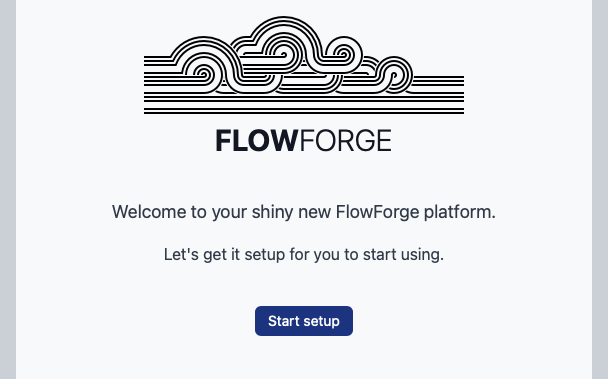

## Installing FlowForge

### Creating the first user

When the FlowForge server is installed and started, the first user can be created.
Keep in mind that the first user is an admin user with elevated permissions.

After browsing to the host that's serving FlowForge, you'll land on a form to
complete the final step of the process.

This form can only be filled in once. After the form has be posted an admin user
is created and this user can be used to sign in and start using FlowForge.

