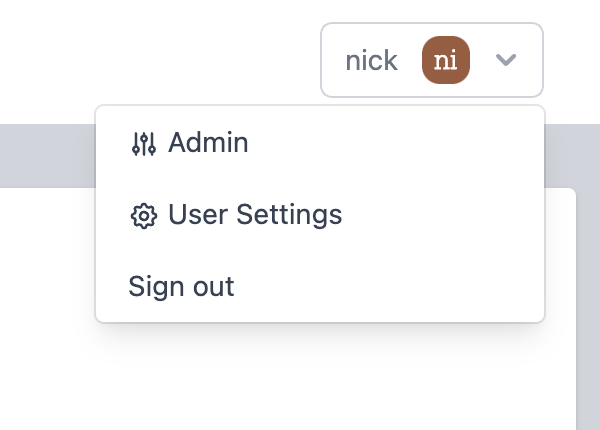

# Administering FlowFuse

## Getting started

 - [Understanding the FlowFuse Architecture](/docs/contribute/architecture.md)
 - [Install/Upgrade](/docs/install) - requirements, deployment models, installation methods and upgrading
 - [`flowforge.yml` configuration](/docs/install/configuration.md) - base platform configuration, done before you run.
 - [First Run Setup](/docs/install/first-run.md) - create your admin user
 - [FlowFuse Concepts](/docs/user/concepts.md)
 - [Usage Telemetry](/docs/admin/telemetry.md)
 - [Single-Sign On](/docs/admin/sso/)
 - [Licensing](/docs/admin/licensing.md)
 - [User management](/docs/admin/user_management.md)
 - [Platform Monitoring](/docs/admin/monitoring.md)

## Administering FlowFuse

### Accessing the Admin Settings

The Admin Settings can be accessed from the main menu:

### Admin Settings

The Admin Settings view lets you manage the platform and its users. The
following settings are available:

 - **Allow new users to register on the login screen** (default: `false`)

    With this option enabled, the platform login page allows visitors to register
    with the platform.

    This option is only available if email sending has been enabled.

 - **Create a personal team for users when they register** (default: `false`)

    With this option enabled, the platform will automatically create a Team
    for the user. This allows them to start creating Node-RED instances straight-away.

    By default, this doesn't happen, which means the user must either manually
    create the Team (if that option is enabled), or be invited to an existing
    Team.

    When enabled, a choice of what type of team should be created for the user
    is shown.

 - **Allow users to reset their password on the login screen** (default: `false)

   With this option enabled, a 'forgot your password' link is shown on the login
   screen, and provides a workflow where a user can reset their password via a
   link emailed to them.

   This option is only available if email sending has been enabled.

 - **Allow users to create teams** (default: `false`)

    This option allows users to create new Teams on the platform. By default,
    it is not enabled which means all Teams must be created by an Admin.

 - **Allow users to invite external users to teams** (default: `false`)

    This option allows users to invite people to join a Team who are not currently
    registered users of the platform. It sends an email with an invitation to
    sign-up to the platform and join the Team.

    By default, this is not enabled - users must be added by an Admin.

    This option is only available if email sending has been enabled.

### Managing Users

The Users page of Admin Settings can be used to manage the user on the platform.

It can be used to:

 - Add new users to the platform.

    With the 0.1.0 release, the admin sets the new user's password and it is left
    to the admin to share the login details with the user outside of the platform.

 - Edit a user's details.

    This includes making them an admin - giving them full access to the platform.

It also provides a list of all pending user invitations, showing who invited who
to what team.

### Managing Teams

With the 0.1.0 release, the Teams page just lists the teams on the platform.

Further team management options will come in later releases.

### Managing Team Types

The Team Types page can be used to manage the Team Types on the platform.

They determine what features of the platform are available to teams of a given type,
including what Instance Types are available and any limits that should be applied.

### Managing Instance Types

The Instance Types page can be used to manage the Instance Types on the platform.

When billing is enabled, an instance type can be associated with a particular
Stripe Product/Price - allowing each type to have a different monthly price
associated with it.

The Instance Types page shows what types are current active, how many stacks
each type has assigned to it, and how many instances have been created of that
type.

Whenever a new Instance Type is created, it will need to be manually enabled for
the individual [Team Types](#managing-team-types) before they will be available
for teams to use.

### Managing Stacks

The Stacks page can be used to manage the Stacks on the platform.

It can be used to create and edit the stacks on the platform.

You can create a new version of an existing stack via the
drop-down menu in the stack table. This allows the platform to notify users
that an update is available for their instance, allowing them to upgrade the stack
at their convenience.

It is *not* possible to edit a stack that is being used by Instances.

For Deployment specific information about working with stacks, refer to the
documentation of your chosen deployment model:

 - [Local Stacks](/docs/install/local/stacks.md)
 - [Docker Stacks](/docs/install/docker/stacks.md)
 - [Kubernetes Stacks](/docs/install/kubernetes/stacks.md)

### Managing Templates

With [templates](/docs/user/concepts/#template) administrators
can apply Node-RED configuration options as default.
For these options, the administrator can lock the selected value so users cannot change
them, or keep them editable by end-users.

If you edit a template that is being used by an Application Instance, those changes will get
applied the next time the instance is restarted.

#### Disallow using nodes

On FlowFuse Cloud, but recommended on self-managed installs on Docker and Kubernetes,
where certain nodes will not work so are excluded from being used by the template.

When adding `31-tcpin.js,32-udp.js,10-file.js,23-watch.js,90-exec.js` to the `Exlude node by
filename` section of a template and locking this value users are prevented from using these.
