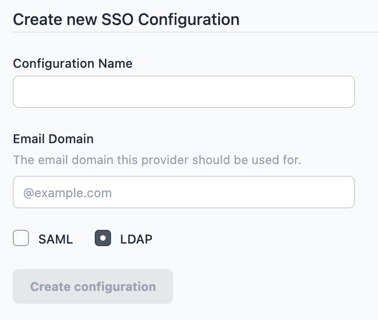
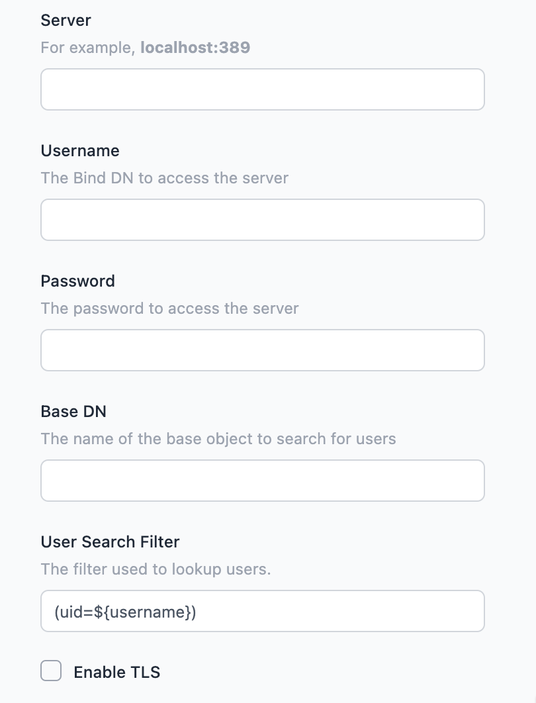

# Configuring LDAP based Single Sign-On

_This feature is only available on self-hosted Enterprise licensed instances of FlowFuse._

The SSO Configurations are managed by the platform Administrator under the
`Admin Settings > Settings > SSO` section.

The user must already exist on the FlowFuse platform before they can sign in via SSO.

### Create a SSO Configuration

1. Click 'Create SSO Configuration' to create a new config

   

2. Give the configuration a name to help identify it, and provide the email domain
   name this configuration should apply to. Ensure the LDAP option is selected - this
   cannot be changed after the configuration is created.

3. Click 'Create configuration'

   At this point, the configuration has been created and metadata generated for the
   configuration, but it is not active.

### Configuration LDAP

The following fields are provided for configuring LDAP. You will need to refer to
your LDAP service provider details for the correct values to enter:

   

 - `Server` - the address of the LDAP server, including port number.
 - `Username` - the bind DN to use to connect to the server. The user must have
   permission to lookup users in the directory.
 - `Password` - the password to connect to the server with.
 - `Base DN` - the base object under which user searches are performed.
 - `User Search Filter` - the filter used to search for a user. See below for more details.
 - `Enable TLS` - whether to use TLS for the LDAP connection
   - `Verify Server Certificate` - when TLS is enabled, whether to perform strict certification
     validation.

You can save the configuration at any time by clicking the `Update configuration`
button. The configuration will only be enabled when you tick the `active` checkbox
and save the changes.

#### User Search Filter

The search filter is used when checking if a user exists within the directory, using
the standard LDAP query notation. The default search filter is `(uid=${username})`.

The platform will replace `${username}` and `${email}` with the user's details when
they attempt to login.

## Creating new users

With FlowFuse 2.7, the SSO Configuration now includes an option to automatically
register users who sign in via the configuration.

This option is not enabled by default, but can be enabled but selecting the `Allow Provisioning of New Users on first login`
option in the SOO configuration.

When creating the user, the platform will use information provided by the LDAP provider
to create the username. The user will be directed to their settings page where they
can modify their user details to their preferred values.