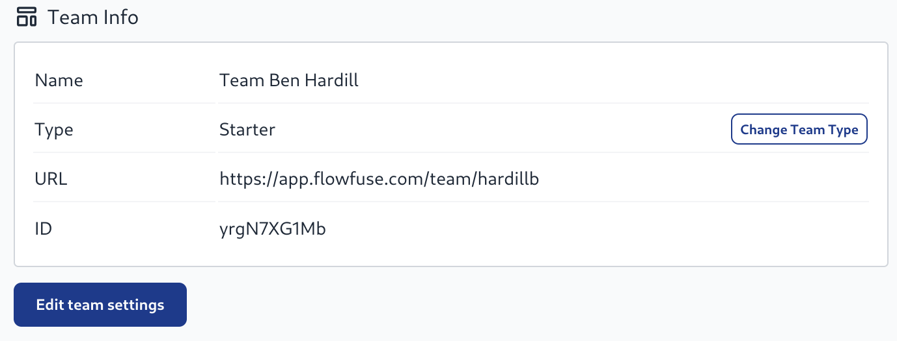
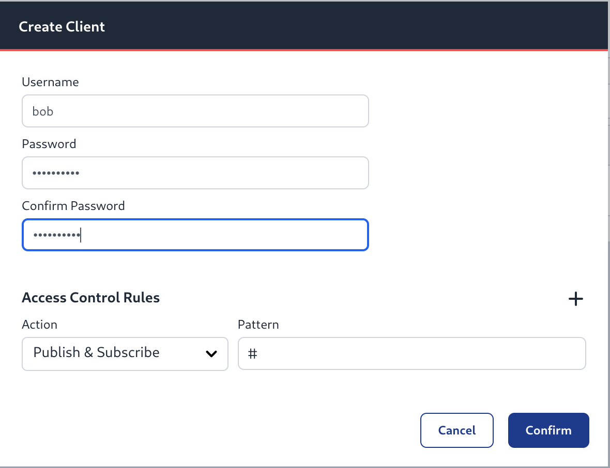

# FlowFuse Cloud

FlowFuse Cloud is a hosted service allowing users to sign-up and start creating Node-RED instances without having to install and manage their own instance of FlowFuse.
The [Concepts](/docs/user/concepts.md) remain the same, but we run the platform for you.

## 14-day Free Trial

When users sign-up to FlowFuse Cloud they get a 14-day free trial of the platform.
This is a great way to start using FlowFuse and discover a lot of the value it provides.

Users can end their trial by heading to the Billing page of their team and 
setting up their payment information. This includes the option to pick which
plan you want to upgrade the team to.

Otherwise, at the end of the 14-day trial period, any instances created in the team
will be suspended. This means they will no longer be running and the
editor will not be accessible. Users will need to add their Billing details at which
point they will be able to restart their suspended Node-RED instances.

We will email users about their trial when it is nearing the end to ensure
they know what is happening.

## Billing

Customers are billed at the team level for each Node-RED instance they create. This is a recurring monthly charge.
See the [Billing](/docs/cloud/billing.md) page for more detailed answers about billing.

## Support

Premium customers can get support by [filing a ticket](/support). We offer
support for the FlowFuse application and your account, any issues relating to
Node-RED such as your flows or a 3rd party node should be raised in the
[community forum](https://community.FlowFuse.com).

### Requesting a new verification email

When a user signs up for FlowFuse Cloud an email will be sent to verify it.
If this email doesn't get delivered one can be resend by signing in to FlowFuse
and click the button to resend it.

## Team Types

FlowFuse Cloud has three different Team Type aimed at different sorts of users

### Starter

Good for getting to know the platform, allows 2 small Instances, 2 Devices and 2 Team members

### Team

Has access to more features e.g.

- Shared Team Library
- Project Nodes
- Team-based Dashboard/API security
- Email alerts for Instance crashes
- Has access to larger Instance Types

Also includes 5 Instances in the base price

### Enterprise

All features from the Team Level plus

 - HA for Instances
 - SSO
 - Better Support SLA
 - MQTT Broker

Includes 10 instances and 20 MQTT Clients in the base price

### Changing Team Type

You can change Team Type by selecting the "Team Settings" option from the left hand
menu, then clicking on the "Change Team Type" button



From here you will be presented with a choice of Team Types. You will not be able
to downgrade to a lower Team Type if you already have more resources than allowed at 
that level. Please Suspend or Delete any no longer required Instances or Devices.


## Node-RED on FlowFuse Cloud

FlowFuse currently offers Node-RED 4.x, 3.x and 2.x to customers. When creating a
new instance a [stack](/docs/user/concepts.md#stack) is chosen, which later
can be [upgraded to a later version](/docs/user/changestack.md).

Each Node-RED can install custom modules as advertised in the [Flow Library](https://flows.nodered.org).

Note that some modules have dependencies on system libraries or other components that are not available within the FlowFuse
container images we use. Those modules cannot be used within FlowFuse Cloud. If you have a particular requirement, please
do [contact us](https://flowfuse.com/contact-us/) so we can discuss what options may be available.

## Cloud Instance Sizes

The different sizes of Cloud Instances relate to how much memory and CPU is made
available to them.

Memory tends to be the main limiting factor for a Node-RED instance. The following
table shows what is currently allocated by instance size.

| Size | Memory (RAM) |
|--------|--------|
| Small | 256MB |
| Medium | 768MB |
| Large | 3840MB |

Medium and Large instance types require the Teams or Enterprise tier.

## Use of the File System

FlowFuse Cloud hosted instances have access to a persistent file-system that will
retain the files stored on it across restarts of the instance.

A quota limit is applied to how much data can be stored, which varies based on
the Team type.

| Team Type | File Storage Quota (per instance) |
|--------|--------|
| Starter | 1GB |
| Team | 10GB |
| Enterprise | 100GB |

Files can be manually uploaded to an instance using the [Static Asset Service](https://flowfuse.com/blog/2024/08/flowfuse-2-8-release/#static-assets-service).

## Node-RED Context

Node-RED Context can be used to store small pieces of application state within the
runtime. By default, this is stored in memory only.

FlowFuse Cloud provides an optional context store that can be used to persist
the data.

The amount of data that can be stored in context is determined by the Team type.

| Team Type | Context Store Quota (per instance) |
|--------|--------|
| Starter | 10MB |
| Team | 100MB |
| Enterprise | 1GB |


## Network Connections

### HTTP(S) & Websockets

Node-RED exposes an HTTPS interface on port 443 with each instance having its own hostname (`example.flowfuse.cloud`). Plain HTTP requests to port 80 will receive a redirect to HTTPS on port 443.
You MUST connect using the hostname not the IP address to reach your Node-RED instance.
Websocket connections over SSL (`wss:`) are also supported.

The payload size per request is limited to 5MB, which is the Node-RED default.
When a request exceeds this limit, the whole request is rejected with a `413 Payload Too Large` error.

### TCP and UDP

The default TCP and UDP nodes have been removed from the Node-RED palette. This is
because it is not possible to route these sorts of connections to the container running
Node-RED inside the FlowFuse Cloud platform.

### MQTT

MQTT Connections to an external broker using the standard MQTT nodes will work fine as the connection is initiated by Node-RED.

FlowFuse provides an MQTT broker for general use by Enterprise Team's Node-RED instances. See the following section.

Also the Project Nodes can be used to easily pass messages between Node-RED instances running in the
platform.

#### Enterprise Team Broker

Enterprise level teams come with their own MQTT broker. You can provision clients from the broker tab in the left hand menu.

Teams can register up to 20 clients as part of their plan. The ability to purchase additional packs of clients will come in a future release.

The broker is available on `broker.flowfuse.cloud` and supports the following connection types:

 - MQTT on port `1883`
 - MQTT over TLS on port `8883`
 - MQTT over secure WebSockets on port `443`

 When creating clients you can specify a username, but it will prepended to the the Team's id e.g. `alice` will become `alice@abcd1234`.
 Clients must also use the username as the MQTT Client ID in order to connect.

 

 e.g.

 ```
 mosquitto_sub -u "alice@abcd1234" -i "alice@abcd1234" -P "password" -h broker.flowfuse.cloud -t "#"
 ```

### IP Addresses

Outbound connections from FlowFuse will always come from the IP address `63.33.85.112`. 

This can make access to a remote database or corporate network possible where those systems are protected by IP address filtering firewalls. 

All incoming connections MUST use the hostname and not an IP address.

## Data Security

FlowFuse Cloud is hosted on Amazon Web Services. The following statements apply to data handling within the platform:

 - The underlying database use the industry standard AES-256 encryption algorithm to encrypt the stored data.
 - Persistent storage offered to Node-RED instances uses AES-256 encryption algorithm to encrypt data and metadata at rest.
 - The network load balancer uses the latest recommended AWS Network Security policy. This enforces TLS1.2 as a minimum.

## Single-Sign On

FlowFuse supports configuring both SAML and LDAP based Single Sign-On for particular email domains.

This can be configured on request for FlowFuse Cloud by submitting a support request
via our [Contact Us](https://flowfuse.com/contact-us/) page.

For SAML providers, you must have the ability to configure a SAML endpoint on your Identity Provider,
and have the authority to configure SSO for your email domain.

We have currently validated our SSO support with the following Identity Providers:

 - Microsoft Entra
 - Google Workspace
 - OneLogin
 - Keycloak

If you are using a different Identity Provider, please still get in touch, and we
can evaluate what will be required to enable it.

## Custom Hostnames

FlowFuse Cloud can support custom hostnames for instances in Enterprise teams.

This allows you to point your own subdomain, such as `dashboard.example.com` at
one of your instances.

See [Custom Hostnames](/docs/user/custom-hostnames.md) for more information.

## Removing your account

Before you can delete your account, teams you own must either be deleted or have at least 1 other owner.
Once this is done, you can remove your account by going to the "User Settings" page and clicking the "Delete Account" button.

See also: [cancelling your subscription](/docs/cloud/billing.md#cancelling-your-subscription).

