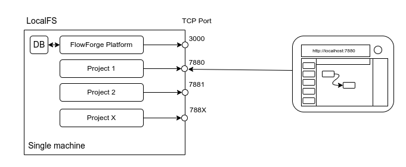
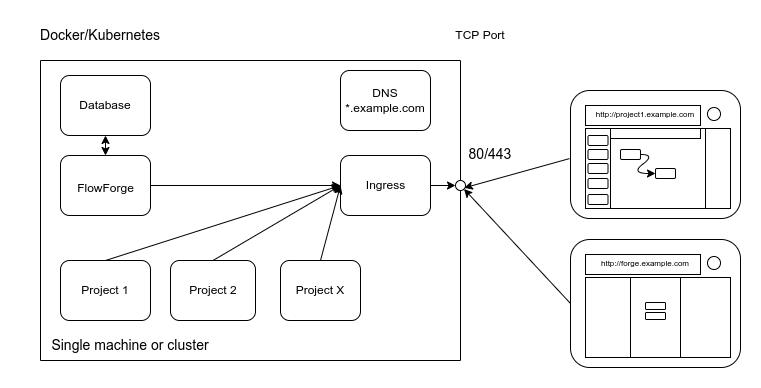
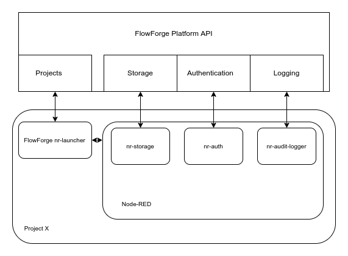
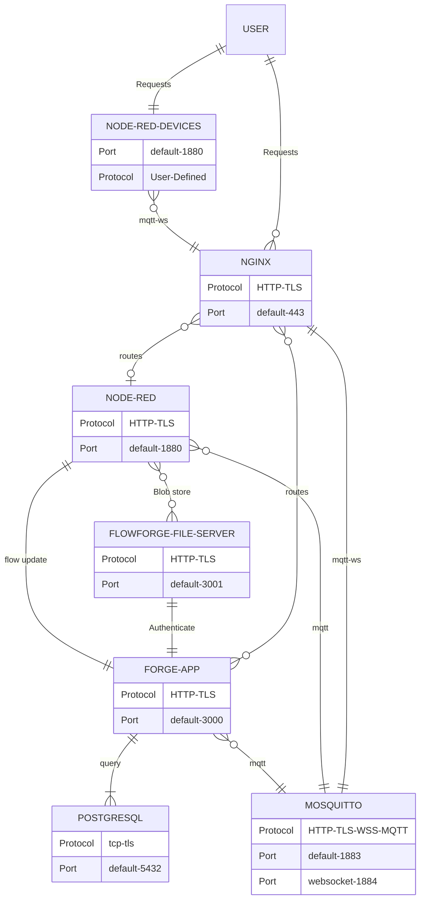

# FlowFuse Architecture

A FlowFuse install is made up of 2 main components

 - The Management Application
 - The Node-RED instances

These can be deployed in one of 2 ways

 - On a single machine

   

 - Using a Container Orchestration platform (Kubernetes/Docker Compose)

   

## FlowFuse Management Application

This provides the interface for managing the objects in the platform. It also
provides a collection of APIs to support the Node-RED instances once started.

A key component is the Container API driver, this is the part that actually creates/destroys 
Node-RED instances and keeps track of what should be running and restarts if needed.

### Container Drivers

Node-RED instances are started by the FlowFuse Management Application via one of the following Container Drivers. Documentation for the Container Driver API will be available in the [API](../api/README.md) section.

#### Localfs

This driver runs Node-RED as separate processes on the same machine as the FlowFuse Management Application. Each instance gets its own `userDir` and a dedicated TCP/IP port to listen to.

State is stored in a local SQLite database

There is no automatic Ingres automation provided by this driver.

#### Kubernetes

This driver runs Node-RED in separate containers and each instance is accessed by a dedicated hostname via an HTTP Ingres proxy.

The state is stored in a provided PostgreSQL database.

Node-RED containers are segregated into their own namespace (currently hardcoded to `flowforge`)

The driver uses the [@kubernetes/client-node](https://www.npmjs.com/package/@kubernetes/client-node) to interact with the cluster.

The driver will create the required Service and Ingres Kubernetes resources to expose each instance via whatever Ingress Controller the underlying Kubernetes cluster provides.

#### Docker-Compose

This driver runs Node-RED in separate containers and each instance is accessed by a dedicated hostname via an HTTP Ingres proxy.

The state is stored in a provided PostgreSQL database.

The driver uses the [dockerode](https://www.npmjs.com/package/dockerode) to interact with the cluster.

The driver will add the required Environment variables to each Node-RED container to work with the [jwilder/nginx-proxy](https://hub.docker.com/r/jwilder/nginx-proxy) NGINX proxy.

## FlowFuse Instances

A FlowFuse Node-RED Instance is made up of 2 processes

- The FlowFuse Launcher
- A Node-RED instance

### FlowFuse Launcher

This is a small application that handles downloading the Instance specific settings, building a `settings.js` from those settings and then starting the Node-RED instance.

The launcher presents an HTTP API (it defaults to the Node-RED port + 1000) that allows the FlowFuse Management Application to start/stop/restart the Node-RED instance as well as query its current state and retrieve the console logs.

The launcher can be found [here](https://github.com/FlowFuse/nr-launcher)

Within the launcher are some custom plugins that are loaded by Node-RED:

#### nr-storage

This plugin is used to save flows, settings, sessions, and library entries back to the FlowFuse Management Application.

#### nr-auth

This plugin is used to authenticate users trying to access the Node-RED Editor, it refers back to the FlowFuse Management Application to ensure only members of the team that owns the instance can log in.

This plugin uses the Node-RED [Authentication API](https://nodered.org/docs/user-guide/runtime/securing-node-red#custom-user-authentication)

#### nr-audit-logger

This plugin sends Node-RED Audit events (e.g. user log in and flow deployment events) back to the to the FlowFuse Management Application to allow a reliable audit of what actions have taken place in the instance.

This plugin uses the Node-RED [Logging API](https://nodered.org/docs/user-guide/runtime/logging)

## Component Overview

