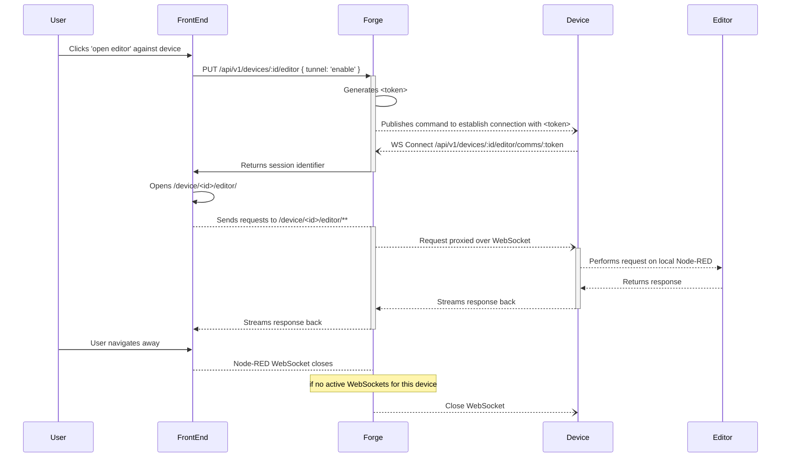

# Enabling the device editor

```mermaid
sequenceDiagram
    User->>FrontEnd: Clicks 'open editor' against device
    FrontEnd->>+Forge: PUT /api/v1/devices/:id/editor { tunnel: 'enable' }
    Forge->Forge: Generates <token>
    Forge--)Device: Publishes command to establish connection with <token>
    Device--)Forge: WS Connect /api/v1/devices/:id/editor/comms/:token
    
    Forge->>-FrontEnd: Returns session identifier
    FrontEnd->>FrontEnd: Opens /device/<id>/editor/
    FrontEnd-->+Forge: Sends requests to /device/<id>/editor/**
    Forge--)+Device: Request proxied over WebSocket
    Device-->>Editor: Performs request on local Node-RED
    Editor-->>Device: Returns response
    Device-->>-Forge: Streams response back
    Forge-->>-FrontEnd: Streams response back
    User->>FrontEnd: User navigates away
    FrontEnd-->Forge: Node-RED WebSocket closes
    Note over Forge: if no active WebSockets for this device
    Forge--)Device: Close WebSocket
```

