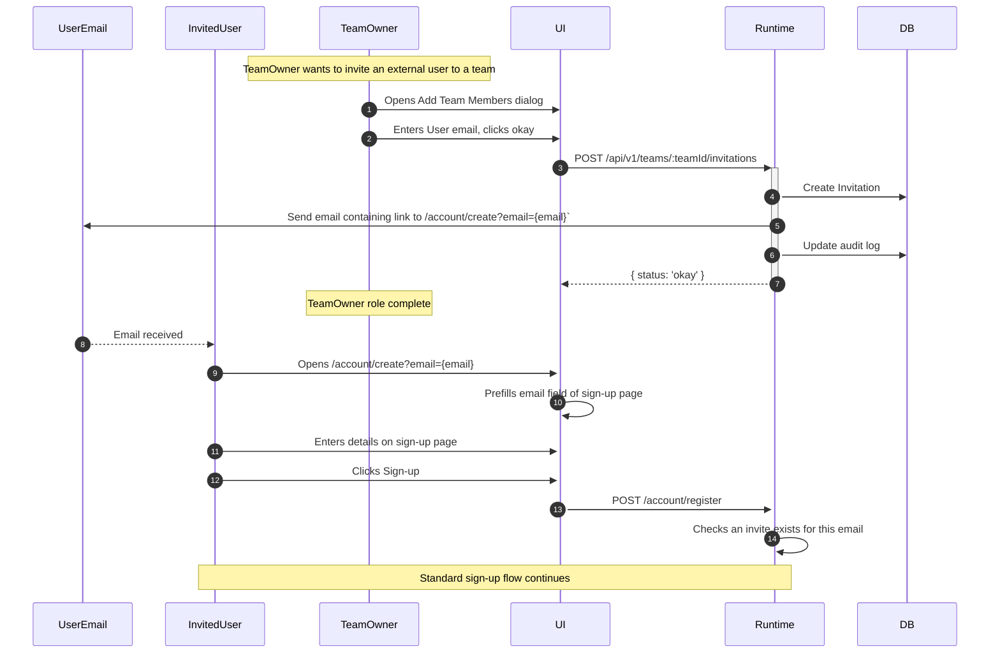

# Invite External User Flow

```mermaid
sequenceDiagram
    autonumber
    participant UserEmail
    participant InvitedUser
    participant TeamOwner
    participant UI
    participant Runtime
    participant DB
    Note over TeamOwner: TeamOwner wants to invite an external user to a team
    TeamOwner->>UI: Opens Add Team Members dialog
    TeamOwner->>UI: Enters User email, clicks okay
    UI->>+Runtime: POST /api/v1/teams/:teamId/invitations
    Runtime->>DB: Create Invitation
    Runtime->>UserEmail: Send email containing link to /account/create?email={email}`
    Runtime->>DB: Update audit log
    Runtime-->>-UI: { status: 'okay' }
    Note over TeamOwner: TeamOwner role complete
    UserEmail-->>InvitedUser: Email received
    InvitedUser->>+UI: Opens /account/create?email={email}
    UI->>UI: Prefills email field of sign-up page
    InvitedUser->>UI: Enters details on sign-up page
    InvitedUser->>UI: Clicks Sign-up
    UI->>+Runtime: POST /account/register
    Runtime->>Runtime: Checks an invite exists for this email
    Note over InvitedUser,Runtime: Standard sign-up flow continues
```

 - See also [User Sign Up](./signup.md)
