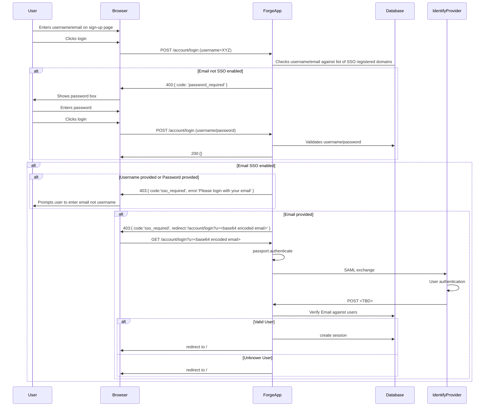

# User Login Flows

This represents the login flow as of FlowForge 1.2, that incorporates optional
SSO

```mermaid
sequenceDiagram
participant U as User
participant B as Browser
participant RT as ForgeApp
participant DB as Database
participant IDP as IdentifyProvider
U->>B: Enters username/email on sign-up page
U->>B: Clicks login
B->>RT: POST /account/login (username=XYZ)
RT->DB: Checks username/email against list of SSO registered domains
alt Email not SSO enabled
    RT->>B: 403:{ code: 'password_required' }
    B->>U: Shows password box
    U->>B: Enters password
    U->>B: Clicks login
    B->>RT: POST /account/login (username/password)
    RT->>DB: Validates username/password
    RT->>B: 200:{}
end

alt Email SSO enabled
    alt Username provided or Password provided
        RT->>B: 403:{ code:'sso_required', error:'Please login with your email' }
        B->>U: Prompts user to enter email not username
    end
    alt Email provided
        RT->>B: 403:{ code:'sso_required', redirect:'/account/login?u=<base64 encoded email>' }
        B->>RT: GET /account/login?u=<base64 encoded email>
        RT->>RT: passport.authenticate
        RT->>IDP: SAML exchange
        IDP->>IDP: User authentication
        IDP->>RT: POST <TBD>
        RT->>DB: Verify Email against users
        alt Valid User
            RT->>DB: create session
            RT->>B: redirect to /
            else Unknown User
            RT->>B: redirect to /
        end
    end
end
```