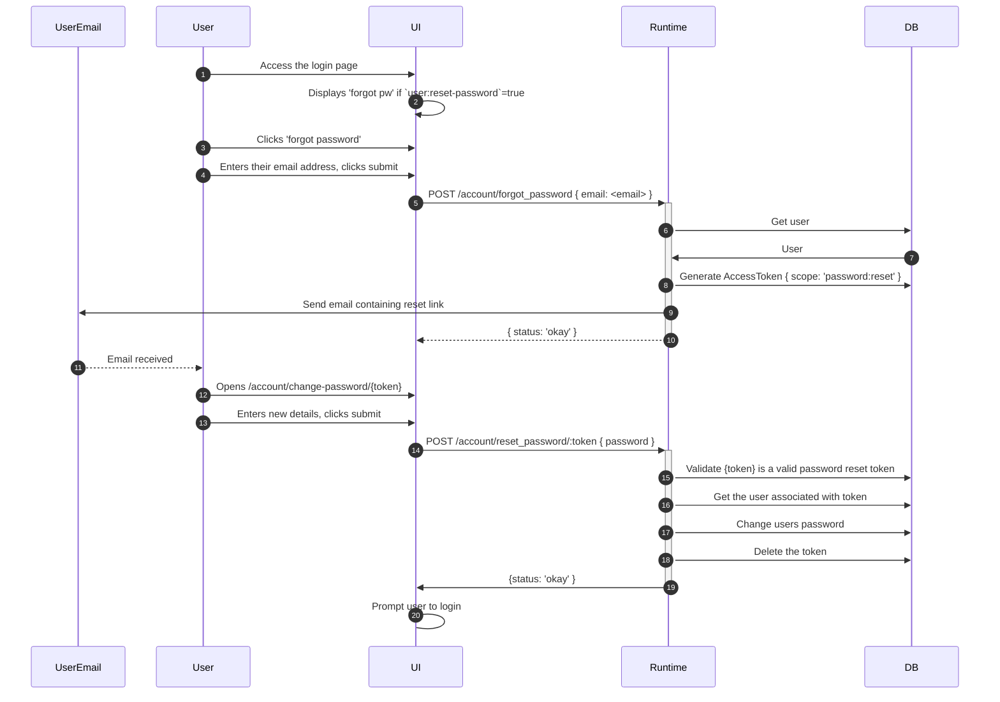

# Reset Password Flow

```mermaid
sequenceDiagram
    autonumber
    participant UserEmail
    participant User
    participant UI
    participant Runtime
    participant DB
    User->>UI: Access the login page
    UI->>UI: Displays 'forgot pw' if `user:reset-password`=true
    User->>UI: Clicks 'forgot password'
    User->>UI: Enters their email address, clicks submit
    UI->>+Runtime: POST /account/forgot_password { email: <email> }
    Runtime->>DB: Get user
    DB->>Runtime: User
    Runtime->>DB: Generate AccessToken { scope: 'password:reset' }
    Runtime->>UserEmail: Send email containing reset link
    Runtime-->>-UI: { status: 'okay' }

    UserEmail-->>User: Email received
    User->>UI: Opens /account/change-password/{token}
    User->>UI: Enters new details, clicks submit
    UI->>+Runtime: POST /account/reset_password/:token { password }
    Runtime->>DB: Validate {token} is a valid password reset token
    Runtime->>DB: Get the user associated with token
    Runtime->>DB: Change users password
    Runtime->>DB: Delete the token
    Runtime->>-UI: {status: 'okay' }
    UI->UI: Prompt user to login

```