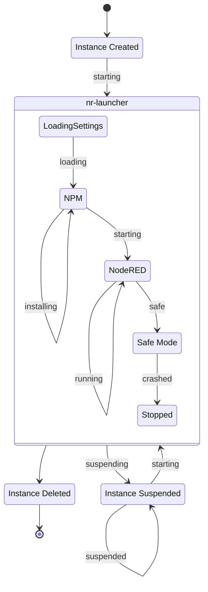

# States
- **Starting (first time)** The nr-laucher process is starting up. On container based systems this is done by creating a container
- **Loading** nr-launcher pulling instance settings 
- **Installing** Once the nr-launcher process has started and downloaded the Instance settings it will npm install any nodes in the settings -> palette section. 
- **Starting (second time)** Once any nodes are installed the Node-RED process will be started, this state ends once the process can will respond to HTTP request
- **Running** The normal state for an Instance
- **Restarting** If the "Restart" action is triggered the nr-launcher will restart just the NR process inside the container. It will pull the latest settings data from the Forge app. A restart will also be triggered if the NR process fails to respond to 3 HTTP health checks in a row. Health checks run ever 7 seconds by default.
- **Suspending** driver has been asked to suspend the Instance
- **Suspended** When an instance is Suspended the Node-RED process is stopped and the nr-launcher shutdown, the container is then shutdown and removed on container based platforms
- **Safe** Node-RED can be started in Safe Mode, this starts the Editor but does not run the flows. This is to allow a user to edit the flow to fix a problem. The flows are started when the flows are deployed. This is triggered if the NR process restarts more than 5 times with a run time of less than 30 seconds between each restart.
- **Stopped** If the NR process continues to crash while in Safe Mode then it will be placed in to a Stopped state. The nr-launcher is still running but the NR process is not.

# 2.3.0

