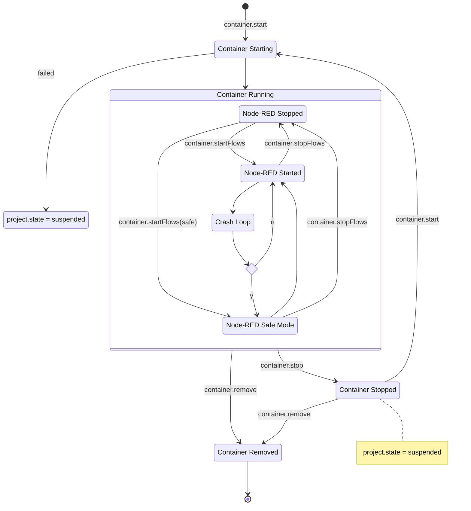

# 0.4.0 

```mermaid
stateDiagram-v2
direction TB
ConStarting: Container Starting
ConRunning: Container Running
ConStopped: Container Stopped
ConRemoved: Container Removed
ProjStateSus: project.state = suspended
NRStopped: Node-RED Stopped
NRStarted: Node-RED Started
NRSafe: Node-RED Safe Mode
Crash: Crash Loop
state crash_loop <<choice>>
[*] --> ConStarting : container.start
ConStarting --> ProjStateSus : failed
ConStarting --> ConRunning
state ConRunning {
    direction TB
    NRStarted --> NRStopped : container.stopFlows
    NRStopped --> NRStarted : container.startFlows
    NRStopped --> NRSafe : container.startFlows(safe)
    NRSafe --> NRStarted
    NRSafe --> NRStopped : container.stopFlows
    NRStarted --> Crash
    Crash --> crash_loop
    crash_loop --> NRSafe : y
    crash_loop --> NRStarted : n
    
}
ConRunning --> ConRemoved : container.remove
ConRunning --> ConStopped : container.stop
ConStopped --> ConRemoved : container.remove
ConStopped --> ConStarting : container.start
note right of ConStopped : project.state = suspended
ConRemoved --> [*]
```

 - Node-RED Stopped: project.state = stopped
 - Node-RED Started: project.state = running
 - Node-RED Safe Mode: project.state = safe