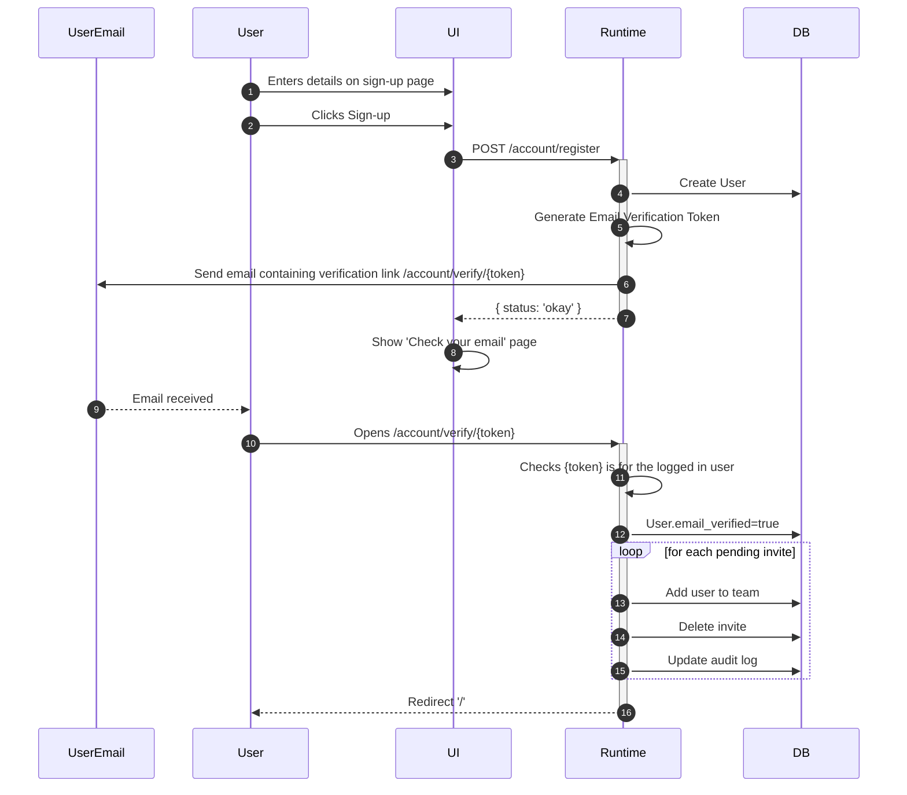

# User Sign Up Flow

```mermaid
sequenceDiagram
    autonumber
    participant UserEmail
    participant User
    participant UI
    participant Runtime
    participant DB
    User->>UI: Enters details on sign-up page
    User->>UI: Clicks Sign-up
    UI->>+Runtime: POST /account/register
    Runtime->>DB: Create User
    Runtime->>Runtime: Generate Email Verification Token
    Runtime->>UserEmail: Send email containing verification link /account/verify/{token}
    Runtime-->>-UI: { status: 'okay' }
    UI->>UI: Show 'Check your email' page
    UserEmail-->>User: Email received
    User->>+Runtime: Opens /account/verify/{token}
    Runtime->>Runtime: Checks {token} is for the logged in user
    Runtime->>DB: User.email_verified=true
    loop for each pending invite
        Runtime->>DB: Add user to team
        Runtime->>DB: Delete invite
        Runtime->>DB: Update audit log
    end
    Runtime-->>-User: Redirect '/'
```
