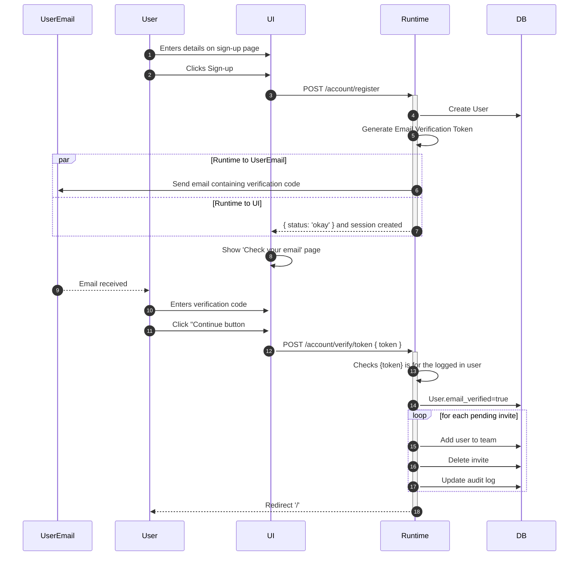

# User Sign Up Flow

```mermaid
sequenceDiagram
    autonumber
    participant UE as UserEmail
    participant US as User
    participant UI
    participant RT as Runtime
    participant DB
    US->>UI: Enters details on sign-up page
    US->>UI: Clicks Sign-up
    UI->>+RT: POST /account/register
    RT->>DB: Create User
    RT->>RT: Generate Email Verification Token
    par Runtime to UserEmail
        RT->>UE: Send email containing verification code
    and Runtime to UI
        RT-->>-UI: { status: 'okay' } and session created
    end

    UI->>UI: Show 'Check your email' page
    UE-->>US: Email received
    US->>+UI: Enters verification code
    US->>UI: Click "Continue button
    UI->>+RT: POST /account/verify/token { token }
    RT->>RT: Checks {token} is for the logged in user
    RT->>DB: User.email_verified=true
    loop for each pending invite
        RT->>DB: Add user to team
        RT->>DB: Delete invite
        RT->>DB: Update audit log
    end
    RT-->>-US: Redirect '/'
```
