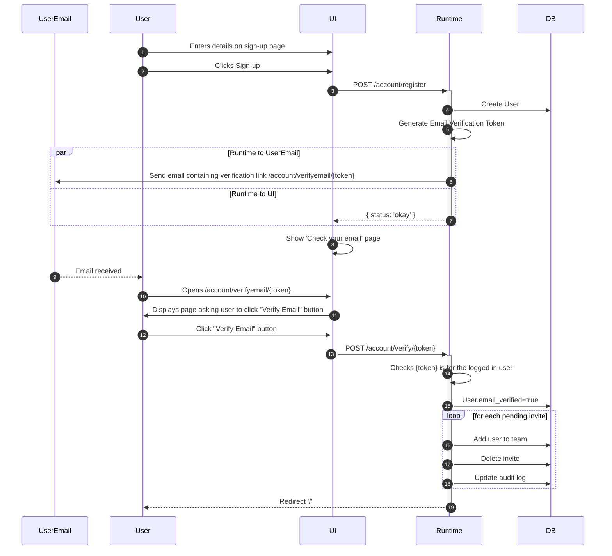

# User Sign Up Flow

```mermaid
sequenceDiagram
    %% https://mermaid.live/edit#pako:eNqNVE2P2jAQ_SsjXzjsUu6RulJ3iSpOWxHSU6TKaw_BSrBTf1BFiP_esRNoYFltOYXM87x5b158ZMJIZBlz-DugFrhUvLZ8X2mgHw_e6LB_Qzv877j1SqiOaw9lDtxB6dDme67aO4DiDLhTW71_t95E_Dpor_b4vrx8Ht6VxfzpqVxlkGuP1oFET_QOjAanaj0PHR2r8Qb80irROCgGxFhcUfFhvcngx2uxgQUXwhD7wmKtnD-Pvd4QavlMLSxyjxNBqRKPf0eNNtaSE_ATrdoqwb2imTamQX1Rc5YH3txad-lY5hkUqCVg6iaMJoFa6RoO08at0s2_mVOpTycWRx85T-MKqdGUdHXFRnTzaM8RnOc-uAxmpuH9DMbTNEalJ25FbLEzf2D2skPRQG-CHeacTV3PY-OyyEZDLApUB5STnTzETq8davcfGgZqardUrmt57xIXpaWJrgTyMUoTccVQsWR_P1BXDN6CpxDfi8Mn2A_SMUx5PeAlCckVB2MRlIOtoeF2CK2pa5SgdJr3JloxCl-S8F_DjlF-9TaMdrbGdKkPcrED8kxG2UoflMeb7MRm36S8eOLx_ClfQZbYIsX1wxZlJ2OceZDKx8knYZgGhzayRqlovR5mi1ml2SPboyUdkm6UYwRXjMTT58wyepTcNhWr9IlwIVHkRGAsy7a8dfjI4n1T9FqwLKo_g8YraUSd_gKYcISX
    autonumber
    participant UE as UserEmail
    participant US as User
    participant UI
    participant RT as Runtime
    participant DB
    US->>UI: Enters details on sign-up page
    US->>UI: Clicks Sign-up
    UI->>+RT: POST /account/register
    RT->>DB: Create User
    RT->>RT: Generate Email Verification Token
    par Runtime to UserEmail
        RT->>UE: Send email containing verification link /account/verifyemail/{token}
    and Runtime to UI
        RT-->>-UI: { status: 'okay' }
    end

    UI->>UI: Show 'Check your email' page
    UE-->>US: Email received
    US->>+UI: Opens /account/verifyemail/{token}
    UI->>US: Displays page asking user to click "Verify Email" button
    US->>UI: Click "Verify Email" button
    UI->>+RT: POST /account/verify/{token}
    RT->>RT: Checks {token} is for the logged in user
    RT->>DB: User.email_verified=true
    loop for each pending invite
        RT->>DB: Add user to team
        RT->>DB: Delete invite
        RT->>DB: Update audit log
    end
    RT-->>-US: Redirect '/'
```
