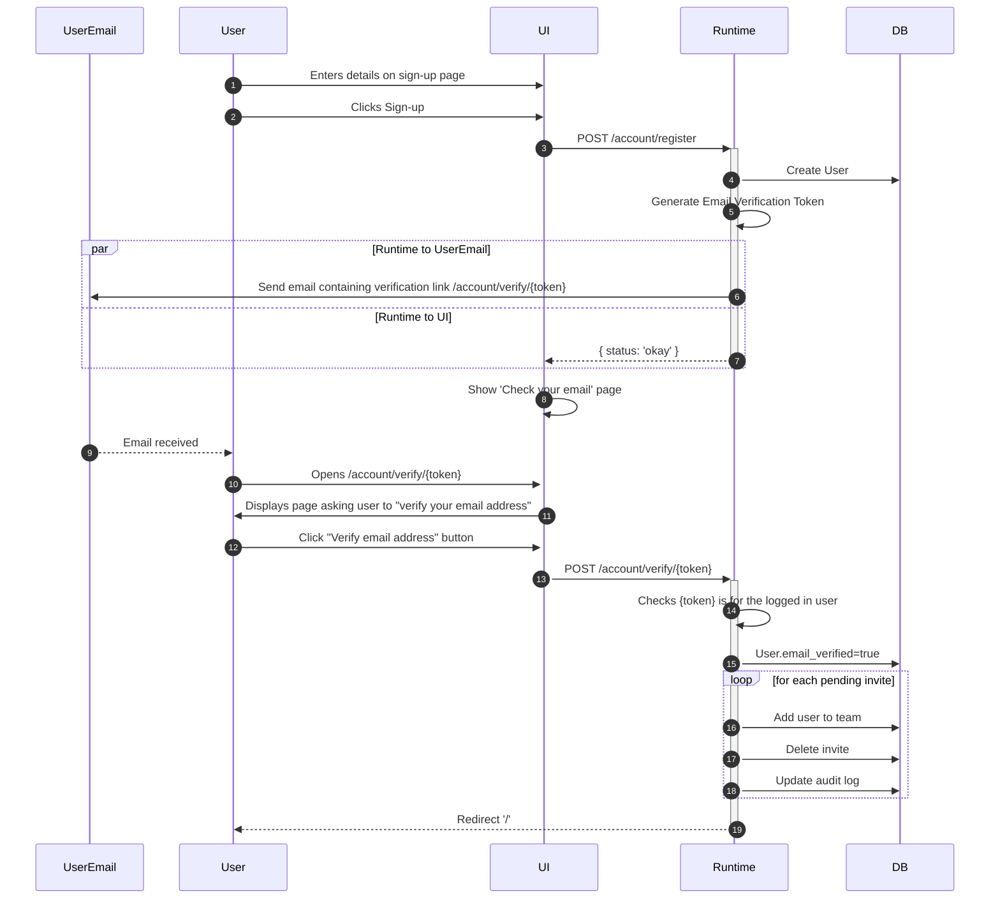

# User Sign Up Flow

```mermaid
sequenceDiagram
    %% https://mermaid.live/edit#pako:eNp9VWtv4joQ_SsWV6t-2GVb0gIp0l0JSHiHQB4UUKXIxCaYJHZwHAit9r-vA7SX7fYun0LmzJkzMyf2a8lnCJcapRTvMkx9rBEYcBg_UyB_X76AjRBJ2ri9jTGPIUHfI7LHtxgR8U8CQ9bA4914pisTZducena6nb9sUzerWVk0uCd2Yj7lPdutOUN48Fo2bznrSqtDJh5OrTFbdCJhLuaGWs-rq0pVXRqD_rIVvZS1LOjwjbsfLdW5Ege9g4dro5Y3fdmr9fq2Yu-ICQ-PkSbyVg1pMa7VofmgEW20cZ7qFU88VnVPSxj3Vg97nqs9UZvl65dkN8ujsJtNKqyjO97U3DYhhdu7Sc9SuDpdqXeEW2Y76Oadje-uO5u9T4NcyfJg6s4PG61-iIeCauXJHj1M4T4yRnZ-3Obj1s4aTtZ3eDwW0Na9psMR2x1WCokdGE_nFcuvLnr3IoeoHC2qm9DdtWdBjUBjwDqwZjHzToXiLlW8eGYmztF_snK16pSN4Q51XdSbdyzqvEBDtajpl7NmHidZ71EzVs5Yh9FAqXZWI_1lrWhKGk6sabfc7mHoO7P7yaJsHo_6Uhs1E7dVtR1Jozs7FcG9v-4Gyx3kyOWxqNbz_jyBTwMeOEfDZY7vz6bpk-VNKq25Nq61k1xbE9WgStOzDTevTnAzavvhrKUYVtQ3BcMdpT1UEli1AzTg94OI5e2obKsdT9tGnfKjAw3EV100DCc-1zU1zLuKy9aRgVd1w4rva7aKzVHutaP1dLla9NN55ZAvZW-mj5faMFdDulgG3c0LPFq7iO2takwqcaTYkxU7uiiMa-7iYM23huNU1cMRJ44_3jzxx3506M96odVtpsc6VNF623-gFeexszuMhswL1AWHro28YLjw-_b87HmYCUazeIX5-X8CuSA-SSAVwNUBTIGbYq7LjyH6BGC_AT6J9f98ZzkF3sqoIDH-M6y1zu9cu_zjh9tvAJ0KzFOAsJDlU8AoSElAy1ki0wL8AdyOiB-mwD4jLsG-DH61nAaYmLYDbqHvM1n9luOApOJNtuVIlNaSFBxDga8aOkWK9C6mmBex0yTADHOyJj4URGpyWIjpezdv7QHBPo7undHVG8DGFAF8YvMZlQ1SQgOwvyaOCA3_03wKHW9fRVHu52V7kuO6Xv-3QrJSuZjMK0gFFFnaADcshMcbcMmWCp7p1aAKrL1hB3DT3mA_BEeW8bPEm-uB6wWxazcus-DYx_KURFfr-FowmQmm6d_ln6tKJo2kSQSP6amM9EhYzCKT0yu6ei6dc6_0AIgQx2n6XPrMBDJjds74AAarTEi7_90bnwl998FpMCm4BAFJwZpJkRsMIhYEGAFCT7o_GKswwveTGO-8YYz-FTy7TDRiLDnxyJNsA-TYUNE-oXsi8AfnFGRNhN5nI_Db5fUbRMMRlmb9Xwo3QYWZYSZvtkL5lR-uvSM3Y8nLT25YgJvbm2da-la63IzyDn0twM8l2bz8mEsN-YggD4uV_JS47FRClwUYLzXWMErxt1Jx2thH6pcaRfdvoMslfEH9_AUC2oYO
    autonumber
    participant UE as UserEmail
    participant US as User
    participant UI
    participant RT as Runtime
    participant DB
    US->>UI: Enters details on sign-up page
    US->>UI: Clicks Sign-up
    UI->>+RT: POST /account/register
    RT->>DB: Create User
    RT->>RT: Generate Email Verification Token
    par Runtime to UserEmail
        RT->>UE: Send email containing verification link /account/verify/{token}
    and Runtime to UI
        RT-->>-UI: { status: 'okay' }
    end

    UI->>UI: Show 'Check your email' page
    UE-->>US: Email received
    US->>+UI: Opens /account/verify/{token}
    UI->>US: Displays page asking user to "verify your email address"
    US->>UI: Click "Verify email address" button
    UI->>+RT: POST /account/verify/{token}
    RT->>RT: Checks {token} is for the logged in user
    RT->>DB: User.email_verified=true
    loop for each pending invite
        RT->>DB: Add user to team
        RT->>DB: Delete invite
        RT->>DB: Update audit log
    end
    RT-->>-US: Redirect '/'
```
