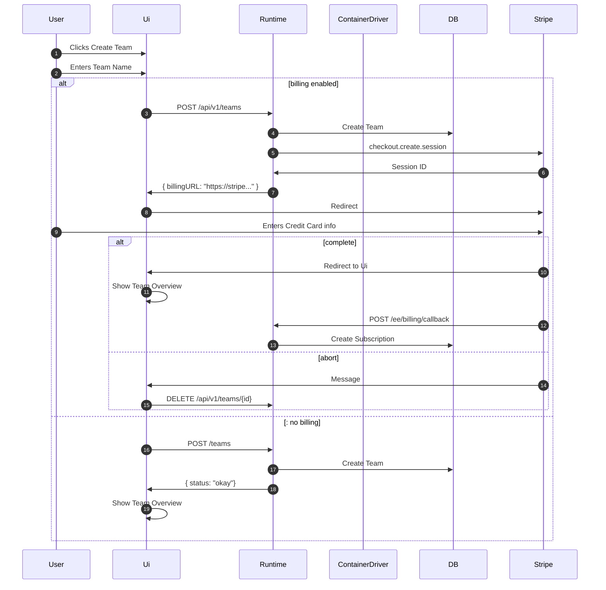

# Sequence For Team Creation

```mermaid
sequenceDiagram
autonumber
participant User
participant Ui
participant Runtime
participant ContainerDriver
participant DB
participant Stripe

User->>Ui: Clicks Create Team
User->>Ui: Enters Team Name
alt billing enabled
Ui->>Runtime: POST /api/v1/teams
Runtime->>DB: Create Team
Runtime->>Stripe: checkout.create.session
Stripe->>Runtime: Session ID
Runtime->>Ui: { billingURL: "https://stripe..." }
Ui->>Stripe: Redirect
User->>Stripe: Enters Credit Card info
alt complete
Stripe->>Ui: Redirect to Ui
Ui->>Ui: Show Team Overview
Stripe->>Runtime: POST /ee/billing/callback
Runtime->>DB: Create Subscription
else abort
Stripe->>Ui: Message 
Ui->>Runtime: DELETE /api/v1/teams/{id}
end
else: no billing
Ui->>Runtime: POST /teams
Runtime->>DB: Create Team
Runtime->>Ui: { status: "okay"}
Ui->>Ui: Show Team Overview
end
```