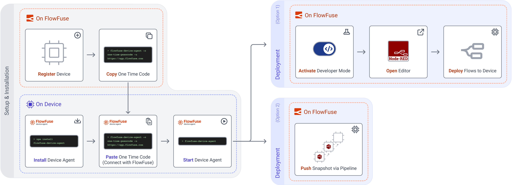

# FlowFuse Device Agent

{data-zoomable}
_Workflow to onboard new Edge Devices through the FlowFuse Platform and Device Agent_

The FlowFuse platform can be used to manage Node-RED instances running on remote hardware, e.g. devices on your factory floor.

By installing the FlowFuse Device Agent, you can securely connect your hardware to FlowFuse in order to manage and deploy Node-RED flows remotely.

In order to connect your device to FlowFuse, and to allow FlowFuse to manage it, you'll need to do the following steps:

- [Quick Start Guide](/docs/device-agent/quickstart.md) - Install on a device and remotely edit through FlowFuse Cloud.
- [Install the FlowFuse Device Agent](/docs/device-agent/install.md) - Install the agent directly onto your device.
- [Register your Device](/docs/device-agent/register.md) - Let FlowFuse know your device has been setup with the Device Agent.
- [Run the Device Agent](/docs/device-agent/running.md) - Run the agent on your device, this will connect to FlowFuse and wait for instruction on which Node-RED flows to run.
- [Deploy Flows to your Device](/docs/device-agent/deploy.md) - With the above steps completed, you can now run Node-RED flows directly on your device, and have them managed by FlowFuse remotely.
