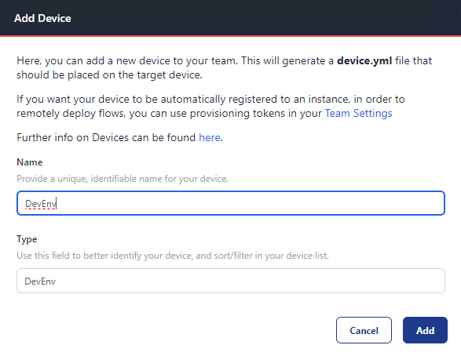
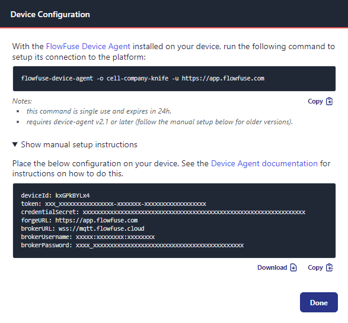
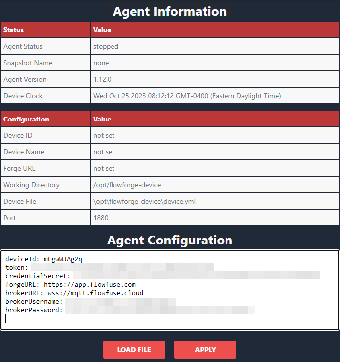
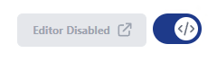
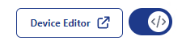
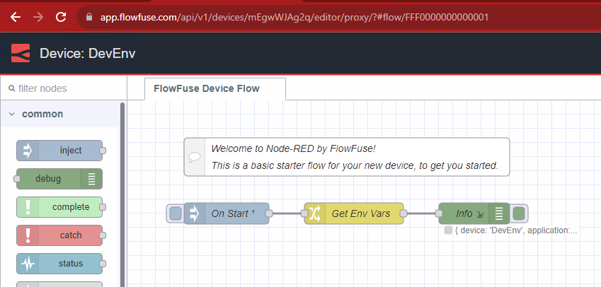

# Developing Flows on Your Device

## Add Device to FlowFuse

### Prerequisites

If you do not already have the device agent installed, follow the [install instructions](./install.md), otherwise, proceed to the next step.

_NOTE: It is good practice to keep your Device Agent up to date. Update instructions are also provided in the link above._


### Step 1: Add a new Device
1. Open your web browser and go to your FlowFuse application page.
2. Navigate to the **Devices** section.
3. Click **Add Device.**
4. Fill in the **Device Name** & **Device Type** and select an **Application**

    
6. Click **Add**
7. You will be presented with a **Device Configuration** that you will need in the next step. _(Do not close this window just yet.)_

    

### Step 2: Start the Device Agent with the Web UI enabled
1. If you have access to a Terminal/Command Prompt and run the following command:
    ```bash
    flowfuse-device-agent --ui --ui-user admin --ui-pass password --ui-port 8081
    ```
    _You can find more details about the Device Agent flags [here](https://flowfuse.com/docs/device-agent/running/)_
2. If the Device Agent is pre-installed on your hardware, follow the manufacturers instructions to start the device agent with the Web UI enabled.
3. Copy the device configuration from the previous step and paste it into the **Agent Configuration** field. 

   

4. Click `Apply.`

Your device is now added to FlowFuse and ready to be used.

## Develop on Device
### Enable Developer Mode
1. Navigate to **Applications** and select the application your device was added to.
2. Go to the **Devices** tab within the application.
3. Locate your newly added device and **click** on your device.
4. Then Click **Developer Mode** toggle button on upper right.

    

5. This will enable editor access for your device.

    

7. Clicking **Device Editor** will launch the editor.

    

## Next Steps

Now you have a device connected to the platform, there are many features you can use to manage and monitor your devices.  Here are a few to get you started:

* [Snapshots](../user/snapshots.md)
* [Pipelines](../user/devops-pipelines.md)
* [Environment Variables](../user/envvar.md)
* [Logs](../user/logs.md)