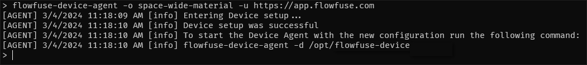

# Developing Flows on Your Device

## Add Device to FlowFuse

### Prerequisites

If you do not already have the device agent installed, follow the [install instructions](./install.md), otherwise, proceed to the next step.

_NOTE: It is good practice to keep your Device Agent up to date. Update instructions are also provided in the link above._

_NOTE: If you prefer to use the Device Agent WEB UI, follow the [Quick Start with Web UI](./quickstart-web-ui.md) guide._

### Step 1: Add a new Device
1. Open your web browser and go to your FlowFuse application page.
2. Navigate to the **Devices** section.
3. Click **Add Device.**
4. Fill in the **Device Name** & **Device Type** and select an **Application**

    
5. Click **Add**
6. You will be presented with a **Device Configuration** that you will need in the next step. _(Do not close this window just yet.)_

    

### Step 2: Connect the Device
1. Open a Terminal/Command Prompt.
2. Paste the command copied from the previous step and run it.

    
3. Start the Device Agent using the command instructed by the device agent output e.g:
   ```bash
   flowfuse-device-agent
   ```

Your device is now connected to FlowFuse and ready to be used.


## Develop on Device
### Enable Developer Mode
1. Navigate to **Applications** and select the application your device was added to.
2. Go to the **Devices** tab within the application.
3. Locate your newly added device and **click** on your device.
4. Then Click **Developer Mode** toggle button on upper right.

    

5. This will enable editor access for your device.

    

6. Clicking **Device Editor** will launch the editor.

    


## Next Steps

Now you have a device connected to the platform, there are many features you can use to manage and monitor your devices.
Here are a few to get you started:

* [Snapshots](../user/snapshots.md)
* [Pipelines](../user/devops-pipelines.md)
* [Environment Variables](../user/envvar.md)
* [Logs](../user/logs.md)