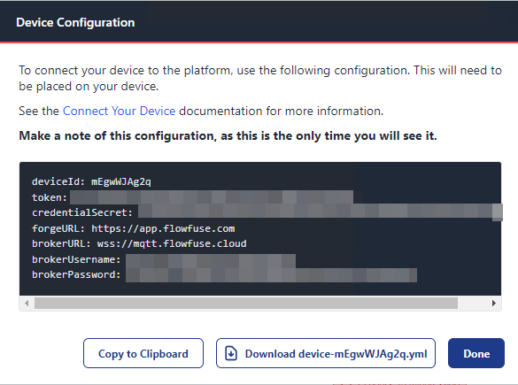
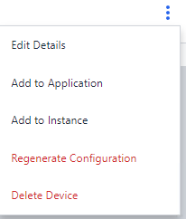
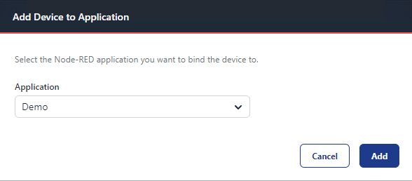
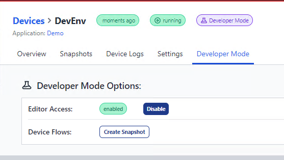
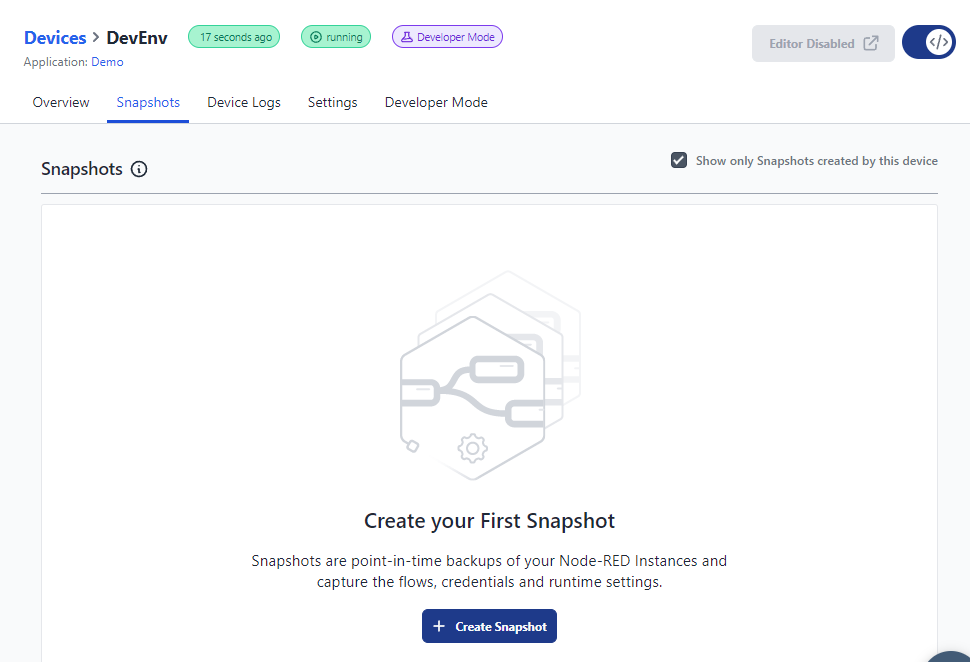
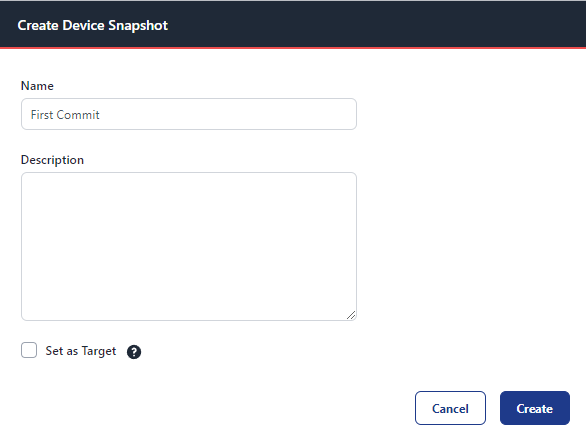
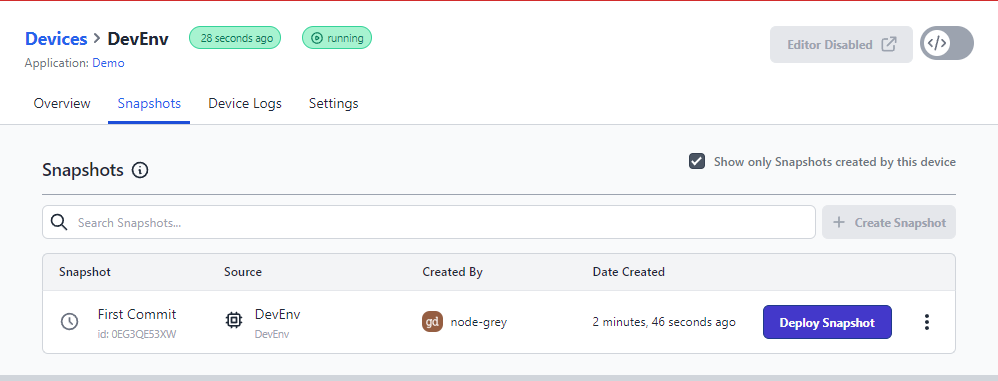
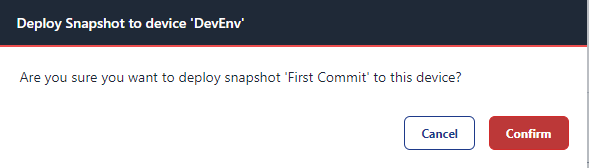

# Developing Flows on Your Device

## Add Device to FlowFuse

### Install Device Agent Software

1. Open your Command Prompt (CMD) as an administrator.
2. Run the following commands in sequence:

Windows:
```bash
mkdir c:\opt\flowforge-device
cd c:\opt\flowforge-device
npm install -g @flowforge/flowforge-device-agent
flowforge-device-agent -w --ui-user admin --ui-pass password --ui-port 8081
```
Linux:
```bash
mkdir /opt/flowforge-device
cd /opt\flowforge-device
npm install -g @flowforge/flowforge-device-agent
flowforge-device-agent -w --ui-user admin --ui-pass password --ui-port 8081
```

Note: The flags used in the command above have the following meanings:
- -w: Run the device agent in web user interface mode.
- --ui-user: Specify the username for the web user interface.
- --ui-pass: Specify the password for the web user interface.
- --ui-port: Specify the port for the web user interface.
- You can find more details about these flags [here](https://flowfuse.com/docs/device-agent/running/).

### Add Device in FlowFuse
1. Open your web browser and go to your FlowFuse application page.
2. Navigate to the **Devices** section.
3. Click **Add Device.**
4. Fill in the **Device Name** and **Device Type,** then click **Add.**


### Configure Device Agent
1. Click **Copy to Clipboard** to copy the device configuration.



2. Open a new browser tab and navigate to localhost:8081 or <<ip of device>>:8081.
3. Paste the copied device configuration into the **Agent Configuration** field. This configuration contains vital information instructing the device on how to communicate with FlowFuse. It's crucial to keep this information secure and not share it with unauthorized individuals.


4. Click `Apply.`

### Link Device to Application
1. Return to the **Devices** section in your FlowFuse application page.
2. Locate your newly added device and click its menu.



3. Choose to add the device to your application and click **Add.**



## Develop on Device
### Enable Developer Mode
1. Navigate to **Applications** and select the application your device was added to.
2. Go to the **Devices** tab within the application.
3. Locate your newly added device.
4. Click **Enable Developer Mode.**


5. Under the **Developer Mode** settings, click **Enable** for **Editor Access.**



6. Access has now been granted to edit the Node-RED instance.


7. Clicking Device Editor will navigate you to a window for edits to your Node-Red instance.


## Snapshots
### Take Device Snapshot
1. Navigate to Devices Menu.
2. Select device that you would like to take a snapshot of.



3. Select **Create Snapshot.**
4. Enter **Name** and **Description** if desired.



5. Click **Create.**

### Restore Device from Snapshot
1. Naviage to Devices Menu.
2. Select the Device needing to be restored.
3. Navigate to Shapshots menu.




4. Hover over the Snapshot desired to be restored from and select **Deploy Snapshot.**



5. Select **Confirm.**