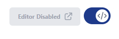
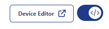
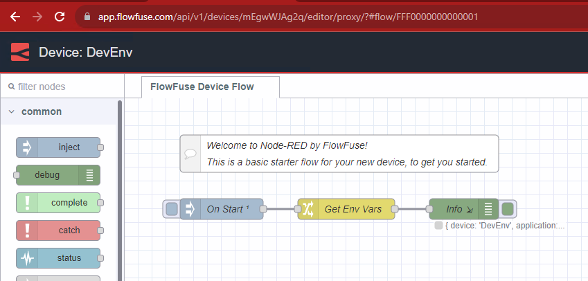
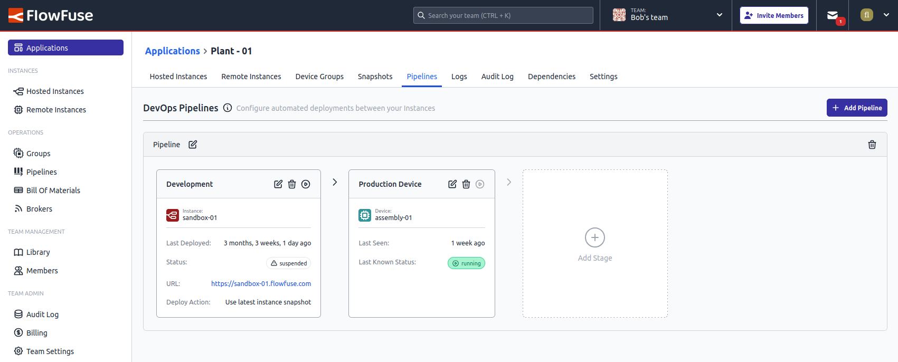

# Quick Start Guide: Device Agent

This guide will walk you through the process of adding a device to FlowFuse, connecting it to the platform, and deploying your Node-RED flows remotely. FlowFuse's Device Agent helps unlock the power of your devices by allowing you to manage and deploy Node-RED flows running on those devices securely and remotely.

## Before you begin

You will need:

 - A terminal or command prompt on the device you wish to install the Agent on
 - A FlowFuse platform account; either on [FlowFuse Cloud](https://app.flowfuse.com) or a self-hosted platform.

If you do not currently have a FlowFuse platform account, this guide will help you set up a trial account on FlowFuse Cloud.

## Step 1: Install the Device Agent

The Device Agent Installer is a one-line command that will:

 - Install Node.js
 - Get your device registered on a FlowFuse platform
 - Configure it to run as a local service

It is the quickest way to get started.

If you already have Node.js v22+ installed, or need to customize the setup, check the [manual installation guide](./install/manual.md).

##### Linux/MacOS

```bash
/bin/bash -c "$(curl -fsSL https://flowfuse.github.io/device-agent/get.sh)" && ./flowfuse-device-agent-installer
```

##### Windows

1. Open a powershell terminal with elevated permission:
  ```bash
# From Windows Run dialog or a terminal window, enter:
powershell -Command "Start-Process 'powershell' -Verb RunAs"
```

2. Run the follow command in the elevated terminal to download and run the installer:
  ```bash
Set-Location $env:USERPROFILE; powershell -c "irm https://flowfuse.github.io/device-agent/get.ps1 | iex"; .\flowfuse-device-agent-installer.exe
```


The installer checks to see if port 1880 is available to use. If it isn't, it will let you know before exiting. This is typically because you already have Node-RED running locally. You can tell the installer to configure its Node-RED to use a different port using the `--port <port>` argument. Pick a different port, for example `1881` and re-run the above command with `--port 1881` added to the end.



By default, the installer will use `/opt/flowfuse-device` (Linux/MacOS) or `c:\opt\flowfuse-device` (Windows) as the install location. To use a different location, use the `--dir` option with the install command. For example, `--dir /path/to/custom/location`.


## Step 2: Follow the installer prompts

The installer will step you through the whole setup process.

It will ask if you are registering a new instance or connecting with a One-Time Code (OTC).

##### Registering a new instance

Select this option if you have not yet registered the instance on your FlowFuse platform.

It will give you a URL to open in your browser where you can register the instance. Once you complete the registration, keep the browser tab open and switch back to the terminal.

##### Connecting with a One-Time Code

If you have already registered the instance on FlowFuse, the platform will have given you a One-Time Code to use when installing the Device Agent.

Enter the code when prompted and the Device Agent will connect.

## Step 3: Import existing flows

The Agent will check common locations for existing Node-RED flows. If it finds any, it will ask if you want to import those flows into your Device Agent managed Node-RED. This makes it easy to migrate an existing Node-RED setup into a fully managed FlowFuse instance. If you want to run an entirely separate instance, you can skip this step.

## Step 4: Setup a system service

The Installer will then setup a system service so the Device Agent automatically runs when the device restarts.

## Step 5: Start editing your flows

Once the Device Agent is running, and Node-RED has started, you can start editing your flows.

If you still have the browser window open from registering the device, it will automatically put the instance into 'Developer Mode' and open up the Node-RED editor.

From there you can start building your applications.

## Deploy Flows to Remote Instances

There are two approaches to deploying flows to your Remote Instances.

- **Developer Mode**: This mode allows you to edit and deploy flows directly from the FlowFuse platform.
- **DevOps Pipelines**: FlowFuse provides [DevOps Pipelines](/docs/user/devops-pipelines.md) as a way of pushing flows from one Hosted Instance/Remote Instance to another (or several in the case of [Device Groups](/docs/user/device-groups.md)). This is the recommended approach if you're pushing from development environments (e.g. remote test instances) out to remote production instances.

### Developer Mode

1. Navigate to **Applications** and select the application your device was added to.
2. Go to the **Remote Instances** tab within the application.
3. Locate your newly added device and **click** on your Remote Instance.
4. Then Click **Developer Mode** toggle button on upper right.

    {data-zoomable}
    _The "Developer Mode" toggle button available on the Device screen_

5. This will enable editor access for your device.

    {data-zoomable}
    _The "Device Editor" button available on the Device screen_

6. Clicking **Device Editor** will launch the editor.

    {data-zoomable}
    _Screenshot of a Node-RED Editor for a Device_

### DevOps Pipelines

{width=750}{data-zoomable}
_Screenshot showing the user interface for creating and running DevOps Pipelines in FlowFuse_

To work with Pipelines, you need at least one other Hosted Instance or Remote Device to push _from_/_to_. You can follow the instructions on setting up a Pipeline and deploying your flows between Hosted Instances/Remote Instances [DevOps Pipelines](/docs/user/devops-pipelines.md).

## Next Steps

Now you have a device connected to the platform, there are many features you can use to manage and monitor your Remote Instances.
Here are a few to get you started:

* [Snapshots](../user/snapshots.md)
* [Pipelines](../user/devops-pipelines.md)
* [Environment Variables](../user/envvar.md)
* [Logs](../user/logs.md)


