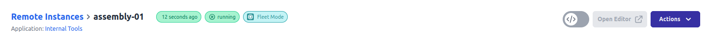

# Quick Start Guide: Device Agent

This guide will walk you through the process of adding a device to FlowFuse, connecting it to the platform, and deploying your Node-RED flows remotely. FlowFuse's Device Agent helps unlock the power of your devices by allowing you to manage and deploy Node-RED flows running on those devices securely and remotely.

{data-zoomable}
_Workflow to onboard new Remote Instances through the FlowFuse Platform and Device Agent_

## Video Walkthrough
This video will walk you through every step from creating a remote instance, installing the Device Agent, and connecting the two. It is focused on the Free tier, but applies to all users.
<iframe width="560" height="315" src="https://www.youtube.com/embed/JFY0s8X5RVo?si=MDgOaO8Iqzmc-KCk" title="YouTube video player" frameborder="0" allow="accelerometer; autoplay; clipboard-write; encrypted-media; gyroscope; picture-in-picture; web-share" referrerpolicy="strict-origin-when-cross-origin" allowfullscreen></iframe>

## Setup & Installation

### Step 1: Register a Remote Instance (On FlowFuse Platform)

1. Open your web browser and go to your FlowFuse application page.
2. Navigate to the **Remote Instances** section.
3. Click **Add Remote Instance.**
4. Fill in the **Name** & **Type** and select an **Application**

    {data-zoomable}{ style="max-width: 600px"; }
    _Screenshot of the dialog form to fill out when registering a Device_
    
5. Click **Add**
6. You will be presented with a **Device Configuration** that you will need in the next step. _(Do not close this window just yet.)_

    {data-zoomable}
    _Screenshot of the dialog shown to a user when a Device is registered_

7. Copy the installation command. You will need it in next step.

### Step 2. Install and Configure the Device Agent (On Device)

1. Open a Terminal/Windows Command Prompt (run elevated[^1]) on the Device.
2. Paste the command you copied from the previous step and execute it.
3. Answer prompts as needed.
4. Installer will set up the runtime and configure the Device Agent, and summarize on successful completion.

    {data-zoomable}
    _Example output in a Terminal showing a device agent successfully installed_

Your device is now connected to FlowFuse and ready to be used.

## Deploy Flows to Remote Instances

There are two approaches to deploying flows to your Remote Instances.

- **Developer Mode**: This mode allows you to edit and deploy flows directly from the FlowFuse platform.
- **DevOps Pipelines**: FlowFuse provides [DevOps Pipelines](/docs/user/devops-pipelines.md) as a way of pushing flows from one Hosted Instance/Remote Instance to another (or several in the case of [Device Groups](/docs/user/device-groups.md)). This is the recommended approach if you're pushing from development environments (e.g. remote test instances) out to remote production instances.

### Developer Mode

1. Navigate to **Applications** and select the application your device was added to.
2. Go to the **Remote Instances** tab within the application.
3. Locate your newly added device and **click** on your Remote Instance.
4. Then Click **Developer Mode** toggle button on upper right.

    {data-zoomable}
    _The "Developer Mode" toggle button available on the Device screen_

5. This will enable editor access for your device.

    {data-zoomable}
    _The "Device Editor" button available on the Device screen_

6. Clicking **Device Editor** will launch the editor.

    {data-zoomable}
    _Screenshot of a Node-RED Editor for a Device_

### DevOps Pipelines

{width=750}{data-zoomable}
_Screenshot showing the user interface for creating and running DevOps Pipelines in FlowFuse_

To work with Pipelines, you need at least one other Hosted Instance or Remote Device to push _from_/_to_. You can follow the instructions on setting up a Pipeline and deploying your flows between Hosted Instances/Remote Instances [DevOps Pipelines](/docs/user/devops-pipelines.md).

## Next Steps

Now you have a device connected to the platform, there are many features you can use to manage and monitor your Remote Instances.
Here are a few to get you started:

* [Snapshots](../user/snapshots.md)
* [Pipelines](../user/devops-pipelines.md)
* [Environment Variables](../user/envvar.md)
* [Logs](../user/logs.md)

[^1]: Run `powershell -Command "Start-Process 'cmd' -Verb runAs` to launching an elevated command prompt window (e.g. as an admin user)