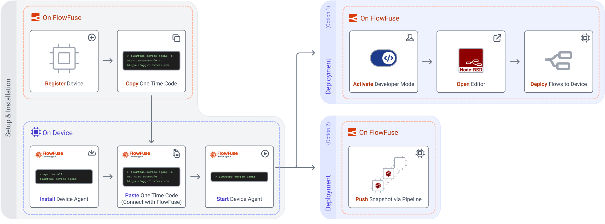
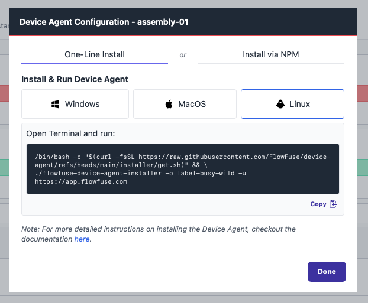
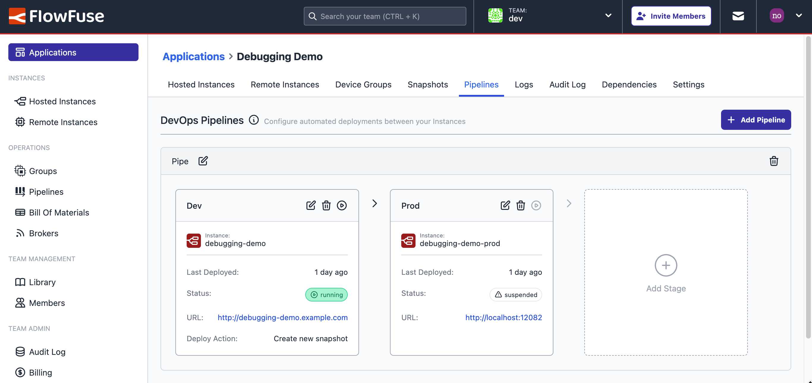

# Quick Start Guide: Device Agent

This guide will walk you through the process of adding a device to FlowFuse, connecting it to the platform, and deploying your Node-RED flows remotely. FlowFuse's Device Agent helps unlock the power of your devices by allowing you to manage and deploy Node-RED flows running on those devices securely and remotely.

{data-zoomable}
_Workflow to onboard new Edge Devices through the FlowFuse Platform and Device Agent_

## Setup & Installation

### Step 1: Install Device Agent (On Device)

NodeJS version 18 is supported but version 20 or later is recommended. However, if necessary, device agent version 2.8 does support NodeJS versions 14 and 16.

For full install instructions, follow the [install instructions here](/docs/device-agent/install.md).

#### Linux/MacOS

```bash
sudo npm install -g @flowfuse/device-agent
```

#### Windows

Issue the below command in an elevated command prompt:

```bash
npm install -g @flowfuse/device-agent
```

### Step 2: Register Device (On FlowFuse)

1. Open your web browser and go to your FlowFuse application page.
2. Navigate to the **Devices** section.
3. Click **Add Device.**
4. Fill in the **Device Name** & **Device Type** and select an **Application**

    {data-zoomable}
    _Screenshot of the dialog form to fill out when registering a Device_
    
5. Click **Add**
6. You will be presented with a **Device Configuration** that you will need in the next step. _(Do not close this window just yet.)_

    {data-zoomable}
    _Screenshot of the dialog shown to a suer when a Device is registered_

### Step 3: Connect the Device (On Device)

1. Open a Terminal/Command Prompt on the Device.
2. Paste the command presented when you registered your Device, and run it.

    {data-zoomable}
    _Example output in a Terminal showing a device agent successfully connecting to the FlowFuse Platform_

### Step 4: Start the Device Agent (On Device)

1. Start the Device Agent using the command instructed by the device agent output e.g:

   ```bash
   flowfuse-device-agent
   ```

Your device is now connected to FlowFuse and ready to be used.

## Deploy Flows to Device

There are two approaches to deploying flows to your Devices.

- **Developer Mode**: This mode allows you to edit and deploy flows directly from the FlowFuse platform.
- **DevOps Pipelines**: FlowFuse provides [DevOps Pipelines](/docs/user/devops-pipelines.md) as a way of pushing flows from one Instance/Device to another (or several in the case of [Device Groups](/docs/user/device-groups.md)). This is the recommended approach if you're pushing from development environments (e.g. test devices) out to production devices.

### Developer Mode

1. Navigate to **Applications** and select the application your device was added to.
2. Go to the **Devices** tab within the application.
3. Locate your newly added device and **click** on your device.
4. Then Click **Developer Mode** toggle button on upper right.

    {data-zoomable}
    _The "Developer Mode" toggle button available on the Device screen_

5. This will enable editor access for your device.

    {data-zoomable}
    _The "Device Editor" button available on the Device screen_

6. Clicking **Device Editor** will launch the editor.

    {data-zoomable}
    _Screenshot of a Node-RED Editor for a Device_

### DevOps Pipelines

{width=750}{data-zoomable}
_Screenshot showing the user interface for creating and running DevOps Pipelines in FlowFuse_

To work with Pipelines, you need at least one other Instance or Device to push _from_/_to_. You can follow hte instructions on setting up a Pipeline and deploying your flows between Instances/Devices [DevOps Pipelines](/docs/user/devops-pipelines.md).

## Next Steps

Now you have a device connected to the platform, there are many features you can use to manage and monitor your devices.
Here are a few to get you started:

* [Snapshots](../user/snapshots.md)
* [Pipelines](../user/devops-pipelines.md)
* [Environment Variables](../user/envvar.md)
* [Logs](../user/logs.md)