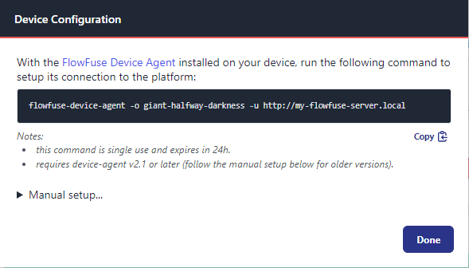
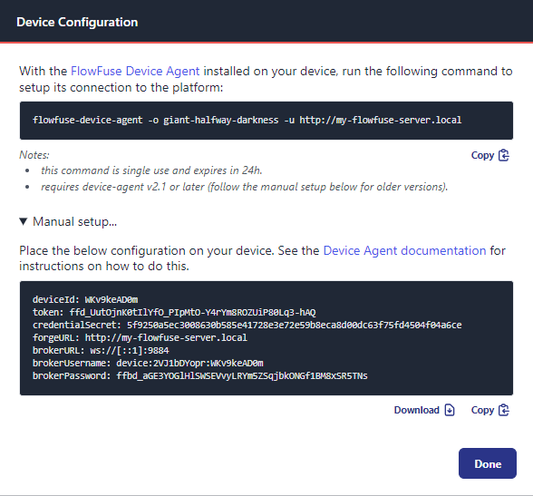

# Register your Device

To connect a device to FlowFuse, it needs a set of credentials and configuration information.

There are two types of configurations to choose from:

* **Device Configuration**: for connecting a single device to the platform
* **Provisioning Configuration**: for setting up one or more devices to automatically register themselves on the platform

### Generating "Device Configuration" 
_for a single device_

1. Go to your teams's **Devices** page.
2. Click the **Add Device** button.
3. You will be prompted to give the device a **Name**, an optional **Type** and to chose which **Application**, if any, the device should be assigned to.
   * 
   * The **Type** field can be used to record additional meta information about the device.
   * If you do not wish to assign the device to an **Application** at this time, you can do so later.
4. Click **Add**

Once the device has been registered, you will be shown the **Device Configuration** dialog which
contains all the information needed to connect the device to the platform.

By default, you are offered the [Setup command](#setup-command-method) method that was introduced in FlowFuse V2.1.


For older versions of the device agent, you can expand the the **Manual Setup** section
and use the configuration data with the [Copy](#copy-method) or the [Download](#download-method) methods instead.


Repeat these steps for each device you want to connect to the platform.


### Generating "Provisioning Configuration" 
_for automatic registration of one or more devices_

1. Go to your teams's **Settings** page.
2. Open the **Device** tab.
2. Click the **Create Provisioning Token** tab.
3. You will be prompted to give the token a **name** and to chose what **instance**, if any, the device should be assigned to.
4. Click **Create**

Once the Provisioning Token has been created, you will be shown the 
**Device Provisioning Configuration** dialog. This is the only time the 
platform will show you this information. 
Make sure to take a copy or use the **Download** button to save
the configuration file locally.

## Connect the device

### Install the configuration

Before you can connect a device to the platform, the device must have
a **Device Configuration** file or a **Device Provisioning Configuration** 
file present in its working directory. There are three ways to do this:
1. Copy the Setup command and run it in a terminal window on the device.
2. Copy the configuration file to the device using its built in Web UI.
   * _The Device Agent must be running and the command line flag for the Web UI must be enabled._
   * _See [Command Line Options](./running.md#device-agent-command-line-options) for more information._
3. Download the configuration file  into the device's 
[Working Directory](./install.md#working-directory).


### Setup command method

The Setup command method was introduced in FlowFuse V2.1. This is the fastest way to connect a device to the platform.

1. Copy the **Setup** command to the clipboard.
2. Open a terminal window to the device and paste or type in the command.
3. The device agent connect to the platform, retrieve the device configuration.

Upon completion, the terminal window will report that the device has connected to the platform and 
will output a new `command` for you to use to start the device agent with the new configuration.

NOTES
* The Setup command is only valid for 24h. If you do not use it within this time, you will need to [regenerate](#regenerating-configurations) it.
* The 3 word One-Time-Code (OTC) contained in the Setup command is single use and is deleted immediately upon use.

### Copy method

If the Device Agent is running with the Web UI enabled, you can download the
configuration file to the device using the Web UI. This is useful if you don't
have direct access to the device's file system. Once the configuration file is
downloaded, the device agent will automatically restart and load the configuration.

### Download method

Place the **Device Configuration** or **Device Provisioning Configuration** file on the device
in the [Working Directory](./install.md#working-directory)

By default, the device agent expects the configuration file to be named `device.yml`, if not, you will need to start the device agent with the `-c` [Command Line Option](./running.md#device-agent-command-line-options) and specify the path of the configuration file.

The agent can then be started with the command: [^global-install]

```bash
flowfuse-device-agent
```

You will see the device start and perform a 'call-home' where it connects back
to the platform to check what it should be running.


#### Additional Information

If you copy or download a **Device Provisioning Configuration** file to the device,
you will see the device start and perform a 'call-home' where it connects back
to the platform to auto register itself in the team devices.  If successful,
the real **Device Configuration** is generated and downloaded to the device. 
The original **Provisioning Configuration** will be overwritten meaning subsequent 
runs will not need to perform the auto registration again.

## Assign the device

The next step is to assign the device to a Node-RED instance or application.

### Assign to Node-RED instance

To assign to a Node-RED instance:

1. Go to your teams's **Devices** page.
2. Open the dropdown menu to the right of the device you want to assign and
   select the **Add to Instance** option.
3. Select the instance in the dialog and click **Add** to continue.

### Assign the device to an Application

If the device was not assigned to an application when it was registered, the next step
is to assign it to a FlowFuse Application

1. Go to your teams's **Devices** page.
2. Open the dropdown menu to the right of the device you want to assign and
   select the **Add to Application** option.
3. Select the application in the dialog and click **Add** to continue.

### Remove from Node-RED instance

To remove the device from a Node-RED instance:

1. Go to your teams's **Devices** page.
2. Open the dropdown menu to the right of the device you want to remove and
   select the **Remove from Instance** option.
3. Confirm the action by clicking the **Remove** option.

The device will stop running the current Node-RED flows. It will then wait
until it is assigned to another instance.

### Remove a device from an Application

To remove the device from an application:

1. Go to your teams's **Devices** page.
2. Open the dropdown menu to the right of the device you want to remove and
   select the **Remove from Application** option.
3. Confirm the action by clicking the **Remove** option.

The device will stop running the current Node-RED flows. It will then wait
until it is assigned to another application or instance.

## Regenerating Configurations

To regenerate device configurations:

1. Go to your team's or instance's **Devices** page.
2. Open the dropdown menu to the right of the device and select the
   **Regenerate Configuration** option.
3. You will need to confirm this action as the existing configuration will be
   immediately revoked. If the device tries to use the old configuration it will
   fail to connect and will delete its local copy of the snapshot it was
   running. Click **Regenerate Configuration** to continue.

You will then be shown the **Device Configuration** dialog again with a new
setup command and the manual configuration to copy or download.

## Deleting a device

To delete a device:

1. Go to your team's or instance's **Devices** page.
2. Open the dropdown menu to the right of the device and select the
   **Delete device** option.
3. Confirm the action by clicking the **Delete** option.

The next time the device attempts to connect to the platform it will find it is
no longer authorised and will stop and delete its local copy of the flows it was running.

## Node-RED Settings

Most Node-RED settings are managed by the platform as part of deploying an instance
to the device. However some settings can be overridden locally on the device.

### HTTPS configuration

*Available in Device Agent 0.10+*

The `https` configuration option in `device.yml` can be used to enable HTTPS within Node-RED. The values
are passed through to the [Node-RED `https` setting](https://nodered.org/docs/user-guide/runtime/configuration).

The `ca`, `key` and `cert` properties can be used to provide custom certificates and keys.
The values should be set to the contents of the certificate/key.

Alternatively, the properties `caPath`, `keyPath` and `certPath` can be used instead
to provide absolute paths to files containing the certificates/keys.

```yml
https:
   keyPath: /opt/flowfuse-device/certs/key.pem
   certPath: /opt/flowfuse-device/certs/cert.pem
   caPath: /opt/flowfuse-device/certs/ca.pem
```

### `httpStatic` configuration

*Available in Device Agent 0.10+*

This option can be used to serve content from a local directory.

If set to a path, the files in that directory will be served relative to `/`.

```yml
httpStatic: /opt/flowfuse-device/static-content
```

It is also possible to configure it with a list of directories and the corresponding
path they should be served from.

```yml
httpStatic:
  - path: /opt/flowfuse-device/static-content/images
    root: /images
  - path: /opt/flowfuse-device/static-content/js
    root: /js
```

## Troubleshooting

If you have problems with the device agent the first thing to do is to enable the verbose logging mode.

To do this add a `-v` to the command line. This will present a lot more information about what the agent is doing.
It will show that is has connected to the FlowFuse instance and every time it checks in, it will also log all the 
local HTTP requests made when accessing the Node-RED Editor via the FlowFuse application.
