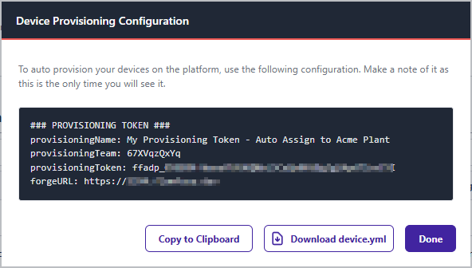

# Register your Remote Instance

To connect your hardware to FlowFuse, you will need to:

1. Install the Device Agent on your hardware
2. Add a "Remote Instance" to FlowFuse, via the FlowFuse UI
3. Connect your hardware to FlowFuse by configuring the Device Agent

The best configuration to use will depend on how many Remote Instances you want to connect:

* **[Single Instance Registration](#single-remote-instance-registration)**: for connecting a single Remote Instance, or a small number of Remote Instances, to the platform.
* **[Bulk Registration](#bulk-registration)**: for setting up one or more Remote Instances which will automatically register themselves to the platform when the device agent is run.

## Single Remote Instance Registration

For a single Remote Instance, or small batch of Remote Instances, you can manually register each Remote Instance individually, naming each Remote Instance and assigning it to an application.

### Add Remote Instance

1. Go to your teams's **Remote Instances** page.
2. Click the **Add Remote Instance** button.
3. You will be prompted to give the Remote Instance a **Name**, an optional **Type** and to chose which **Application**, if any, the Instance should be assigned to.
   * 
   * The **Type** field can be used to record additional meta information about the Remote Instance.
   * If you do not wish to assign the Remote Instance to an **Application** at this time, you can do so later.
4. Click **Add**

### Connect Hardware to FlowFuse

Once the Remote Instance has been added in the FlowFuse UI, you will be shown the **Device Agent Configuration** dialog which
contains all the information needed to connect your hardware to the FlowFuse platform.

#### Quick Connect

By default, you are offered the [Setup command](#setup-command) method that was introduced in FlowFuse V2.1, and provides a one-time passcode to automatically connect the hardware to FlowFuse.


Running this command on hardware with the Device Agent installed will automatically configure it and connect it to FlowFuse.

#### Manual Setup

For older versions of the device agent, you can expand the the **Manual Setup** section
and use the configuration data with the [Device Agent Web UI](#device-agent-web-ui) or the [Manual Download](#manual-download) methods instead._

Repeat these steps for each Remote Instance you want to connect to the platform.

## Bulk Registration

If you have dozens, or hundreds of pieces of hardware to connect, you can use the **Provisioning Configuration** method.

This approach provides you with a single "Provisioning Token" for all of your Remote Instances. When passed to the `flowfuse-device-agent`, this token will automatically register your Remote Instances with the relevant instance or application. There is no need to "Add Remote Instance" each time, as is the case with the [Single Device Registration](#single-device-registration) method.

### Generating "Provisioning Configuration"

1. Go to your teams's **Settings** page.
2. Open the **Remote Instance** tab.
2. Click the **Create Provisioning Token** tab.
3. You will be prompted to give the token a **name** and to chose what **instance**, if any, the Remote Instance should be assigned to.
4. Click **Create**

Once the Provisioning Token has been created, you will be shown the 
**Device Provisioning Configuration** dialog. This is the only time the 
platform will show you this information.



Make sure to take a copy or use the **Download** button to save
the configuration file locally.

## Connecting your Hardware

### Install the configuration

The Device Agent requires information about the FlowFuse Platform, and how to connect. This comes in the form of a a **Device Configuration** file or a **Device Provisioning Configuration** 
file present in its working directory

There are three methods by which you can get this configuration onto your hardware:

- **[Quick Connect](#setup-command):** Copy the Setup Command (with one-time passcode) and run it in a terminal window on the hardware. Your hardware will then automatically configure itself.
- **[Device Agent Web UI](#device-agent-web-ui):** Copy the configuration file (`device.yml`) to your hardware using its built in Web UI.
   * _The Device Agent must be running and the [command line flag](./running.md#device-agent-command-line-options) for the Web UI must be enabled._
- **[Manual Download](#manual-download):** Download the configuration file directly into the hardware's [Working Directory](./install.md#working-directory).

### Methods

#### Quick Connect

The Quick Connect method was introduced in FlowFuse v2.1. This is the fastest way to connect your hardware to the platform.

When registering your hardware you would have been presented the following dialog, with a one-time-passcode that the Device Agent can use to retrieve it's configuration:


If you're no longer able to see that dialog, you can regenerate the configuration by following the [Regenerating Configurations](#regenerating-configurations) steps, or clicking **"Finish Setup"** on the Remote Instance's page:


When the quick connect command has been run, the terminal window will report that the Remote Instance has connected to the platform and 
will output a new `command` for you to use to start the Remote Instance agent with the new configuration.

NOTES
* The Setup command is only valid for 24h. If you do not use it within this time, you will need to [regenerate](#regenerating-configurations) it.
* The 3 word One-Time-Code (OTC) contained in the Setup command is single use and is deleted immediately upon use.

#### Device Agent Web UI


If the Device Agent is running [with the Web UI enabled](docs/device-agent/running.md#device-agent-command-line-options), you can download the
configuration file to the Remote Instance using the Web UI. This is useful if you don't
have direct access to the Remote Instance's file system. Once the configuration file is
downloaded, the device agent will automatically restart and load the configuration.

#### Manual Download

Place the **Device Configuration** or **Device Provisioning Configuration** file onto your hardware.
in the [Working Directory](./install.md#working-directory)

By default, the device agent expects the configuration file to be named `device.yml`, if not, you will need to start the device agent with the `-c` [Command Line Option](./running.md#device-agent-command-line-options) and specify the path of the configuration file.

The agent can then be started with the command: [^global-install]

```bash
flowfuse-device-agent
```

You will see the Device Agent start and perform a 'call-home' where it connects back
to the platform to check what it should be running.


#### Additional Information

If you copy or download a **Device Provisioning Configuration** file to your hardware,
you will see the Device Agent start and perform a 'call-home' where it connects back
to the platform to auto register itself in the Team's Remote Instances.  If successful,
the real **Device Configuration** is generated and downloaded to the device. 
The original **Provisioning Configuration** will be overwritten meaning subsequent 
runs will not need to perform the auto registration again.

## Assign the Remote Instance

The next step is to assign the device to a Node-RED instance or application. Note, that if
you've followed [Single Device Registration](#single-device-registration) or 
[Bulk Registration](#bulk-registration) to register your device, it will
automatically be assigned to an Application or Instance.

### Applications (Recommended)

#### Assign to Application

This step will permit you to push Snapshots to your Remote Instance via [DevOps Pipelines](/docs/user/devops-pipelines.md), or via a [Target Snapshot](/docs/user/snapshots/#application-owned-devices) from the Application.

1. Go to your teams's **Remote Instances** page.
2. Open the dropdown menu to the right of the Remote Instance you want to assign and
   select the **Add to Application** option.
3. Select the application in the dialog and click **Add** to continue.

#### Remove from Application

To remove the Remote Instance from an application:

1. Go to your teams's **Remote Instances** page.
2. Open the dropdown menu to the right of the Remote Instance you want to remove and
   select the **Remove from Application** option.
3. Confirm the action by clicking the **Remove** option.

The Remote Instance will stop running the current Node-RED flows. It will then wait
until it is assigned to another application or instance.

#### Bulk Assigning Remote Instances to an Application

If you have a large number of Remote Instances to assign to an application, you can use do them all at once:

1. Select the Remote Instances you want to assign and open the **Actions** dropdown menu.
2. Select the **Move to Application** option and then select the application or instance you want to assign the Remote Instances to.
3. Click **Move** to continue.

##### Details:
* Remote Instances that are already assigned to the chosen application will not be changed or updated.
* For any Remote Instance that is moved by the operation:
   * Remote Instances moved by the operation will have their target snapshot cleared, device group membership cleared and will be sent an update command.
   * Remote Instances in Fleet Mode will automatically apply the changes resulting in Remote Instances restarting with the basic starter snapshot flows.
   * Remote Instances in [Developer Mode](/docs/device-agent/quickstart/#developer-mode) will continue to run their current flows until they are switched to fleet mode at which point they will update accordingly.

NOTE: If you wish to keep the flows currently running on the Remote Instance, it must be in developer mode at the time of operation. Once the Remote Instance is moved, create a new snapshot with the "Set as Target" option checked.

### Hosted Instances

This method permits you to set a [Target Snapshot](/docs/user/snapshots/#instance-owned-devices) from the Hosted Instance to the Remote Instance. Note though, you can only push nodes and flows that are supported by _both_ Hosted and Remote Instances. The best use case for Remote Instances are generally to be assigned by an Application instead.

#### Assign to Hosted Instance

1. Go to your teams's **Remote Instances** page.
2. Open the dropdown menu to the right of the Remote Instance you want to assign and
   select the **Add to Hosted Instance** option.
3. Select the instance in the dialog and click **Add** to continue.

### Remove from Hosted Instance

To remove the Remote Instance from a Node-RED instance:

1. Go to your teams's **Remote Instances** page.
2. Open the dropdown menu to the right of the Remote Instance you want to remove and
   select the **Remove from Hosted Instance** option.
3. Confirm the action by clicking the **Remove** option.

The Remote Instance will stop running the current Node-RED flows. It will then wait
until it is assigned to another Hosted Instance or Application

### Bulk Assigning Remote Instances to a Hosted Instance

If you have a number of Remote Instance to assign to an instance, you can do them all at once.
1. Select the Remote Instances you want to assign and open the **Actions** dropdown menu adjacent to the **Add Remote Instance** button.
2. Select the **Move to Instance** option and then select the instance you want to assign the Remote Instances to.
3. Click **Move** to continue.

#### Details:
* Remote Instances that are already assigned to the chosen instance will not be changed or updated.
* For any Remote Instance that is moved by the operation:
   * If the chosen instance has a target snapshot set, the newly assigned Remote Instances will inherit this.
   * If the chosen instance does not have a target snapshot set, newly assigned Remote Instances will have their target snapshot cleared.
   * Remote Instances in fleet mode will automatically apply the changes.
   * Remote Instances in developer mode will continue to run their current flows until they are switched to fleet mode at which point they will update accordingly.

### Bulk Removing Remote Instances from an Application or Instance

If you have a number of Remote Instances to remove from an application or instance, you can do them all at once.
1. Select the Remote Instances you want to remove and open the **Actions** dropdown menu adjacent to the **Add Remote Instance** button.
2. Select the **Unassign** option.
   1. Depending on where you are viewing Remote Instances, this may say "Remove from Application" or "Remove from Instance".
3. Confirm the action by clicking **Unassign**.

#### Details:
* Remote Instances that are already unassigned will not be changed or updated.
* For any Remote Instance that was previously assigned to an application or instance:
   * Remote Instances in developer mode will be switched to fleet mode.
   * Remote Instances will have their target snapshot and Remote Instance group membership cleared.
   * Remote Instances will be informed of the changes resulting in their flows being cleared and the Remote Instance entering a stopped state waiting for a new assignment.

## Regenerating Configurations

To regenerate Remote Instance configurations:

1. Go to your team's or instance's **Remote Instances** page.
2. Open the dropdown menu to the right of the Remote Instance and select the
   **Regenerate Configuration** option.
3. You will need to confirm this action as the existing configuration will be
   immediately revoked. If the Remote Instance tries to use the old configuration it will
   fail to connect and will delete its local copy of the snapshot it was
   running. Click **Regenerate Configuration** to continue.

You will then be shown the **Remote Instance Configuration** dialog again with a new
setup command and the manual configuration to copy or download.

## Deleting a Remote Instance

To delete a Remote Instance:

1. Go to your team's or instance's **Remote Instances** page.
2. Open the dropdown menu to the right of the Remote Instance and select the
   **Delete Remote Instance** option.
3. Confirm the action by clicking the **Delete** option.

The next time the Remote Instance attempts to connect to the platform it will find it is
no longer authorised and will stop and delete its local copy of the flows it was running.

## Node-RED Settings

Most Node-RED settings are managed by the platform as part of deploying an instance
to the Remote Instance. However some settings can be overridden locally on the Remote Instance.

### HTTPS configuration

*Available in Device Agent 0.10+*

The `https` configuration option in `device.yml` can be used to enable HTTPS within Node-RED. The values
are passed through to the [Node-RED `https` setting](https://nodered.org/docs/user-guide/runtime/configuration).

The `ca`, `key` and `cert` properties can be used to provide custom certificates and keys.
The values should be set to the contents of the certificate/key.

Alternatively, the properties `caPath`, `keyPath` and `certPath` can be used instead
to provide absolute paths to files containing the certificates/keys.

```yml
https:
   keyPath: /opt/flowfuse-device/certs/key.pem
   certPath: /opt/flowfuse-device/certs/cert.pem
   caPath: /opt/flowfuse-device/certs/ca.pem
```

### `httpStatic` configuration

*Available in Device Agent 0.10+*

This option can be used to serve content from a local directory.

If set to a path, the files in that directory will be served relative to `/`.

```yml
httpStatic: /opt/flowfuse-device/static-content
```

It is also possible to configure it with a list of directories and the corresponding
path they should be served from.

```yml
httpStatic:
  - path: /opt/flowfuse-device/static-content/images
    root: /images
  - path: /opt/flowfuse-device/static-content/js
    root: /js
```

## Troubleshooting

If you have problems with the device agent the first thing to do is to enable the verbose logging mode.

To do this add a `-v` to the command line. This will present a lot more information about what the agent is doing.
It will show that is has connected to the FlowFuse instance and every time it checks in, it will also log all the 
local HTTP requests made when accessing the Node-RED Editor via the FlowFuse application.
