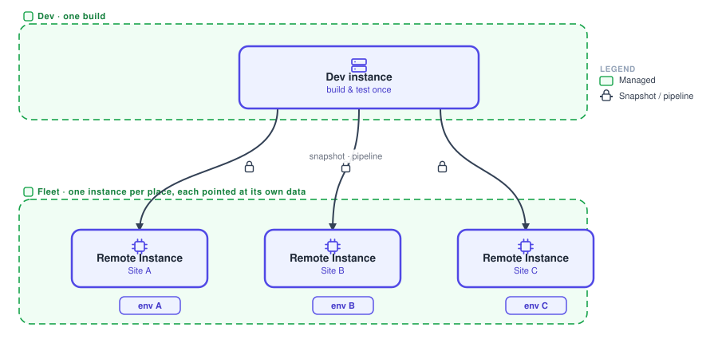
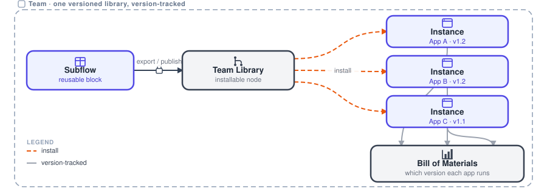

# App delivery methods

Two different units of code, delivered two ways. You can ship the whole app, a complete versioned project promoted through environments. Or you can publish one reusable piece, a package the whole team installs and upgrades in one place. Pick by what you are shipping: the app, or a part of it.

## Whole app

Snapshots and pipelines: promote a complete, versioned project through dev, staging and production, out to every place that runs it.

{data-zoomable}

Take the whole app, every flow, setting and dependency, as a versioned [snapshot](/docs/user/snapshots/). Then promote that one controlled build through pipeline stages to every place that should run it.

**Use it when** you are shipping a complete application and every site should run the same, controlled version.

A [pipeline](/docs/user/devops-pipelines/) promotes a snapshot from dev to staging to production. Each target is parameterised by its own environment variables, so one controlled build serves every site.

**Major components**:

- **Snapshot**: the whole app, frozen as one versioned build.
- **Pipeline**: promotes that snapshot through dev, staging and production.
- **Dev instance**: where you build and test the project.
- **Remote and Hosted Instances**: the fleet each snapshot rolls out to. See the [Device Agent](/docs/device-agent/) for how a Remote Instance connects.

**Where config and data live**:

- **Config**: each target is parameterised by its own [environment variables](/docs/user/envvar/).
- **Rollout**: [Device Groups](/docs/user/device-groups/) plus pipeline promotion, so one controlled build reaches many places.

## Pieces

Subflow export: publish one piece as a package the team installs, like a shared library.

{data-zoomable}

Package a single piece of a flow, a block of logic or UI, as a reusable subflow. Publish it to the [Team Library](/docs/user/shared-library/) as an [installable node](/docs/user/custom-npm-packages/) that other apps pull in, instead of copying code between projects.

**Use it when** a part of an app should be reused across many apps and upgraded in one place. This is a shared library, not a whole application.

There are two routes. The subflow can travel as importable JSON, or it can be published to the Team Library as an installable package with an example flow. Apps install it like a library dependency, and the [Bill of Materials](/docs/user/bill-of-materials/) tracks every version in use.

**Major components**:

- **Subflow**: the one reusable piece you package.
- **Team Library**: the catalogue you publish the package to.
- **Instances**: the apps that install and run the piece.
- **Bill of Materials**: tracks which version each app runs.

**Where config and data live**:

- **Config**: the subflow's instance properties, or the environment where it is installed.
- **Distribution**: publish once to the Team Library, and apps install and upgrade from it, like a library.

## A note on separate servers

Dev and production may sit on separate servers, with dev in IT or the cloud and production in OT or air gapped. A GitHub bridge carries the same versioned code across that boundary. That is an [architecture decision](/docs/flowfuse-guide/architectures/).
