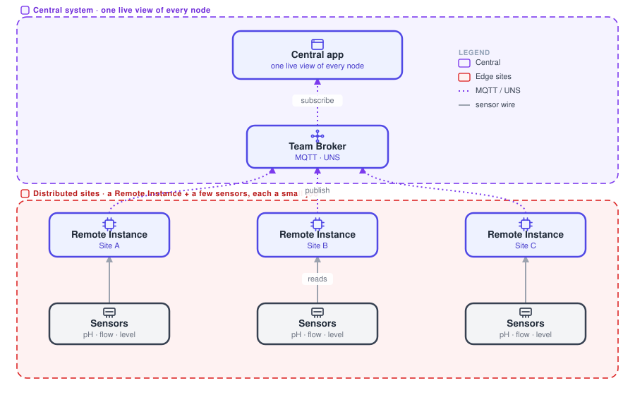
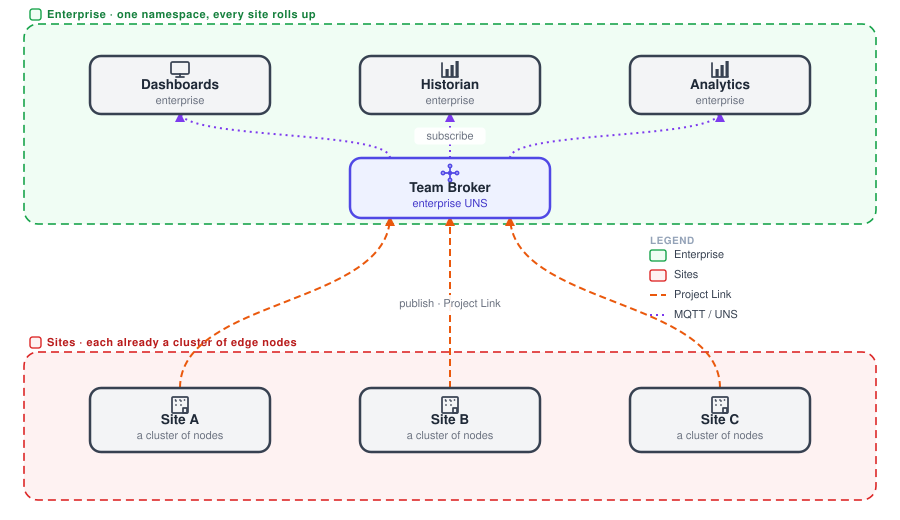

# IIoT architectures

Distributed edge nodes, each reading a few sensors and doing one small job, feeding one central system. No single node does much on its own. The value is the large-scale live picture that many small nodes add up to.

## Distributed edge

{data-zoomable}

This is the IIoT shape. Many distributed [Remote Instances](/docs/device-agent/), each reading just a few sensors and doing one small job, publish to a central [Team Broker](/docs/user/teambroker/). One central app subscribes and sees every node at once. Each node is small, and the value is the large-scale live picture they add up to. Think water-quality monitoring across dozens of pump stations.

**Use it when** you have lots of small, spread-out measurement points that only pay off when aggregated into one live view.

## Across many sites

{data-zoomable}

Scale the same pattern across sites. Each site, itself a cluster of edge nodes, publishes into one enterprise namespace over [Project Link](/docs/user/projectnodes/), with no inbound ports. A single Team Broker carries every site's live data, and enterprise dashboards, historians and analytics subscribe across all of them.

**Use it when** the distributed-edge pattern spans multiple plants or geographies that must roll up to one enterprise view.

Where does the data live in each of these? That is the [data plane](/docs/flowfuse-guide/data-plane/).
