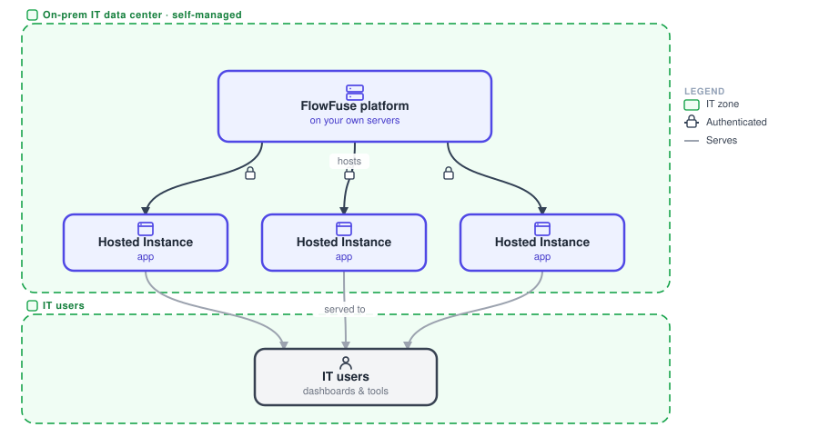
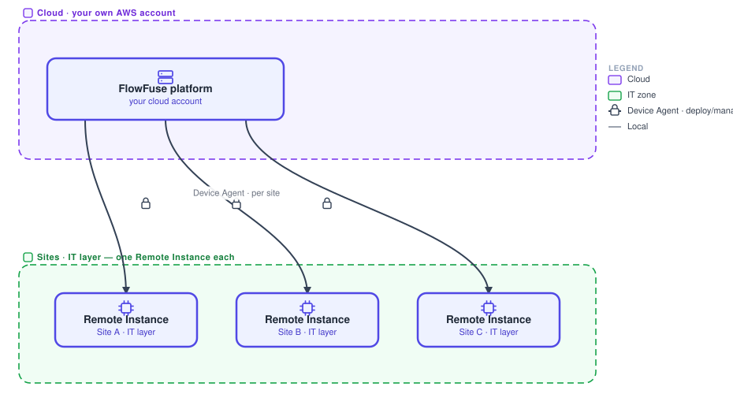
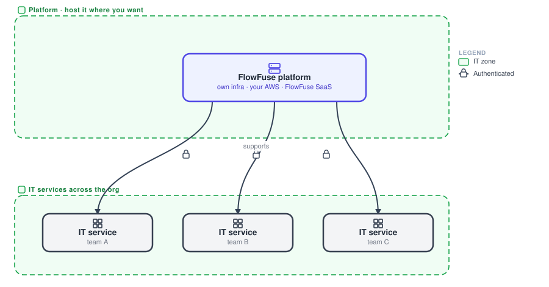
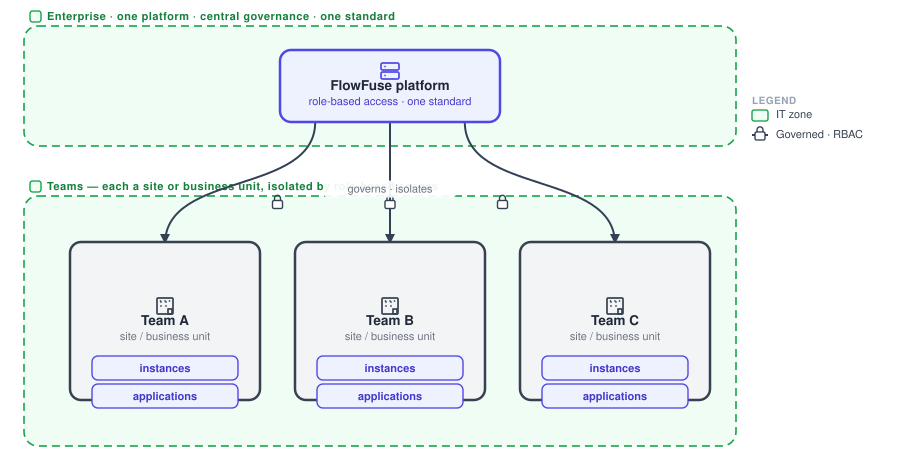

# IT architectures

How FlowFuse deploys for IT, hosting the platform and serving the wider organisation. Read each diagram bottom-up: the platform above, the instances and services it serves below.

## On-prem IT

{data-zoomable}

The whole FlowFuse platform runs on the company's own servers in their IT data center. It hosts the apps as [Hosted Instances](/docs/user/concepts/) and serves them to IT users. Nothing leaves the building unless you choose to connect it.

**Use it when** IT wants to own and run the platform entirely in-house, on their own infrastructure.

## Cloud + per-site

{data-zoomable}

The FlowFuse platform runs in the company's own cloud account (for example AWS) and deploys and manages a [Remote Instance](/docs/device-agent/) in each site's IT layer via the Device Agent. The cloud platform governs and deploys. Each site's instance runs locally and keeps working on its own even if the link drops.

**Use it when** the platform lives in your cloud, but each site needs its own instance in its IT layer.

## Scaled-out, hosting choice

{data-zoomable}

One FlowFuse platform supports IT services across the whole organisation, and you choose where it runs: your own infrastructure, your own AWS, or FlowFuse's SaaS. Same platform, same apps, wherever it is hosted.

**Use it when** you are supporting IT broadly and want the freedom to host the platform on-prem, in your cloud, or as SaaS.

## Enterprise governance

{data-zoomable}

One FlowFuse platform serves the whole company. Each site or business unit is its own team, with its own instances and applications, isolated by role-based access and unified under central governance and one standard.

**Use it when** you need central governance and one standard across many sites, with each team's work kept separate.
