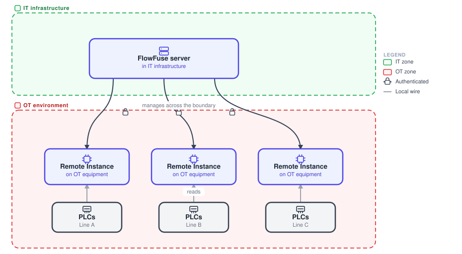
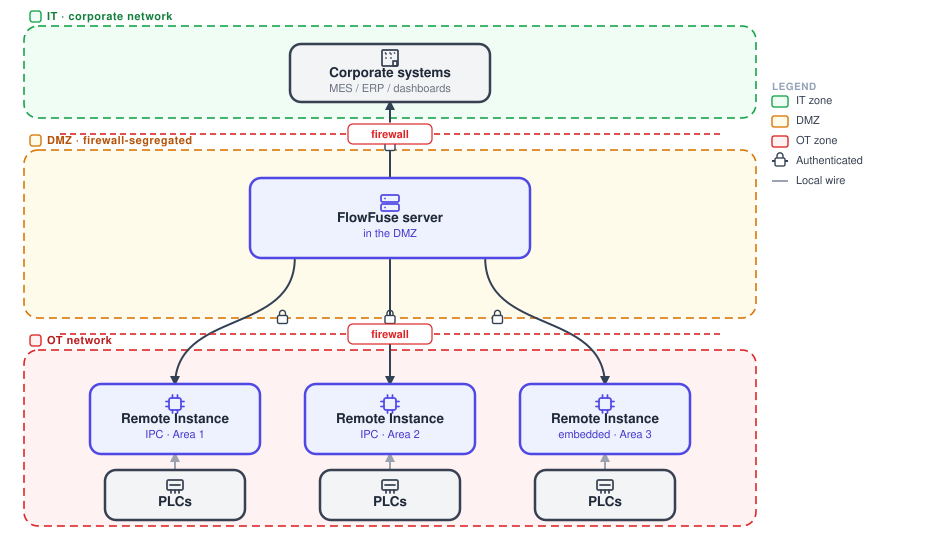
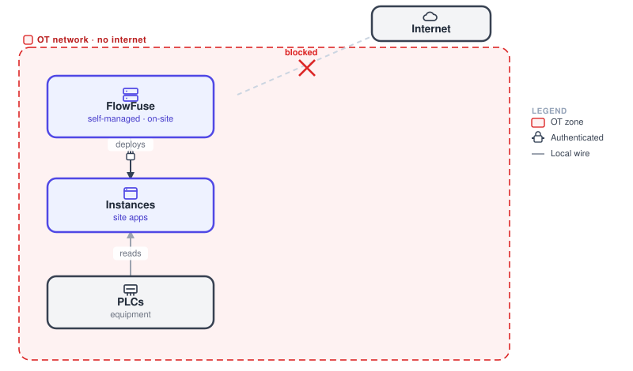
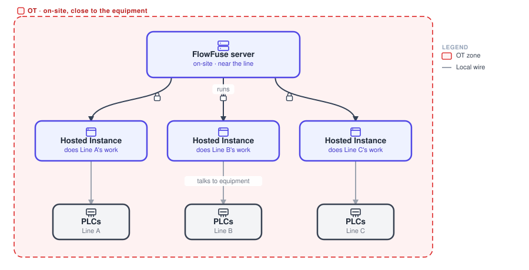

# OT architectures

This page covers how FlowFuse deploys in operational-technology environments, near the equipment. Read each diagram bottom-up: the equipment sits on the floor and the platform sits above it. The [Remote Instance](/docs/device-agent/) is the execution layer that lives down in OT.

## Edge, server in IT

{data-zoomable}

The FlowFuse server lives up in the IT infrastructure. The Remote Instances live down in the OT environment, on the equipment. The server deploys to them and manages them across the IT/OT boundary, and each Remote Instance keeps running locally if the link drops.

**Use it when** IT owns and hosts the platform, but execution must sit next to the machines in OT.

## Edge, server in OT / DMZ

{data-zoomable}

The FlowFuse server sits inside the plant, firewall-segregated in a DMZ. It has a controlled uplink to corporate systems, and it manages Remote Instances on IPCs and embedded hardware in the OT network below. Nothing reaches OT except through the firewalls.

**Use it when** security policy keeps the platform inside the plant boundary, exposed only through a DMZ.

## Air-gapped

{data-zoomable}

This is the DMZ pattern taken to its extreme. A self-managed FlowFuse runs on a server inside an isolated OT network with no internet at all. It manages that site's instances and edge hardware entirely within the OT boundary. Nothing goes in or out.

**Use it when** site security policy forbids any internet traffic in or out of the OT network.

## Edge, hardware-saving

{data-zoomable}

Instead of a Remote Instance on every piece of equipment, deploy one FlowFuse server close to the line and run several [Hosted Instances](/docs/user/concepts/) on it. Each one does the work an instance at the edge would have done, talking to its equipment directly. That means fewer physical boxes to buy and maintain, with the same separation of concerns.

**Use it when** you want the edge workloads consolidated onto nearby server hardware to cut the number of boxes on the floor.
