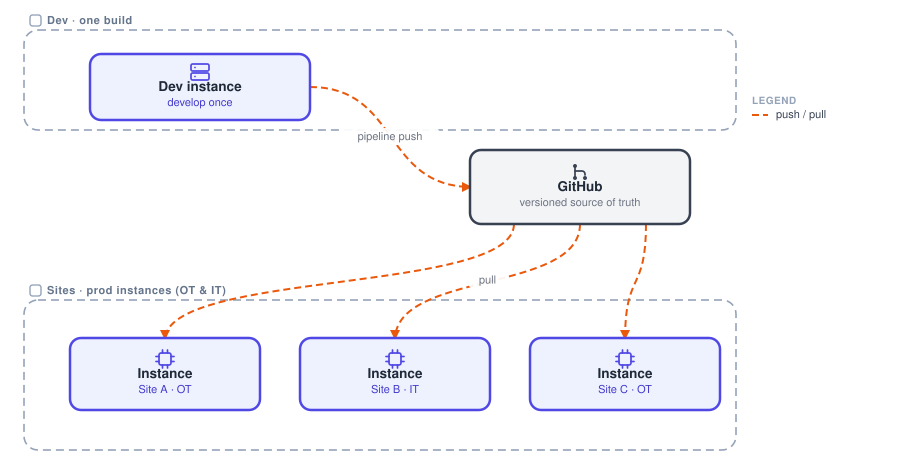

# Architectures

Every FlowFuse deployment is the same building blocks (instances, broker, data, edge) arranged for where it runs. Read any diagram as a vertical stack, then pick the world you are designing for.

## The three families

**OT architectures** sit near the equipment. They cover edge deployments with the server in IT or in an OT/DMZ, hardware-saving consolidation, and air-gapped sites.

**IT architectures** are about hosting and governing. They cover on-prem, your own cloud per site, hosting choice at scale, enterprise governance, and secure data exposure.

**IIoT architectures** are the live data backbone: a [Unified Namespace](/docs/user/teambroker/) where the edge publishes once and many subscribe, across every site.

## Separating dev from prod

This is a modifier for any of the three worlds above. Your development server is often a different server from production: dev in IT or the cloud, prod down in OT or air-gapped. A GitHub bridge carries the same versioned code across that boundary.

{data-zoomable}

A [pipeline](/docs/user/devops-pipelines/) pushes your dev work up to a repository, and each site's instance pulls it back down. You get one versioned source of truth, with review, history and rollback in Git, and dev stays safely off the production deployment servers.

Once the code is on a server, it ships from there through [snapshots](/docs/user/snapshots/) or subflows.
