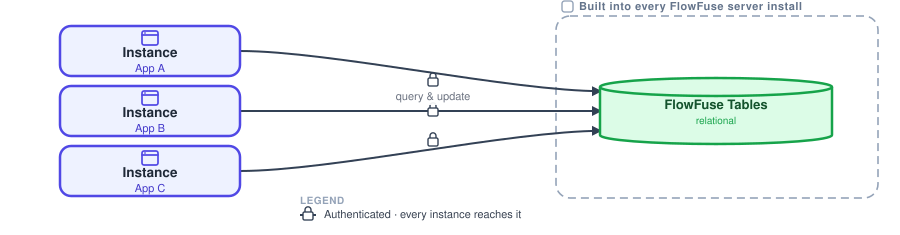
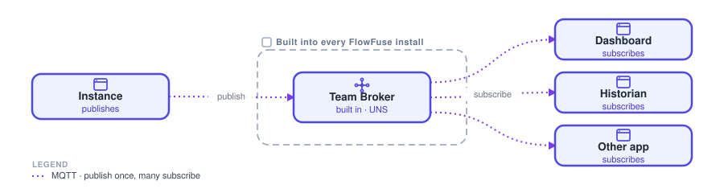
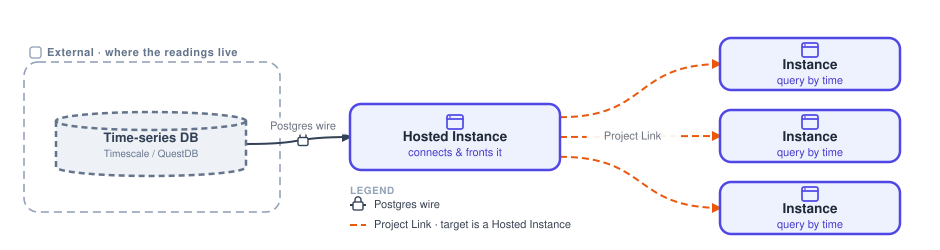
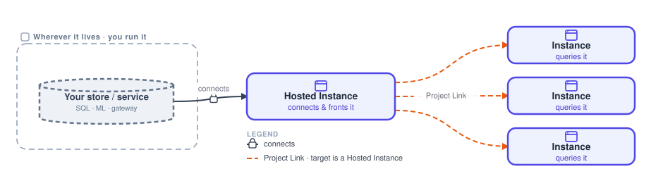

# Data plane

Before you pick where things run, decide how data is handled. Two stores come built into every FlowFuse server install, the [Team Broker](/docs/user/teambroker/) and relational [Tables](/docs/user/ff-tables/), exposed to every instance with nothing extra to stand up. Everything else you bring your own: you run it (a time-series database, an existing database, a model) and expose it to the community over [Project Link](/docs/user/projectnodes/), with no inbound ports. This is the data plane every architecture sits on.

**Single service?** Calling one external endpoint from a flow, an HTTP request or webhook to one system, is a [Node-RED decision](/docs/node-red-guide/handling-data/), not a platform data target.

## Relational

**Built in**: ships with every FlowFuse server install, and is exposed to every instance.

{data-zoomable}

A place for records that relate to each other, such as assets, config, users and orders, that you look up, join and update in place. It is FlowFuse Tables, built into every FlowFuse server install and exposed to every instance on the team.

**Use it when** the data has structure and relationships, and apps across the team should read and write the same store.

FlowFuse Tables is managed PostgreSQL, reached through the Query node. Because it ships with the server, any instance on the team reaches it natively over an authenticated connection. External systems can read it too.

**In FlowFuse**:

- **FlowFuse Tables**: managed PostgreSQL, built into every FlowFuse install
- **Query node**: read, join and update from any instance
- **Exposed to the whole team automatically**: nothing to stand up
- Also any external Postgres, through the same node

**Watch out**: this is not for high-rate timestamped streams. Use the time-series target for those.

## Broker / UNS

**Built in**: ships with every FlowFuse server install. Publish once, many subscribe.

{data-zoomable}

A real-time bus, not storage: one instance publishes to a topic, and any number subscribe. It is the Team Broker, built into every FlowFuse server install, and the backbone of a Unified Namespace.

**Use it when** live data needs to reach many consumers at once, decoupled, as it happens.

The built-in Team Broker works through publish and subscribe nodes. Because it ships with the server, every instance on the team can publish and subscribe over MQTT. Pair it with Tables when you also need to keep history.

**In FlowFuse**:

- **Team Broker**: built into every FlowFuse install, with no separate product to stand up
- publish and subscribe nodes
- **Topic structure**: your Unified Namespace
- Exposed to the whole team; pair with Tables for history

**Watch out**: it carries data, it does not store it. Write to Tables as well if you need history.

## Time-series

**Bring your own**: FlowFuse has no built-in time-series database today, so you run one and expose it to the fleet.

{data-zoomable}

A store built for a steady stream of timestamped readings, such as sensor data, telemetry and trends, written fast and queried by time.

**Use it when** the data is a continuous stream of timestamped values, written at high rate and queried by time window.

Run TimescaleDB, QuestDB or InfluxDB where you want. A Hosted Instance connects to it and fronts it. Timescale and Quest speak the Postgres wire, so the Query node connects exactly as it does to Tables. Other instances reach it over Project Link, which always calls a Hosted Instance, with no inbound ports.

**In FlowFuse**:

- **TimescaleDB / QuestDB**: speak the Postgres wire, so the Query node connects like it does to Tables
- **Hosted Instance**: connects to it and fronts it for the fleet
- **Project Link**: reaches it with no inbound ports, and always targets a Hosted Instance

**Watch out**: pair it with the Team Broker so you have live data alongside history.

## Bring your own

**Bring your own**: expose any other store or service to the fleet over Project Link.

{data-zoomable}

Any other store or service FlowFuse does not provide: an existing SQL database, an ML model, a site gateway. You run it where it already lives and expose it to the community of managed instances over Project Link, with no inbound ports.

**Use it when** you need to reach a store or service that is not built in and is not a time-series database, such as an existing database, a model or a gateway.

A Hosted Instance connects to the store or service and fronts it. Other instances reach it over Project Link, which always targets a Hosted Instance, as a secure API or MCP endpoint. There are no inbound ports, and no copy into a warehouse.

**In FlowFuse**:

- **Hosted Instance**: connects to the store or service and fronts it
- **Project Link**: calls a Hosted Instance, because only Hosted Instances are callable targets
- Any SQL database, ML model or gateway
- Exposed as a secure API or MCP endpoint, with no inbound ports

**Good for**: keeping data and services where they already live and exposing them securely to the fleet. FlowFuse does not care what the target is.

With the data targets decided, the next question is where everything runs: see [architectures](/docs/flowfuse-guide/architectures/).
