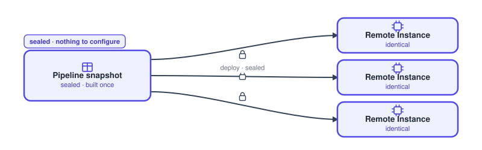
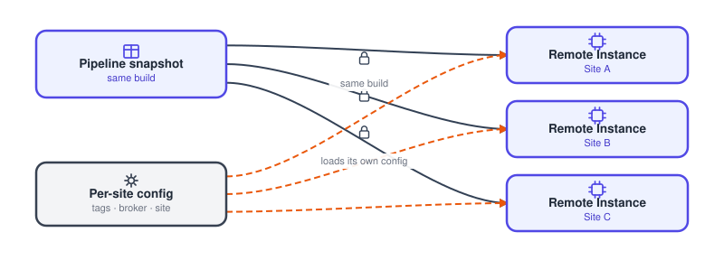
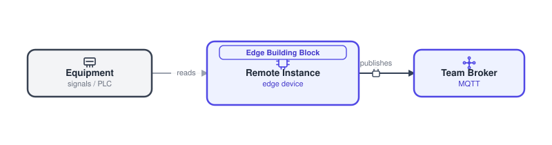

# Hardware apps

There are three shapes a FlowFuse app takes when it runs on hardware. Pick by how much varies per site: nothing (Packaged App), a few settings (Configurable App), or you assemble it yourself (Edge Building Block).

## Packaged App

{data-zoomable}

A sealed product that ships on a piece of hardware and is identical everywhere. Buy it, it runs on its hardware, nothing to configure.

**Use it when** the app ships with a known partner device and the data it reads is fixed by that hardware.

It is built and promoted through a [pipeline](/docs/user/devops-pipelines/), dev to staging to prod, then deployed to a [Remote Instance](/docs/device-agent/) as a [snapshot](/docs/user/snapshots/). Everything is baked in. Only fixed [environment variables](/docs/user/envvar/) vary at deploy.

**Major components**:

- **Pipeline snapshot**: the app built once, promoted to the hardware.
- **Remote Instance**: FlowFuse-managed Node-RED at the edge, running the sealed app.
- **[Team Broker](/docs/user/teambroker/) (MQTT)**: carries the app's events to subscribers.
- **[FlowFuse Tables](/docs/user/ff-tables/)**: stores the rows the app writes.

**Where config and data live**:

- **Config**: baked into the snapshot. Only fixed environment variables at deploy, nothing per-site.
- **Data**: events to the Team Broker, records to FlowFuse Tables.

## Configurable App

{data-zoomable}

The same shelf product, plus a few knobs that differ per site and live on the Remote Instance: tag names, broker address, site name.

**Use it when** the flows are the same everywhere but the values they use differ per install and may change over time.

Delivery is the same pipeline delivery to a Remote Instance, and the runtime loads a per-site config from a file on that Remote Instance. Back that file up to the database, so a hardware swap restores the config. The Remote Instance is the source of truth, the database is the safety net.

**Major components**:

- **Pipeline snapshot**: the same build promoted to every Remote Instance.
- **Remote Instance**: runs the app and loads its own per-site config.
- **Per-site config**: tags, broker address and site name, held in a file on the Remote Instance and backed up to the database.
- **Team Broker and FlowFuse Tables**: event egress and records.

**Where config and data live**:

- **Config**: a per-site file on the Remote Instance (tags, broker address, site name), backed up to FlowFuse Tables so a swap restores it.
- **Data**: Team Broker and FlowFuse Tables.

## Edge Building Block

{data-zoomable}

Not a finished app. One hardware-facing block plus example flows, running on a Remote Instance. You assemble everything upstream of it yourself.

**Use it when** the hardware-facing piece is reusable, but everything before it differs so much per site that no finished app would fit.

Blocks are published as subflows to the [Team Library](/docs/user/shared-library/) with an example flow. Consumers drop them onto a Remote Instance and wire them up.

**Major components**:

- **Equipment (signals and PLC)**: the source hardware the block reads.
- **Remote Instance**: runs the edge building block at the line.
- **Team Broker (MQTT)**: publishes the normalized data upstream.
- **Team Library**: where the block is published as an installable subflow.

**Where config and data live**:

- **Config**: lives in the consuming flow you build around the block (environment variables or context).
- **Data**: Team Broker, normalized and upstream.
