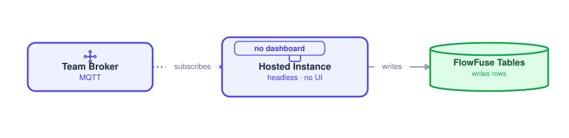
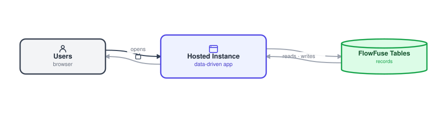
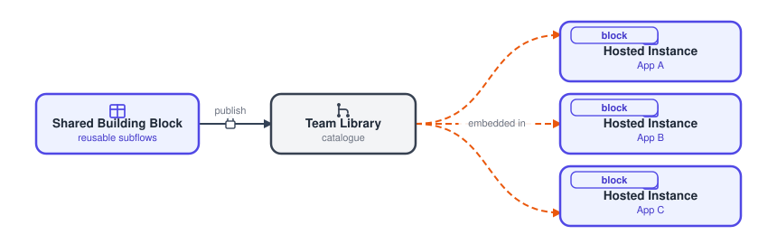

# Software apps

A FlowFuse app that runs on the platform takes one of three shapes. Pick by what the app needs: a headless job (Packaged App), a user-facing app driven by data (Data-Driven App), or a reusable piece that other apps embed (Shared Building Block). The name Packaged App also appears in the guide to hardware apps, where the same shape is described from the hardware side. This page stays on the platform side, where an app runs on a Hosted Instance.

## Packaged App

{data-zoomable}

A headless, self-contained job that runs the same everywhere: an MQTT-to-DB connector, a pipeline, a scheduled task. It has no UI.

**Use it when** the job is self-contained, with no screen and no per-site settings: connectors, pipelines, scheduled work.

It is built and promoted through a [pipeline](/docs/user/devops-pipelines/), then runs headless on a Hosted Instance (or a [Remote Instance](/docs/device-agent/)). Everything is baked into the [snapshot](/docs/user/snapshots/). Only fixed [environment variables](/docs/user/envvar/) vary at deploy.

**Major components**

- **[Team Broker](/docs/user/teambroker/) (MQTT)**: the event stream the app subscribes to.
- **Hosted Instance**: FlowFuse-managed Node-RED running the headless app.
- **Packaged App (no UI)**: the logic itself, no dashboard.
- **[FlowFuse Tables](/docs/user/ff-tables/)**: where the app writes its rows.

**Where config and data live**

- **Config**: baked into the snapshot, with only fixed environment variables at deploy.
- **Data**: reads the Team Broker, writes FlowFuse Tables.

## Data-Driven App

{data-zoomable}

A user-facing app on a Hosted Instance, such as a time clock or an asset manager, whose content is driven by data. It needs a backend and a data source to be complete.

**Use it when** the settings or records the app displays change between deployments and grow over time: time clocks, registries, asset managers.

Delivery is the same, through a pipeline to a Hosted Instance. The runtime loads its data from FlowFuse Tables or the Team Broker, served by a backend behind the screen.

**Major components**

- **Users (browser)**: the people using the app's dashboard.
- **Hosted Instance**: runs the data-driven app and serves its UI.
- **FlowFuse Tables**: the records the app reads and writes.

**Where config and data live**

- **Config**: app settings and records live in FlowFuse Tables (or context), editable without redeploying.
- **Data**: FlowFuse Tables for records, the Team Broker for live values.

## Shared Building Block

{data-zoomable}

A reusable piece of UI or logic that other apps embed, not an app in its own right. Think of a common dashboard surface that many Hosted Instances present through.

**Use it when** many apps should share one piece of UI or logic and upgrade it in lockstep.

It is published as subflows to the [Team Library](/docs/user/shared-library/), with an example flow. Updating the subflow updates every Hosted Instance that adopts the new version.

**Major components**

- **Shared Building Block (reusable subflows)**: the block authored once.
- **Team Library**: the catalogue it is published to.
- **Hosted Instances**: the apps that embed it and upgrade together.

**Where config and data live**

- **Config**: through the subflow's instance properties, or the environment where it is embedded.
- **Data**: none of its own, it embeds into the host app's data.
