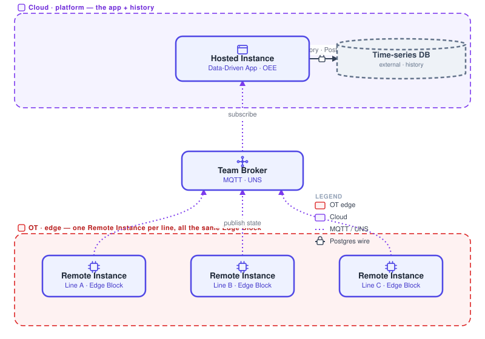

# Worked example: OEE, end to end

This is the whole guide in one example. It shows how an Edge Building Block, the [Team Broker](/docs/user/teambroker/), a Data-Driven App and an external time-series database snap together into one architecture you can say in a sentence. Two packages, two connections.

{data-zoomable}

## What OEE is

OEE (Overall Equipment Effectiveness) tells you how much good product a line makes versus its full potential: one live number per line, plus history for trends.

## Most real apps are more than one piece

OEE joins an Edge Building Block and a Data-Driven App through the Team Broker, with an external time-series database added for history.

**Pieces:**

- **[Remote Instance](/docs/device-agent/) (Edge Block)**: reads the machine signals at the edge and publishes its state. Built once, rolled out to every Remote Instance across the fleet.
- **Team Broker (MQTT)**: carries machine state from edge to cloud. The edge publishes to a topic; the cloud app subscribes. Neither references the other.
- **[Hosted Instance](/docs/user/concepts/) (Data-Driven App)**: subscribes to the machine state, computes availability, performance and quality, and presents the OEE dashboard.
- **External time-series DB (Timescale / QuestDB)**: each reading is written so trends can be charted over time. FlowFuse has no built-in time-series store, so history goes to an external Timescale or QuestDB reached over the Postgres wire protocol. That is a second egress, because the data is a timestamped stream.

## The architecture, in one sentence

> OEE is a Hardware: Edge Building Block (on a Remote Instance) publishing machine state over the Team Broker to a Software: Data-Driven App (on a Hosted Instance), which computes and displays OEE and writes history to an external time-series DB (Timescale / QuestDB).
