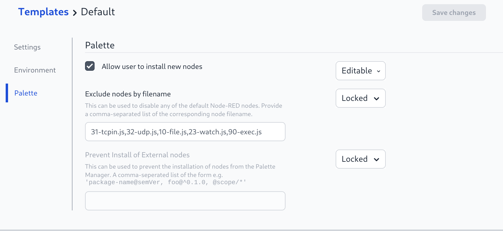

# Docker Install

This version of the FlowFuse platform is intended for running in the Docker Container management system. Typically suited for small/medium on premise deployments.

## Prerequisites

### Platform

The following instructions assume you are running Docker on a Linux or MacOS host system.

#### Digital Ocean

If you are using the Digital Ocean Docker Droplet to host FlowFuse you will need to ensure that port 80 & 443 are opened in the UFW firewall before starting.

```bash
sudo ufw apply http
sudo ufw apply https
```

We have a 1-Click Digital Ocean Droplet that will install and configure FlowFuse for you. Details can be found [here](./digital-ocean.md)

### Docker Compose

FlowFuse uses Docker Compose to install and manage the required components. Instructions on how to install Docker Compose on your system can be found here:

[https://docs.docker.com/compose/install/](https://docs.docker.com/compose/install/)

FlowFuse requires docker-compose v2

### DNS

The orchestration uses an instance of Nginx to route requests to each Node-RED instance. To do this it needs each instance to have a unique hostname, to generate this the instance name is prepended to a supplied domain.

To make this work you will need to configure a DNS server to map a wildcard domain entry to the IP address of the host running Docker. e.g `*.example.com`.

The FlowFuse Application will be hosted on `http://forge.example.com`

**Note** When testing locally you can add entries for each Node-RED instance to your `/etc/hosts` file but you must use the external IP address of the host machine, not the loopback address (`127.0.0.1`).

Notes on how to setup DNS can be found [here](../dns-setup.md).

## Installing FlowFuse

### Download

Download the latest release tar.gz from the docker-compose project:

[https://github.com/FlowFuse/docker-compose/releases/latest](https://github.com/FlowFuse/docker-compose/releases/latest)

Unpack this and cd into the created directory.	

```bash
tar zxf v1.x.y.tar.gz
cd docker-compose-1.x.y
```

### Configuring FlowFuse

Configuration details are stored in the `etc/flowforge.yml` and the `docker-compose.yml` files.

Before starting you will need to edit this file to update the the following fields in the `etc/flowforge.yml` file:

- `domain`
- `base_url`
- `broker.public_url`

These will need to be updated to replace `.example.com` with the domain you chose earlier. 

Please note that once set, the `domain` and `base_url` values should not be changed as these values are used as part of the configuration stored in the database of each Node-RED instance. The ability to migrate `domains` is on the feature backlog.

You also need to update all the `VIRTUAL_HOST` entries in the `docker-compose.yml` file to replace `.example.com`  with the same domain.

For more details on the options available, see the [configuration guide](../configuration.md).


### HTTPS (optional)
If you want to serve the forge app and Node-RED via SSL you will need to obtain a wildcard TLS certificate for the domain you are using eg `*.example.com`. If you are running on an Internet facing machine you can use the LetsEncrypt acme-companion.

Otherwise you will need to contact a SSL Certificate vendor and configure Nginx manually.

#### Let's Encrypt

In the `docker-compose.yml` file, uncomment the following lines
```yaml
- "./certs:/etc/nginx/certs"
```
```yaml
- "443:443"
```
```yaml
  acme:
    image: nginxproxy/acme-companion
    volumes:
      - "/var/run/docker.sock:/var/run/docker.sock:ro"
      - "./acme:/etc/acme.sh"
    volumes_from:
      - nginx:rw
    environment:
      - "DEFAULT_EMAIL=mail@example.com"
    depends_on:
      - "nginx"
```
If you wish to redirect all traffic to use HTTPS then add the following section to the nginx service on docker-compose.yml
```yaml
environment:
      - "HTTPS_METHOD=redirect"
```
Then, in the `docker-compose.yml` file, edit the following lines added your domain and email address

```yaml
- "DEFAULT_EMAIL=mail@example.com"
```
```yaml
- "LETSENCRYPT_HOST=mqtt.example.com"
```
```yaml
- "LETSENCRYPT_HOST=forge.example.com"
```

You will also need to update the `etc/flowforge.yml` file to change `base_url` from starting with `http://` to `https://` and the `broker.public_url` entry from starting with `ws://` to `wss://`.

#### Wildcard TLS Certificate

Create a folder in the `docker-compose-1.x.0` directory named `certs`, place your .crt and .key files in there, they should be named for the domain without the `*` eg `example.com.crt` & `example.com.key`
You  also need to create a copy of the .crt and .key files named `default.crt` & `default.key` in the same folder. This is used for serving unknown hosts.

In the `docker-compose.yml` file, 
- uncomment the line 
```yaml
-   "443:443"
```

- Add this line to the `volumes` section of the nginx proxy 
```yaml
- "./certs:/etc/nginx/certs"
```

If you wish to redirect all traffic to use HTTPS then add the following section to the nginx service on docker-compose.yml
```yaml
environment:
      - "HTTPS_METHOD=redirect"
```

You will also need to update the `etc/flowforge.yml` file to change the `broker.public_url` entry from starting with `ws://` to `wss://`.


## Running FlowFuse

We need to manually download the `flowfuse/node-red` container that will be used for the default stack.

This is done with this command:

```bash
docker pull flowfuse/node-red
```

Once that completes we can start FlowFuse:

Using the docker compose plugin
```bash
docker compose -p flowforge up -d
```

Or using the docker-compose command
```bash
docker-compose -p flowforge up -d
```

This will also create a directory called `db` to hold the database files used to store Node-RED instance and user information.

## First Run Setup

The first time you access the platform in your browser, it will take you through
creating an administrator for the platform and other configuration options.

For more information, follow [this guide](../first-run.md).

Once you have finished setting up the admin user there are some Docker specific items to consider.


### Using FlowFuse File Storage

Node-RED instances running in Docker do not have direct access to a persistent
file system to store files or use for storing context data.

FlowFuse includes a File Storage service that can be enabled to provide persistent
storage.

#### Disabling the default File nodes

To remove the default Node-RED file nodes from the palette:

1. Edit the Template to add `10-file.js,23-watch.js` to the "Exclude nodes by filename" section




#### Configuring the File Storage service

Full details on configuring the file storage service are available [here](../file-storage/).

#### Enabling the File Storage service

To enable the FlowFuse File Storage component add the following to the `etc/flowforge.yml` file:

```yaml
fileStore:
  enabled: true
```

## Upgrade

- Stop the existing instance with 
   ```bash
   docker-compose -p flowforge down
   ```
- Download the latest Source code tar.gz [here](https://github.com/FlowFuse/docker-compose/releases/latest/)
- Uncompress the tar file: `tar -xzvf v2.y.y.tar.gz`. A new directory should appear `docker-compose-2.y.y`
- Pull the latest version of the containers from Docker hub
     - `docker pull flowfuse/forge-docker`
     - `docker pull flowfuse/node-red`
     - `docker pull flowfuse/file-server`
- Copy the `db` (and the `certs` & `acme` if using HTTPS certs) directory from the old version directory to the new (this will probably require root due to file ownership)
    ```bash
    sudo cp -r docker-compose-x.x.x/db docker-compose-y.y.y/db
    ```
- Compare the old `docker-compose.yml` to the version supplied with the new version, copy over any changes made, 
    e.g. enabling HTTPS/TLS Certificates and setting the `VIRUAL_HOST` environment variables 
    Ensure the new container names are used starting with `flowfuse/` not `flowforge/`
- Compare the old `flowforge.yml` to the new version, and copy over variables specific to your set-up: url, broker, etc.
- Start the new version in the new directory 
   ```bash
   docker-compose -p flowforge up -d
   ```
