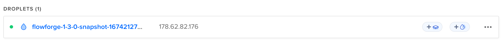
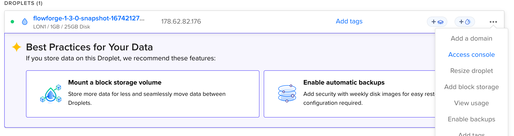

# 1-Click Digital Ocean Droplet Install

We have packaged the Docker Compose build of FlowFuse as a Digital Ocean Droplet. It can be found in the [Digital Ocean Market Place](https://marketplace.digitalocean.com/apps/flowfuse?refcode=fb23e438a477).

You can go straight to the [deployment wizard](https://marketplace.digitalocean.com/apps/flowfuse?refcode=fb23e438a477&action=deploy)

## Prerequisites

### DNS

To make use of this Droplet you will need a DNS Domain to host both the FlowFuse application and the Node-RED instances you create. 

For example if you use `ff.example.com` then the FlowFuse application will run on `https://forge.ff.example.com` and Node-RED would be on `https://[instance-name].ff.example.com`.

You will need to set up a wildcard DNS entry that points the whole domain to the Public IP address of the Droplet.

```
*.ff.example.com 3600 A xxx.xxx.xxx.xxx
```

The Public IP address of the Droplet will be listed in the UI when it has been created



### SMTP Server (Optional)

This is used to send invites to new user and to enable password resets.

You will need to know the following:

- SMTP Server hostname
- Port (Default 587)
- Username/Password

If you don't already have a SMTP server you can grab one from an email delivery service like 
SparkPost, [Sendgrid](https://marketplace.digitalocean.com/apps/sendgrid), Mailgun, etc.

## Setup

After the Droplet has been created and you have set up the DNS entry you will need to connect to the droplet to and enter the domain name 

You can do this in 2 ways

1. With SSH, either using keys or password depending on what Authentication mechanism you picked at creation time
    ```
    ssh -i digital-ocean-ssh.key root@xxx.xxx.xxx.xxx
    ```
2. Opening a Console from the Web Interface
    

Once logged in you will be presented with a wizard to set the domain and confirm by entering `1` or `2` to enter the domain again.


The wizard will then ask about setting up a SMTP server to allow FlowFuse to send email. This used to invite users or reset passwords, 
it is optional.


The wizard will then update the configuration files and start FlowFuse


It will then present a link to complete setup in the browser. You can now close the console connection to the droplet.

Details of how to complete this steps are [here](../first-run.md)

## Upgrade

You can follow the normal FlowFuse Docker [upgrade instructions](./README.md#upgrade), the install directory is `/opt/flowforge` 
