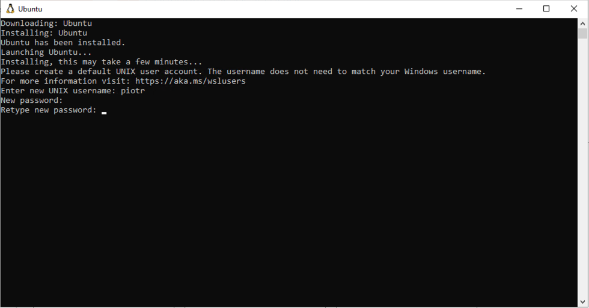
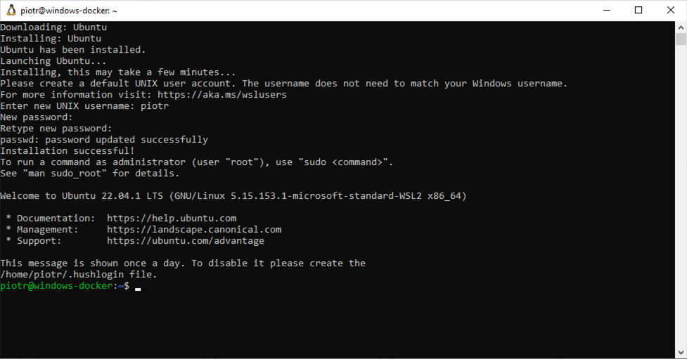
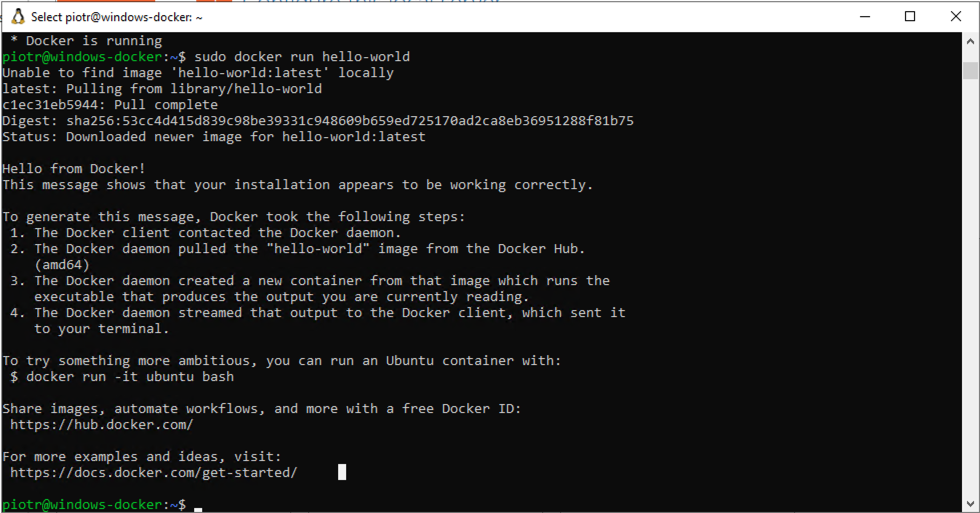

# How to Install Docker Engine (Docker CE) on Windows using WSL2

## Disclaimer 

Docker containers are inherently a Linux technology. The setup described here for running Docker on Windows using WSL2 is intended for development, testing, or learning purposes and may not be suitable for production environments.

## Prerequisites

Ensure your system meets the following requirements:

- Windows Server 2019 (version 1709) and later
- Windows 10 version 2004 and higher (Build 19041 and higher)
- Windows 11

## Step 1: Install Windows Subsystem for Linux 

Open PowerShell as an administrator and run the following commands:

1. Install WSL and the default Linux distribution (Ubuntu) using the following command:
   ```powershell
   wsl --install
   ```

2. Reboot your system to apply changes
   ```powershell
   shutdown -r -t 5
   ```

  After the reboot, WSL will automatically start installing the Ubuntu Linux distribution.
   You will be prompted to create a new UNIX account. Follow the instructions to create a new user account and set a password.
   

   Once completed, you will be dropped into a new Ubuntu shell.
   

## Step 2: Install Docker on Ubuntu

Once the Ubuntu system is ready, follow these steps to install Docker:

1. **Remove Conflicting Packages**

   First, remove any existing Docker packages that might conflict with the installation:

   ```bash
   for pkg in docker.io docker-doc docker-compose docker-compose-v2 podman-docker containerd runc; do sudo apt-get remove $pkg; done
   ```

2. **Add Docker’s Official GPG Key and APT Repository**

   Next, update your package list and add Docker's official GPG key and APT repository:

   ```bash
   sudo apt-get update
   sudo apt-get install ca-certificates curl
   sudo install -m 0755 -d /etc/apt/keyrings
   sudo curl -fsSL https://download.docker.com/linux/ubuntu/gpg -o /etc/apt/keyrings/docker.asc
   sudo chmod a+r /etc/apt/keyrings/docker.asc
   ```

   Add the Docker repository to your APT sources:

   ```bash
   echo \
     "deb [arch=$(dpkg --print-architecture) signed-by=/etc/apt/keyrings/docker.asc] https://download.docker.com/linux/ubuntu \
     $(. /etc/os-release && echo "$VERSION_CODENAME") stable" | \
     sudo tee /etc/apt/sources.list.d/docker.list > /dev/null
   sudo apt-get update
   ```

3. **Install Docker Packages**

   Now, install Docker and its associated packages:

   ```bash
   sudo apt-get install docker-ce docker-ce-cli containerd.io docker-buildx-plugin docker-compose-plugin
   ```

4. **Start the Docker Service**

   Start Docker using the following command:

   ```bash
   sudo /etc/init.d/docker start
   ```

5. **Verify Docker Installation**

   Run a test Docker container to verify that Docker is installed and running correctly:

   ```bash
   sudo docker run hello-world
   ```

   If Docker is installed correctly, you should see a similar output:

   


Once Docker is installed, you can [install the FlowFuse platform using docker compose](./README.md).


## Optional: Port Forwarding from External IP Address to Docker Container

If you want to forward a port from your external IP address to a Docker container, follow these additional steps.

Consider a scenario where you want to run an Nginx container:

1. **Run the Nginx Container**

   In Linux shell, start the Nginx container, binding port 8080 on your localhost to port 80 in the container:

   ```bash
   sudo docker run -d -p 8080:80 --name mynginx nginx
   ```

2. **Set Up Port Forwarding**

   To forward traffic from an external IP to your container, run the following PowerShell command (administrator privileges required):

   ```powershell
   netsh interface portproxy add v4tov4 listenport=8080 listenaddress=0.0.0.0 connectport=8080 connectaddress=127.0.0.1
   ```
   
   This command forwards traffic from port 8080 on your external IP address to port 8080 on your localhost, where the Nginx container is listening for a connections.
   The value for `listenport` can be changed as needed.

3. **Open the Port on Your Firewall**

   Ensure that port 8080 (or any other port you specivied as a value for `listenport` in the previous step) is open on your firewall:

   ```powershell
   New-NetFireWallRule -DisplayName 'WSL 8080TCP' -Direction Inbound -LocalPort 8080 -Action Allow -Protocol TCP
   New-NetFireWallRule -DisplayName 'WSL 8080TCP' -Direction Outbound -LocalPort 8080 -Action Allow -Protocol TCP
   ```

4. **Access the Nginx Container** 

   You can now access the Nginx container by visiting `http://<server-external-ip>:8080` in your browser.
