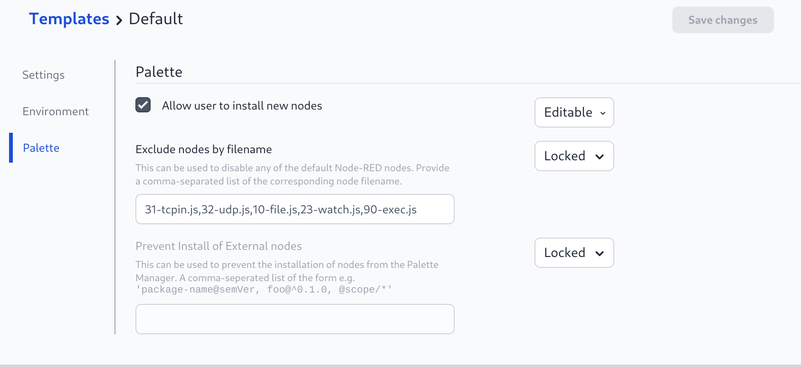

# FlowFuse File Storage

FlowFuse has two storage-related features for Node-RED instances in container-based deployments. They are not mutually exclusive, and some deployments use both.

- **Persistent Storage** mounts a persistent volume into the Node-RED instance at `/data/storage`. This was introduced in FlowFuse v2.6.0 for Kubernetes.
- **The File Storage service** provides the FlowFuse File nodes and Persistent Context.

The rest of this page is structured around those two features so it is clearer which configuration you need.

## Which configuration do I need?

Use the following guide when choosing what to configure:

Requirement | FlowFuse version | What to configure
------------|-----------------|------------------
Files written directly by the Node-RED instance must survive restart, suspend/resume, or stack upgrades | v2.6.0 or later | Configure [Persistent Storage for Node-RED instances](#persistent-storage-for-node-red-instances)
|| Before v2.6.0 | Configure [The File Storage service](#the-file-storage-service)
You want to use [FlowFuse Persistent Context](https://flowfuse.com/docs/user/persistent-context/) | v2.6.0 or later | Configure [The File Storage service](#the-file-storage-service) and the [Persistent Context configuration](#persistent-context-configuration). If the instance also needs persistent filesystem access, configure [Persistent Storage for Node-RED instances](#persistent-storage-for-node-red-instances) as well.
|| Before v2.6.0 | Configure [The File Storage service](#the-file-storage-service) and the [Persistent Context configuration](#persistent-context-configuration). The File Storage service also provides persistent storage for the instance.

## Persistent Storage for Node-RED instances

As part of the FlowFuse v2.6.0 release, a new Persistent Storage approach was implemented for Kubernetes. Docker support will follow.

This mounts a Persistent Volume into the container running the Node-RED instance on `/data/storage`. 
Files written to this location are preserved for the life of the instance and across suspend/resume operations and stack upgrades.

If you are using FlowFuse version lower than v2.6.0, you will need to use the File Storage service to provide persistent storage to Node-RED or upgrade to v2.6.0 or later to use this feature.

### Configuring

Create a Kubernetes `StorageClass` that allows dynamic provisioning of `PersistentVolumes` from `PersistentVolumeClaims`, for example the [AWS EFS CSI driver](https://github.com/kubernetes-sigs/aws-efs-csi-driver).

Then pass the following values to the FlowFuse Helm Chart when upgrading.

```yaml
forge:
  persistentStorage:
    enabled: true
    storageClass: '<name of StorageClass>'
    size: '5Gi'
```
Where `size` is the default size for the volume.

#### Azure

If you are using the `azurefile-csi` Persistent Storage driver then we recommend adding the following to the `StorageClass mountOptions`:

```yaml
mountOptions:
  - dir_mode=0777
  - file_mode=0777
  - mfsymlinks
  - nobrl
```

See [the Azure Kubernetes documentation](https://learn.microsoft.com/en-us/troubleshoot/azure/azure-kubernetes/storage/mountoptions-settings-azure-files) for more details.

## The File Storage service

The FlowFuse Platform includes a File Storage service that provides:

  - A set of custom File nodes that behave the same way as the standard Node-RED
    File nodes
  - An optional Persistent Context store for storing context data within flows.
    This feature is only available for platforms running with a premium license.

On FlowFuse v2.6.0 or later, the File Storage service is used exclusively for Persistent Context. Instance-level Persistent Storage is handled separately via [Persistent Storage for Node-RED instances](#persistent-storage-for-node-red-instances).

Before FlowFuse v2.6.0, this service was also the primary way to provide persistent storage to Node-RED in container-based environments, in addition to Persistent Context.


The File Storage service is only required in Docker or Kubernetes environments. If you are using the LocalFS platform driver, Node-RED already has direct access to the local filesystem.


### Configuring

The File Storage server has its own configuration file: `etc/flowforge-storage.yml`.

 - **Docker Compose** - edit the file directly before starting the service
 - **Kubernetes/Helm** - include the options in your `customization.yml`, using `forge.fileStore.*` as the property name prefix.
   You must also set `forge.fileStore.enabled` to `true` to tell Helm to deploy the service.

There are three parts to the configuration:
 - [Platform Configuration](#platform-configuration) - how to access the main FlowFuse platform application
 - [File Storage configuration](#file-storage-configuration) - what storage to use for the File nodes
 - [Persistent Context configuration](#persistent-context-configuration) - what storage to use for Persistent Context

### Platform Configuration

Option        | Description
--------------|------------
`host` | Where to listen for incoming connections. Default: `0.0.0.0`. 
`port` | The port to listen on. Default: `3001`
`base_url` | The url to access the FlowFuse platform on. This defaults to `http://localhost:3000`


### File Storage service configuration

The File Storage configuration determines where the files used by the Node-RED File nodes are stored.

You can configure it to store files either on the local filesystem of the File Storage server or in an AWS S3-compatible service.

#### LocalFS

Stores the files locally, for example by using a volume mounted into the File Storage server container.

Option        | Description
--------------|------------
`driver.type` | `localfs`
`driver.quota` | A per-instance quota for how much data will be stored - in bytes. If this is not set, no limit will be applied
`driver.options.root` | The root path under which Node-RED instance data should be stored.


The following shows an example configuration using the `localfs` file driver.

```yaml
driver:
  type: localfs
  quota: 104857600
  options:
    root: var/root
```

#### S3 Compatible Storage

Stores the files in an external service using the AWS S3 API.

Option        | Description
--------------|------------
`driver.type` | `s3`
`driver.quota` | A per-instance quota for how much data will be stored - in bytes. If this is not set, no limit will be applied
`driver.options.bucket` | Name of the S3 bucket to use (required)
`driver.options.region` | Name of AWS region of the bucket (required)
`driver.options.endpoint` | S3 ObjectStore Endpoint, if not using AWS S3
`driver.options.forcePathStyle` | `true`
`driver.options.credential.accessKeyId` | Account ID / Username
`driver.options.credential.secretAccessKey` | Secret Key / Password

The full list of valid options under `driver.options` is available in the [AWS S3Client documentation](https://docs.aws.amazon.com/AWSJavaScriptSDK/v3/latest/clients/client-s3/interfaces/s3clientconfig.html).

For example:

```yaml
driver:
  type: s3
  quota: 104857600
  options:
    bucket: flowforge-files
    credentials:
      accessKeyId: XXXXXXXXXXXXXXXXXXX
      secretAccessKey: XXXXXXXXXXXXXXXXXXXXXXXXXXXXXXXX
    forcePathStyle: true
    region: us-east-1
```

#### Enabling the FlowFuse File Nodes

The FlowFuse File nodes have been written to be direct replacements
for the Node-RED core file-in and file-out nodes. This means that only 
one version of these nodes can be active in Node-RED at a time.

The FlowFuse File nodes will automatically disable themselves if the 
core nodes are present. This means to enable the nodes you need to 
exclude the code nodes.

This can be done in the FlowFuse Template.



Adding `10-file.js` to the list of "Excluded nodes by filename" section will ensure that the core file nodes are not loaded by Node-RED.

### Persistent Context configuration

The Context Storage configuration determines where Node-RED Context data is stored.

This feature is only available when running with a FlowFuse Premium license.

Due to the different access patterns for context data, this requires a separate
storage configuration to the File store. It can use either an SQLite or PostgreSQL
database.

#### SQLite

Option        | Description
--------------|------------
`context.type` | `sequelize`
`context.quote` | A per-instance quota for how much data will be stored - in bytes. If this is not set, no limit will be applied
`context.options.type` | `sqlite`
`context.options.storage` | Path to the sqlite database file to use

For example:

```yaml
context:
  type: sequelize
  quota: 1048576
  options:
    type: sqlite
    storage: ff-context.db
```

#### PostgreSQL

Option        | Description
--------------|------------
`context.type` | `sequelize`
`context.quote` | A per-instance quota for how much data will be stored - in bytes. If this is not set, no limit will be applied
`context.options.type` | `postgres`
`context.options.host` | The hostname of the database server
`context.options.port` | The port of the database server
`context.options.database` | The name of the database to store context data in
`context.options.username` | The username to access to the database with
`context.options.password` | The password to access to the database with

For example:

```yaml
context:
  type: sequelize
  quota: 1048576
  options:
    type: postgres
    host: flowforge-postgresql
    port: 5432
    database: ff-context
    username: postgres
    password: password
```

## Working with FlowFuse Devices

The FlowFuse Device Agent does *not* use the File Storage service. Any flows
using the file nodes or persistent context that are deployed to a Device will use
the local filesystem directly.
