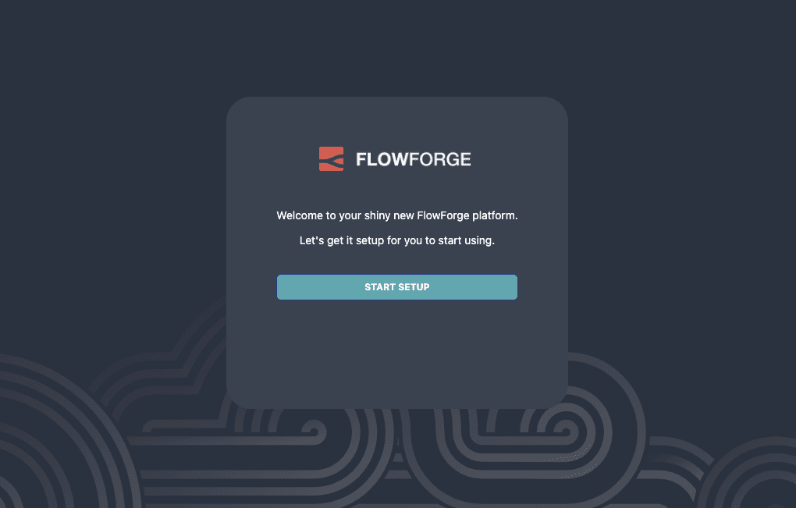
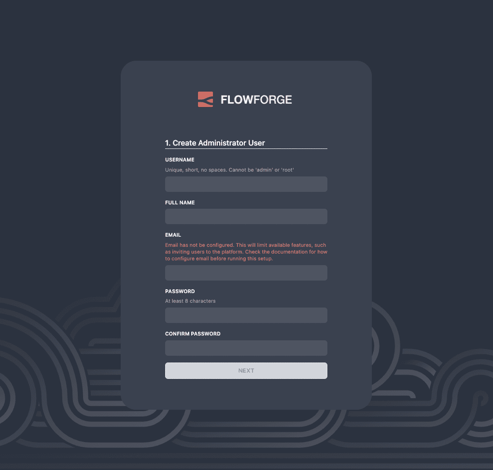
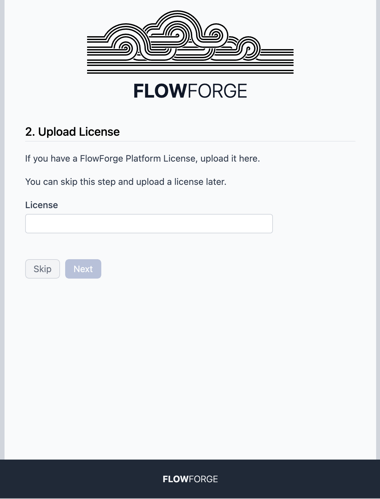

# First-run Setup

Following a successful install, you will be able to access the platform to go
through the initial setup.

## 1. Start setup

### - LocalFS
Open FlowFuse in your browser [http://localhost:3000](http://localhost:3000){rel="nofollow"}.  

### - Docker or Kubernetes
Open FlowFuse in your browser [http://forge.example.com](http://forge.example.com){rel="nofollow"} (Change `.example.com` to match the domain you set up in DNS)

Click the **START SETUP** button

## 2. Create an Administrator

The first user you create will be an Administrator. They will have full access
to the platform, be able to set platform-wide configuration and manage users and teams.

**Note**: with the 0.3 release, it is possible to reset your password *if* you have email
configured and enabled the `user:reset-password` option in Admin settings. Otherwise,
make sure you make a note of the password you set. We will provide tools to manage passwords
outside of the platform in a future release.

## 3. Upload a license

FlowFuse Community Edition is Open Source and can be used freely without a license.

If you have a FlowFuse Enterprise Edition license you can upload it here.

## 4. Finish setup

Once you complete the setup, you will be able to log in as the Administrator
user you created and start using the platform. You can setup your Team and
create your first Node-RED instance.

More information about using the FlowFuse platform is available in the
main [user guide](/docs/user/introduction.md).
