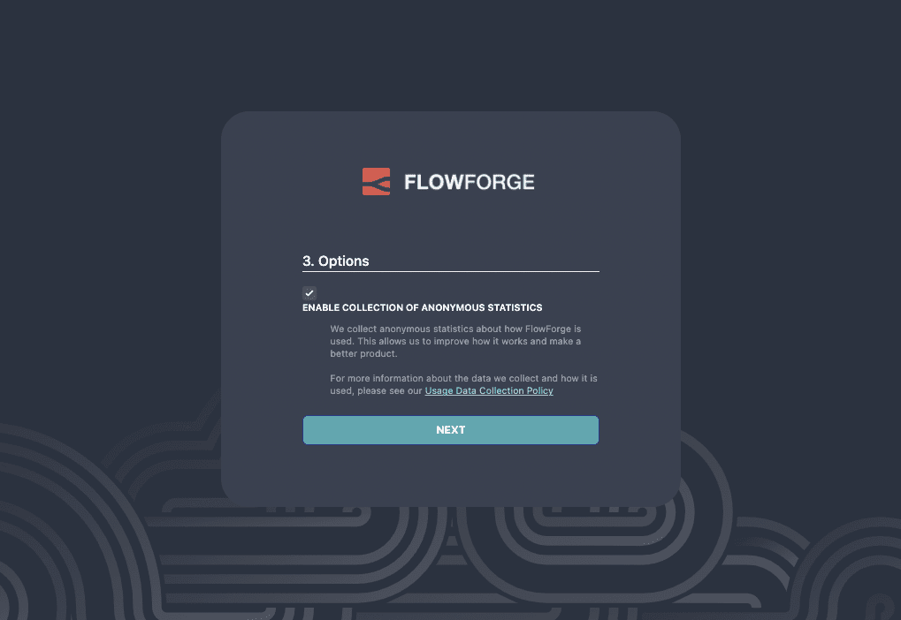

# First-run Setup

Following a successful install, you will be able to access the platform to go
through the initial setup.

By default, you can access the platform at [http://localhost:3000](http://localhost:3000).

## 1. Start setup
Open FlowForge in your browser [http://localhost:3000](http://localhost:3000).  
Click the **START SETUP** button

## 2. Create an Administrator

The first user you create will be an Administrator. They will have full access
to the platform, be able to set platform-wide configuration and manage users and teams.

**Note**: with the 0.3 release, it is possible to reset your password *if* you have email
configured and enabled the `user:reset-password` option in Admin settings. Otherwise,
make sure you make a note of the password you set. We will provide tools to manage passwords
outside of the platform in a future release.

## 3. Upload a license

FlowForge Community Edition is Open Source and can be used freely without a license.

If you have a FlowForge Enterprise Edition license you can upload it here.

## 4. Platform Options

There are some runtime configuration options that can be configured at this stage.

### Anonymous usage statistics

To help us understand how the project is being used, we gather high level
anonymous usage information from running instances.

The Administrator can opt-out of this feature.

## 5. Finish setup

Once you complete the setup, you will be able to log in as the Administrator
user you created and start using the platform. You can setup your Team and
create your first Node-RED project.

More information about using the FlowForge platform is available in the
main [user guide](../user/).