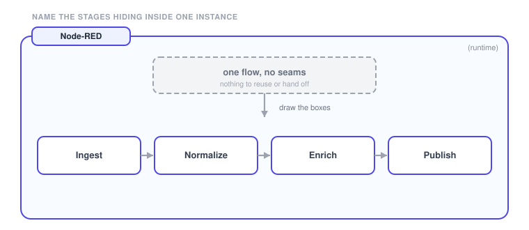
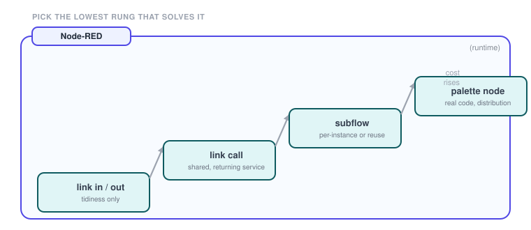
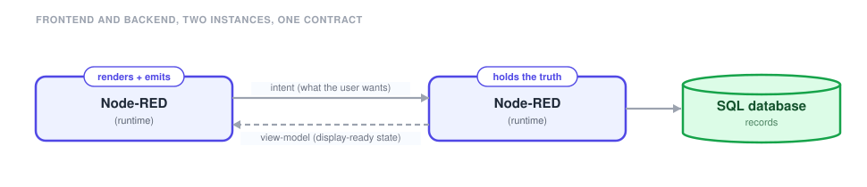
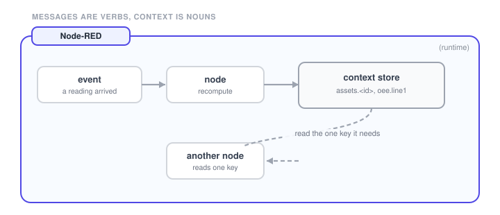
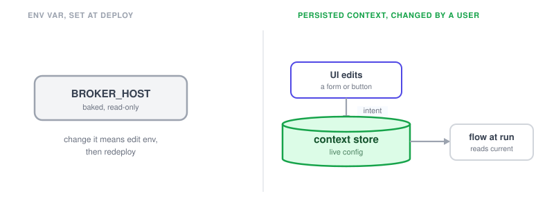
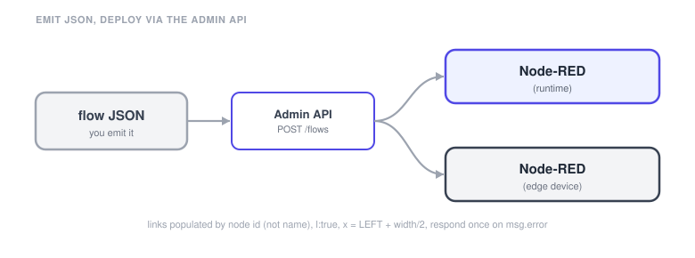
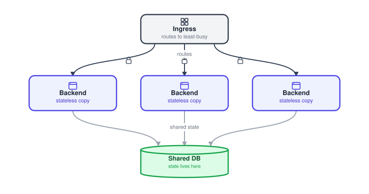

# Design patterns

These are the moves that turn a flow into something you can reuse, test and hand off. Find the seams, pick the lightest level of reuse, keep the UI and the logic apart, and hold state in context. Scale only when one instance proves it must.

## Find the seams

{data-zoomable}

A giant flow is bad because it has no seams. Most spaghetti is three or four well-defined components that were never named.

**Use it when** you cannot reuse, test, or hand off a piece of a blob, and any edit means reading the whole tab. Naming the structure is the fix, not tidier wires.

The seams show up as a repeated cluster, a logical stage (ingest, normalize, enrich, publish), a bounded responsibility, or a reuse magnet. Each one earns a box drawn around it, and then gets extracted.

**Good for**: splitting one tab into ingestion, processing, storage, and presentation.

## Levels of reuse

{data-zoomable}

Once you have found structure there are levels of extraction: link in and out, then link call, then a [subflow](https://nodered.org/docs/user-guide/concepts), then a packaged node. Pick the lowest one that solves the problem.

**Use it when** you have found structure worth extracting. Each rung costs more than the one below it, and reaching straight for a subflow or a [custom node](/docs/user/custom-npm-packages/) when a link call would do adds weight you do not need.

Link in and out is for tidiness and tab-to-tab routing. Link call is for a shared, returning service. A subflow earns its place when the piece needs per-instance config or reuse across instances. A palette node is for real code, or for distribution.

**Watch out**: link nodes are organization, not modularity. Do not mistake tidiness for a reusable unit.

## Decouple frontend and backend

{data-zoomable}

Treat the boundary between the Dashboard and your flow logic like a client and a server API. The frontend renders state and emits intent. The backend holds the truth.

**Use it when** the UI and the logic change at different rates. If you build payloads inside templates or cram logic next to a widget, every change touches both.

The backend sends a finished, display-ready view-model. The frontend emits a consistent intent message: an action plus a payload. Templates bind and emit. They never fetch, transform, or decide.

**Good for**: redesigning the whole dashboard without touching a single business-logic node.

## Use the context store

{data-zoomable}

Context is shared memory with a defined scope. It holds a logical object in one place instead of threading it through wires. Messages are verbs. Context is nouns.

**Use it when** you are passing the same fat object through fifteen nodes just to move it. That is the job context exists to do, and wire gymnastics to avoid storing a value is the real anti-pattern.

The object lives once, under a namespaced key, at the narrowest scope that works: node first, then flow, then global. Each node reads the one key it needs. Anything that has to survive a restart belongs in a [persistent store](/docs/user/persistent-context/).

**Watch out**: one writer per key, serialize concurrent updates, and keep enough on the wire to stay debuggable.

## Config: env vars vs persisted context

{data-zoomable}

There are two different kinds of configuration. Static config changes per environment and is set at deploy: broker host, database connection. Runtime config changes while the flow is running, by a user, with no redeploy.

**Use it when** a user needs to change what the flow operates on. [Environment variables](/docs/user/envvar/) are resolved at deploy time and are read-only to the running flow, so an env var here forces a developer and a redeploy.

Static config belongs in env vars or a config node. User-editable config belongs in persisted context, or a config file, edited through the UI by an intent message and read by the flow at execution time.

**Watch out**: if a value would ever be changed through a button or a form, it is not an env var.

## Generating flows (Admin API)

{data-zoomable}

You can emit flows as JSON and deploy them through the Admin API. The editor quietly fixes mistakes that a programmatic deploy does not, so the failure classes are different.

**Use it when** API-deployed flows look right but hang, double-respond, loop, or read as spaghetti, which is what happens when the things the editor papers over are left undone.

Over the API, link arrays have to carry target node ids, because name matching is an editor convenience, and `l:true` has to be set explicitly. The response layer needs the same care: a success formatter that still runs when `msg.error` is set will respond twice, and a tab-wide catch that re-dispatches a response-layer error turns one failure into a loop. Layout is arithmetic too, since a node's `x` is its centre, not its left edge.

**Watch out**: empty link arrays are the top reason an API-deployed flow does nothing.

## Scaling out a runtime

This one is a modifier, not a starting shape. Reach for it late, once the patterns above are in place and one instance has proved it cannot keep up.

Split the frontend from the backend so each scales on its own, then run several stateless copies of the piece that is under load behind an ingress that routes each request to the least-busy copy.

{data-zoomable}

The Node-RED pattern is a decoupled frontend and backend. In FlowFuse you realise it with [scaled Hosted Instances](/docs/user/high-availability/) behind an ingress. Stateless copies pool freely and share their state in a database. A backend that holds a live connection, such as an MQTT subscription, cannot pool, so keep it single and offload the heavy work to a single service instead.
