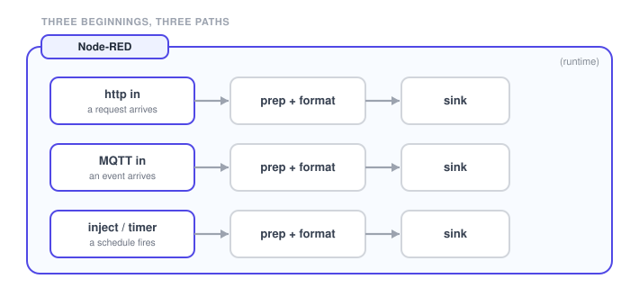
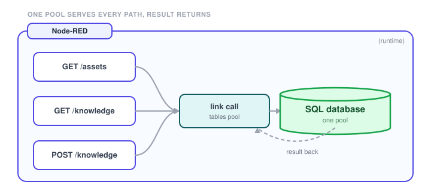
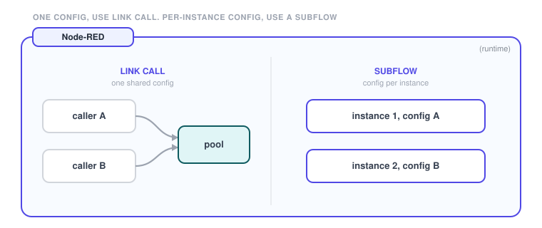
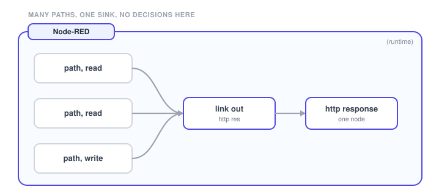

# Flow shape

Turn an architecture sentence into a flow you can read at a glance. Four shape rules draw the flow for you: where paths begin, how they share services, when to reuse as a [subflow](https://nodered.org/docs/user-guide/concepts) or a link call, and where they end.

## Beginnings

**Entry paths**: list every entry first, and keep each path separate. Do not funnel them through one shared front door.

{data-zoomable}

Every way work enters a piece is a beginning: an http in, an MQTT in, an inject or a timer. Each beginning is its own path.

**Use it when** you are laying out a piece and want to see its paths before wiring.

Draw one row per beginning. Each row runs straight: beginning, prep, a call to services, then a sink. The paths stay separate the whole way across.

**Good for**: keeping a device path and a browser path from running through each other.

## Shared services (link call)

**Shared services**: expose a resource once behind link in and link out. Every path calls it, results return, and there is no central router to build.

{data-zoomable}

A shared service is anything that holds a connection or is a common dependency many paths use: a database pool, a model call, a broker. You call it, and the result returns to the caller.

**Use it when** more than one path needs the same resource and you do not want a copy per path. One pool, one call, a result back to whoever asked.

Expose the resource once behind a link in that ends in a returning link out. Each path uses a link call, and results come back.

**Good for**: one database pool serving every read and write path without mixing them.

## Subflow vs link call

**Reuse**: a link call covers one fixed config. Reach for a subflow only when it needs per-instance config, or reuse across [instances](/docs/user/concepts/).

{data-zoomable}

Both reuse logic, but they are not interchangeable. A link call shares one fixed configuration. A subflow is a reusable assembly with its own per-instance config.

**Use it when** it needs per-instance config, or it is reused in other Node-RED instances. Otherwise a link call is lighter and enough.

Single config and single project means link call. Different settings per drop, or reuse across other Node-RED instances, means subflow. Start as a link call and promote it if it earns the distribution.

**Watch out**: defaulting to subflows for everything duplicates connections and adds indirection.

## Single sink

**Single sink**: each family of paths converges on one sink that routes nothing. Keep the decisions upstream.

{data-zoomable}

The sink is the one ending each family of paths converges on, reached by a labeled link: an http response, an MQTT publish, or a dashboard update. It only sends. No decisions live here.

**Use it when** every path in a surface needs to end somewhere, and that ending should route nothing.

Point each path at one labeled sink that only sends and never branches. Reads and writes converge there. An HTTP path responds exactly once, and a streaming path simply emits.

**Watch out**: if a node everything passes through decides where things go, that is a router. Split it back out.
