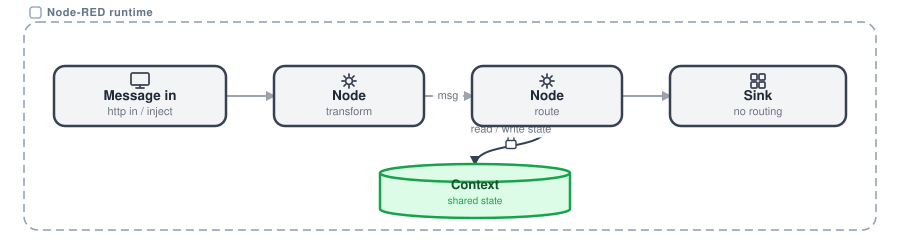

# Foundations

The handful of concepts you need to build with Node-RED, and how they fit together. You wire pre-built nodes into flows and spend your effort on the logic, on what the system should do, while the platform handles the syntax and the connectivity. Learn these and you can build real integrations in Node-RED with only a little JavaScript, because the structure carries most of the weight.

## How it fits together

{data-zoomable}

A **message** enters a **flow** and passes from **node** to node, transformed along the way, until it reaches a sink that sends and routes nothing. Reuse comes from **subflows** and **link nodes**. Shared state lives in **context**. New capabilities come from installing nodes off the **palette**.

## The core pieces

- **Node**: a single processing block. It receives a message, does one thing (read, transform, call or route) and passes it on.
- **Flow**: nodes wired left to right on a tab. A message enters, is transformed, and exits. One working unit of automation.
- **Message (msg)**: the object that travels the wires, carrying `msg.payload` plus metadata between nodes.
- **Subflow**: a block you define once and drop in many places, with its own inputs, outputs and per-instance config.
- **Link nodes**: link in, link out and link call wire flows together across tabs with no visible wires. They are your in-process service calls.
- **Context**: storage that keeps state between messages, in flow and global scope, held [in memory or persisted](/docs/user/persistent-context/).
- **Palette**: the library of installable nodes (npm) you add new capabilities from.
- **Editor and runtime**: the browser editor where you wire flows, and the runtime that executes them continuously.

That is the working model. For the full glossary, every core term and node type straight from the Node-RED project, see the [Node-RED concepts documentation](https://nodered.org/docs/user-guide/concepts) rather than a glossary here.
