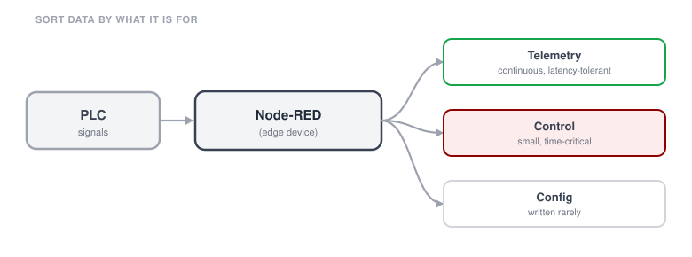
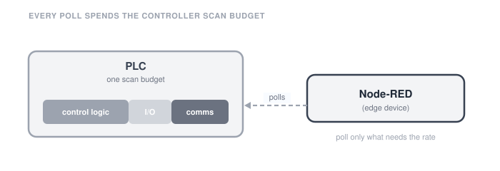
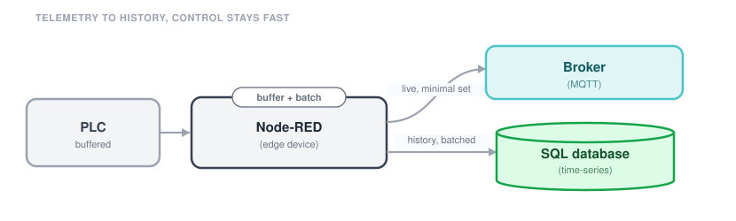

# Handling data

This page is about the data you read from and write to a PLC. Sort that data by what it is for before you tune anything. Telemetry and control have different timing needs, so classify them, respect the controller's scan budget, and give each its own path. The fast path then never inherits the slow one's load.

## Classify the data

{data-zoomable}

Before tuning anything, sort the data by what it is for. Telemetry is continuous and latency-tolerant. Control data is small and time-critical. Config is written rarely.

**Why it matters**: the common mistake is treating every point as one population and polling all of it at the fastest rate. That is what creates load a controller cannot sustain.

Ask whether a delay changes a control decision or only a timestamp, whether the point is read or write, and what cadence the data actually needs versus how fast it is polled today.

**Good for**: deciding which few points genuinely need the fast path, usually far fewer than ride it.

## How PLCs respond

{data-zoomable}

A PLC has a finite budget per scan, and communications is only one slice of it. Every poll, read and connection costs the controller.

**Why it matters**: polling a large set of points fast spends the budget on data that did not need the rate, leaving less headroom for the data that does.

Know which direction a connection is established in, and that each protocol is its own driver. Common protocols ([MQTT](/docs/user/teambroker/), OPC UA, WebSocket, Modbus TCP) are not deterministic. Data handling, not the runtime, decides the timing you hit.

**Watch out**: test one signal end to end, isolated from the rest, so you measure the transport itself and not your application logic.

## Treat data reliably

{data-zoomable}

Separate read traffic from event-driven traffic, then handle each on its own path. This split is the foundational step, and everything else follows from it.

**Why it matters**: telemetry and control have different timing needs. Sharing one path and one protocol makes the fast path inherit the load of the slow one.

Buffer telemetry in the PLC and pull it at its real cadence, timestamped at acquisition. Batch it into a time-series database. Keep the control path to the minimum tag set, on a dedicated, faster route.

**Good for**: batched inserts into a time-series database land at a fraction of the overhead of individual writes.
