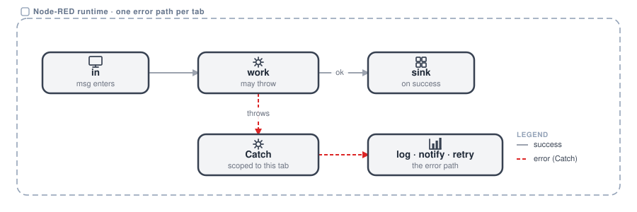
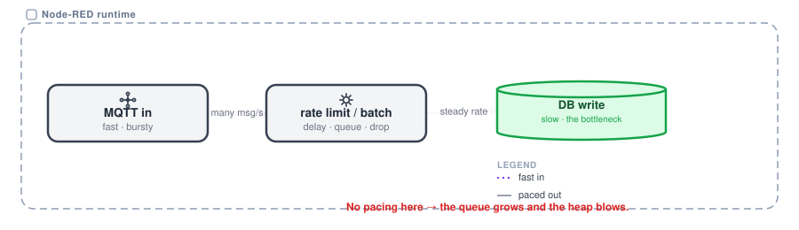
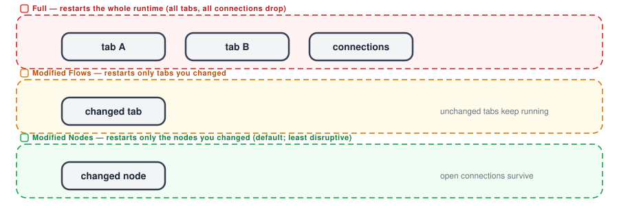
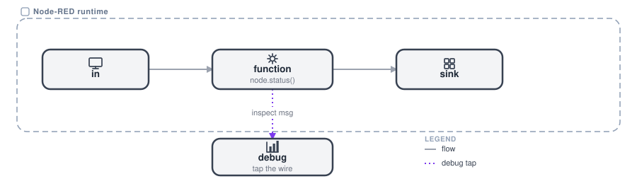

# Operating flows

A clean flow shape is not enough to survive production. Four operational habits keep a flow running when the real world pushes back: catch errors on a path you control, pace fast inputs so memory does not blow, deploy with the smallest restart, and keep the flow observable.

## Error handling

A `Catch` node per tab turns a thrown error into a route you control, not a silent stall.

{data-zoomable}

Every flow that talks to the outside world will fail sometimes. A database is down, a payload is malformed, a request times out. Node-RED routes those failures to a `Catch` node instead of crashing, and you decide what happens next.

**Use it when** the flow does any I/O: HTTP calls, database writes, broker publishes, file access, which is almost all of them.

The reach of the error path is a design decision. A `Catch` node can be scoped to a few named nodes or to a whole [tab](https://nodered.org/docs/user-guide/concepts), and that choice decides how much of the flow it speaks for. Errors reach it when they are raised with the message attached, which is what `node.error(msg, msg)` does. From there the error path is an ordinary flow: it can log, notify or retry, and on an API flow it can answer with an error status rather than leaving the caller hanging. A `Status` node alongside it surfaces node health on the canvas.

**Watch out**: an unscoped, tab-wide `Catch` that re-runs your success or response nodes will double-respond. Keep the error path separate from the happy path.

## Backpressure and memory

When input outruns a sink, the queue grows and the heap blows. This is the most common failure in event-driven flows.

{data-zoomable}

A fast source, such as an [MQTT topic](/docs/user/teambroker/) or a tight poll, feeding a slow sink, such as a database write or an API, has no natural brake. Messages pile up in memory faster than they drain, and the runtime eventually runs out of heap and dies.

**Use it when** a high-rate or bursty input feeds something slower downstream, such as telemetry going to a database, or a fan-out to a remote API.

The brake has to be explicit. A `delay` node in rate-limit mode paces the stream, a `join` node batches messages into chunks, and where only the latest reading matters the older ones can be dropped. Batched inserts also cut per-write overhead. Heap and queue size are what tell a spike apart from a real problem: a queue that only grows is backpressure, not a burst.

**Watch out**: a backend that holds a live connection, such as an MQTT subscription, cannot be pooled away. Pace at the source, or offload the heavy work.

## Deploy modes

Full, Modified Flows and Modified Nodes decide what stops and what keeps running. Pick the smallest restart that ships the change.

{data-zoomable}

Deploy does not just save. It restarts nodes, and that drops their connections and their in-flight state. Node-RED offers three scopes so that a one-node change does not have to restart the world.

**Use it when** you deploy to a running system, especially one holding live connections such as brokers, serial ports or websockets that you do not want to bounce.

**Modified Nodes** is the default and the least disruptive: only the nodes you edited restart. **Modified Flows** restarts the tabs you changed. **Full** restarts everything and drops all connections. The smallest scope is usually the right one, with Full kept for changes to config nodes or global state. Deploys made through the Admin API work the same way: the request carries a `Node-RED-Deployment-Type` header that sets the mode.

**Watch out**: nodes holding a connection re-initialise on restart, so a Full deploy on a busy broker flow drops and re-subscribes everything.

## Debugging

Tap the wire, surface node state, and keep enough on the message to trace it.

{data-zoomable}

You cannot fix what you cannot see. Node-RED gives you live message inspection and per-node status without stopping the flow, which beats guessing.

**Use it when** you are building, and any time a flow misbehaves in a way its shape does not explain.

A `debug` node taps any wire, showing `msg.payload` or the whole message in the sidebar. `node.status()` and `node.warn()` put state and hints on the canvas, next to the node they belong to. It also pays to keep enough context on the message to trace a request end to end, though fat debug payloads should not travel as far as a production dashboard.

**Good for**: confirming which branch a message took and what it carried, before assuming the logic is wrong.
