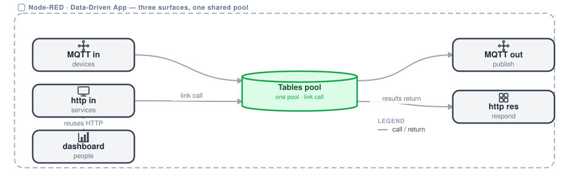
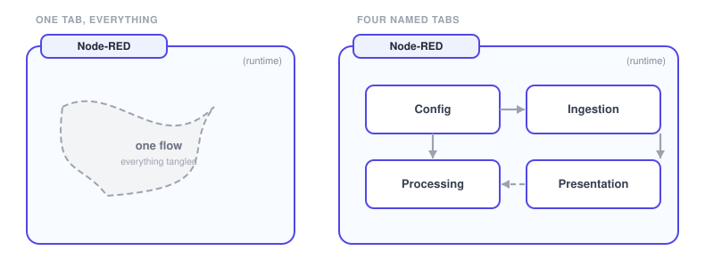

# Worked example

The shape rules and patterns applied end to end. One app reached three ways over shared services, and the same requirement built with and without seams, so you can see what the seams buy you.

## Napkin: multi-surface app

{data-zoomable}

One app reached three ways over shared services: an HTTP API, a dashboard and MQTT over one shared [FlowFuse Tables](/docs/user/ff-tables/) pool. Each surface ends at its own sink.

- **Surfaces**: a dashboard for people, an HTTP API for services, an MQTT feed for devices and events. Each beginning is its own path, so a device path never runs through a browser path.
- **Shared services**: one Tables pool and one external service call, both invoked with [link call](https://nodered.org/docs/user-guide/concepts). One pool serves all three surfaces without mixing them.
- **Single sink**: each surface converges on one sink through a labeled link, either an http response or an MQTT publish. It only sends. The HTTP path responds exactly once, the MQTT path just publishes.
- **People reuse HTTP**: the dashboard is a ui-template that fetches the HTTP API, so it adds no new backend paths of its own.

**The architecture, in one sentence**

> A Software: Data-Driven App backed by a Relational DB, reached three ways over one shared Tables pool and one external service call, each surface ending at its own sink.

## Good vs bad

{data-zoomable}

The same requirement built with and without seams.

- **The bad version**: one tab, everything on it. Tags and thresholds frozen in Function nodes, a template that holds logic and pulls its own data, the full object threaded node to node. A second line means copy, paste, edit.
- **The good version**: four tabs with clear boundaries, Config, Ingestion, Processing and Presentation. Config lives in a [persistent store](/docs/user/persistent-context/) the operator edits, the template only renders a view-model, and state lives in a namespaced context key.
- **Why it wins**: named seams you can read one at a time, runtime config with no redeploy, a clean UI boundary, and a Threshold Evaluator subflow, so a second line is configuration rather than copy-paste.

**The architecture, in one sentence**

> Draw the boundary on purpose and define the contract across it, and there is nowhere for spaghetti to accumulate.
