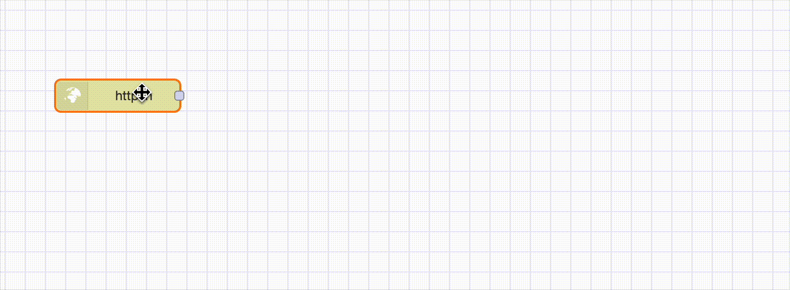
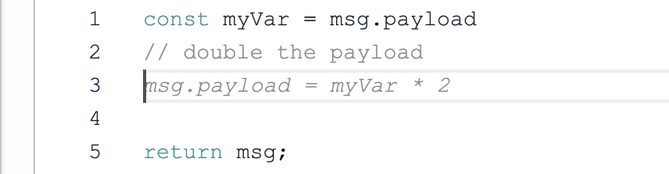
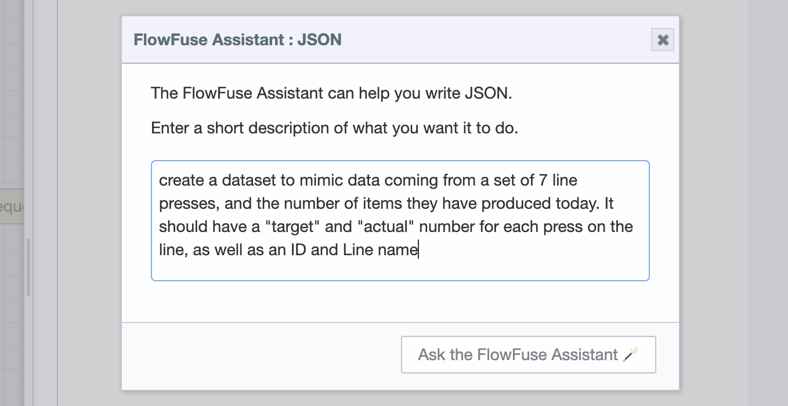
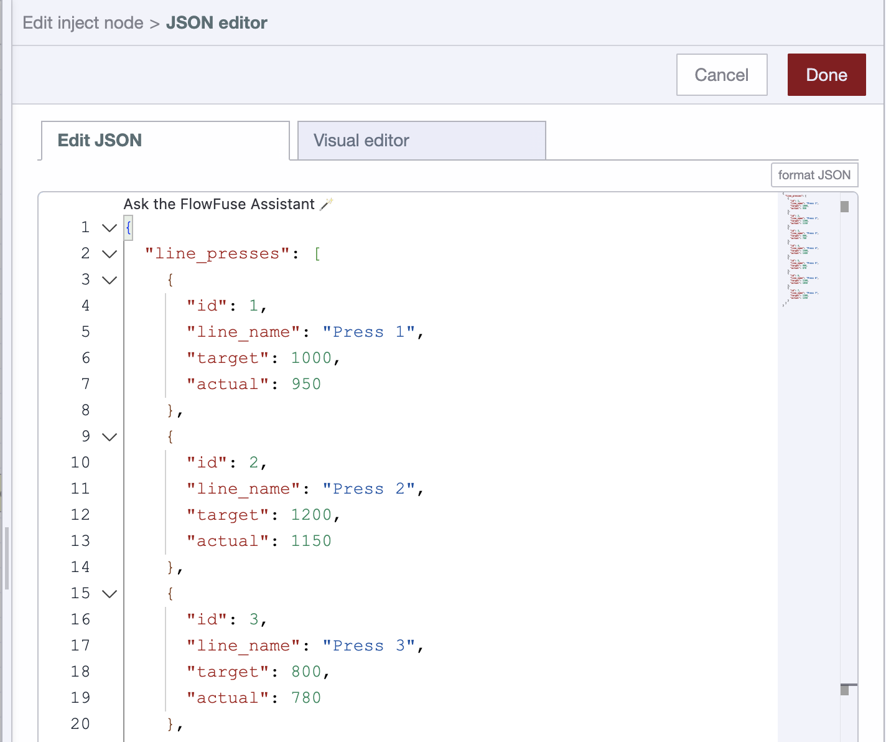

# FlowFuse Assistant Plugin

**Introduced in FlowFuse 2.6 on FlowFuse Cloud only. This feature is not yet available for self-hosted customers.**

The FlowFuse Assistant brings the power of AI to the Node-RED editor and FlowFuse. Hosted Instances running
within FlowFuse Cloud will include the **FlowFuse Assistant**, a plugin that helps you work faster and smarter.

## Assistant Features Overview

The Assistant currently supports the following features:

  <a class="assistant-feature" href="#flow-autocomplete">
    <svg width="48" height="48" viewBox="0 0 24 24" class="icon-stroke" xmlns="http://www.w3.org/2000/svg">
      <path d="M3 12c0-2 1-4 3-4s3 2 3 4" stroke-width="2" stroke-linecap="round"/>
      <path d="M9 12c0 2 1 4 3 4s3-2 3-4" stroke-width="2" stroke-linecap="round"/>
    </svg>
    <label style="margin: 10px 0; font-size: 16px; color: #333;">Flow Autocomplete</label>
  </a>
  
  <a class="assistant-feature" href="#inline-code-completions">
    <svg width="48" height="48" viewBox="0 0 24 24" class="icon-stroke" xmlns="http://www.w3.org/2000/svg">
      <path d="M6 7h6M6 11h6M6 15h12" stroke-width="1.5" stroke-linecap="round"/>
      <path d="M16 7l2 2-2 2" stroke-width="2" stroke-linecap="round" stroke-linejoin="round"/>
    </svg>
    <label style="margin: 10px 0; font-size: 16px; color: #333;">Inline Code Completions</label>
  </a>

  <a class="assistant-feature" href="#flow-explainer">
    <svg width="48" height="48" viewBox="0 0 24 24" class="icon-stroke" xmlns="http://www.w3.org/2000/svg">
      <path d="M21 15a2 2 0 01-2 2H7l-4 4V5a2 2 0 012-2h14a2 2 0 012 2z" stroke-width="2"/>
      <path d="M8 9h8M8 13h6" stroke-width="1.5" stroke-linecap="round"/>
    </svg>
    <label style="margin: 10px 0; font-size: 16px; color: #333;">Flow Explainer</label>
  </a>

  <a class="assistant-feature" href="#function-node-creation">
    <svg width="48" height="48" viewBox="0 0 54 54" class="icon-fill">
      <path xmlns="http://www.w3.org/2000/svg" d="M30.999 31.005v-3h-6.762s.812-12.397 1.162-14 .597-3.35 2.628-3.103 1.971 3.103 1.971 3.103l4.862-.016s-.783-3.984-2.783-5.984-7.946-1.7-9.633.03c-1.687 1.73-2.302 5.065-2.597 6.422-.588 4.5-.854 9.027-1.248 13.547h-8.6v3H18.1s-.812 12.398-1.162 14-.597 3.35-2.628 3.103-1.972-3.102-1.972-3.102l-4.862.015s.783 3.985 2.783 5.985c2 2 7.946 1.699 9.634-.031 1.687-1.73 2.302-5.065 2.597-6.422.587-4.5.854-9.027 1.248-13.547z" />
    </svg>
    <label style="margin: 10px 0; font-size: 16px; color: #333;">Function Builder</label>
  </a>
  
  <a class="assistant-feature" href="#function-code-generation">
    <svg width="48" height="48" viewBox="0 0 24 24" class="icon-fill" xmlns="http://www.w3.org/2000/svg">
      <path d="M13 2L3 14h9l-1 8 10-12h-9l1-8z" fill="#2563eb"/>
    </svg>
    <label style="margin: 10px 0; font-size: 16px; color: #333;">Function Code Generation</label>
  </a>
  
  <a class="assistant-feature" href="#json-generation">
    <svg width="48" height="48" viewBox="0 0 24 24" class="icon-stroke" xmlns="http://www.w3.org/2000/svg">
      <path d="M14 2H6a2 2 0 00-2 2v16a2 2 0 002 2h12a2 2 0 002-2V8z" stroke-width="2"/>
      <polyline points="14,2 14,8 20,8" stroke="#2563eb" stroke-width="2"/>
      <path d="M8 13h8M8 17h4" stroke="#2563eb" stroke-width="2" stroke-linecap="round"/>
    </svg>
    <label style="margin: 10px 0; font-size: 16px; color: #333;">JSON Generation</label>
  </a>  
  
  <a class="assistant-feature" href="#css-and-html-generation-for-flowfuse-dashboard">
    <svg width="48" height="48" viewBox="0 0 24 24" fill="none" xmlns="http://www.w3.org/2000/svg">
      <path d="M21 16V8a2 2 0 00-1-1.73l-7-4a2 2 0 00-2 0l-7 4A2 2 0 003 8v8a2 2 0 001 1.73l7 4a2 2 0 002 0l7-4A2 2 0 0021 16z" stroke="#2563eb" stroke-width="2"/>
      <polyline points="3.29,7 12,12 20.71,7" stroke="#2563eb" stroke-width="2"/>
      <line x1="12" y1="22" x2="12" y2="12" stroke="#2563eb" stroke-width="2"/>
      <path d="M8 10l4-2 4 2" stroke="#2563eb" stroke-width="1"/>
    </svg>
    <label style="margin: 10px 0; font-size: 16px; color: #333;">CSS & HTML Generation</label>
  </a>

1. **Flow Autocomplete:** Automated, intelligent suggestions for which node should be added next in your flow
2. **Inline Code Completions:** Inline code completions for Function node, Tables Query node and FlowFuse Dashboard `ui-template` node
3. **Flow Explainer:** Get detailed explanations of the selected nodes in your flow
4. **Function Node Creation:** Create a new function node directly, driven by natural language.
5. **Function Code Generation:** Within the scope of an eisting function node, ask the assistant to write code for you.
6. **JSON Generation:** In-editor JSON generation within the JSON editor for all typed inputs and JSON editors.
7. **CSS and HTML Generation:** In-editor CSS and HTML generation for FlowFuse Dashboard `ui-template` nodes

To enable the Assistant and any new features, ensure your Instance is running the latest Stack and the Assistant is updated to the latest version.

### Flow Autocomplete

{data-zoomable width="700px"}
_Recording of the flow autocomplete in-action, with up/down keys used to toggle suggestions and tab to move to the next suggestion_

The FlowFuse Assistant runs our trained, in-browser, machine learning model that will provide intelligent suggestions
for which node should be added next in your flow.

You can accept the suggestion by clicking the suggestion or by pressing the `Tab` key. You can also toggle through the suggestions by pressing the `Up` and `Down` keys.

### Inline Code Completions

Mimicking the ever-familiar co-pilot assistant in your IDE, the FlowFuse Assistant plugin provides
inline code completions for Function nodes, Tables Query nodes, and FlowFuse Dashboard `ui-template` nodes.

{data-zoomable width="450px"}
_A simple example of inline code completions for a Function node_

This feature accelerates the writing of custom code and queries by providing intelligent suggestions
without having to leave the editor. Coding with the FlowFuse Assistant is a breeze, and lowers the 
barrier to entry for non-technical users.

Using comments is optional here, the assistant will do it's best to understand the context of the code
and provide suggestions based on the surrounding code, however, if you do write comments, we've found
that it really helps to frame the request in a way that is more likely to be understood by the assistant.

### Flow Explainer

The FlowFuse Assistant plugin also adds a new button to the Assistant menu that will explain what the selected nodes do.
To use this feature, simply select the 1 or more nodes that you want to understand and click the "Explain Flows" button in the Assistant menu.

### Function Node Creation

_Screenshot showing the assistant dialog for creating a function node_

Use natural language to request a _new_ function node be added to the Node-RED flow.

This is useful when you want to quickly add a function
node to your flow without having to drag it from the palette and write the code yourself.

If your Instance supports external modules, you can also ask for a function node that uses this
and it will be added to the function node setup.

If your function node requires multiple outputs, the assistant will know to set the number of outputs
on the function node setup.

### Function Code Generation

#### Ask FlowFuse Assistant

The FlowFuse Assistant plugin also adds a new code lens to the function node editor that allows you
to generate code directly within the editor. 

{data-zoomable}

This is useful when you want to quickly add code to an
existing function node without having to generate a full function node from scratch.

### JSON Generation

The FlowFuse Assistant plugin also adds a code lens to the JSON editor that allows you
to generate JSON directly within the monaco editor.

{data-zoomable width="700px"}
_Screenshot showing a FlowFuse Assistant prompt for JSON generation_

This is useful when you want to quickly generate JSON for a prototype, or test
a piece of functionality in your flows.

He we can see the result of the above prompt, requesting simulated data for progress on
lines in a manufacturing plant:

{data-zoomable width="700px"}
_Screenshot showing the result of the above FlowFuse Assistant prompt_

### CSS and HTML Generation for FlowFuse Dashboard

The FlowFuse Assistant plugin also adds a code lens to the FlowFuse Dashboard `ui-template` node that allows you
to generate CSS and HTML directly within the code editor. It is aware of the context of the node and will
generate suitable CSS and HTML components for vuetify and the FlowFuse Dashboard.

