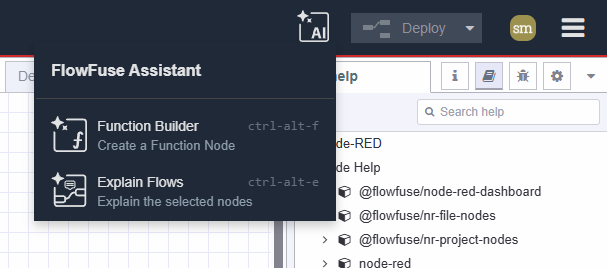
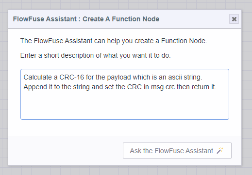
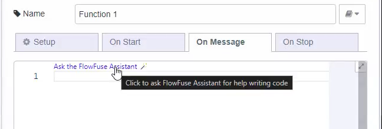

# FlowFuse Assistant Plugin

**Introduced in FlowFuse 2.6 on FlowFuse Cloud only. This feature is not yet available for self-hosted customers.**

The FlowFuse Assistant brings the power of AI to the Node-RED editor.

Node-RED instances running within FlowFuse Cloud will include the **FlowFuse Assistant**
plugin that aims to helps you work faster and smarter.

The plugin currently supports 2 features:

1. Function node creation directly from the Node-RED editor toolbar
2. In-line Function code generation within the function node editor

To enable the Assistant, ensure your Instance is running the latest Stack.

### Function Node Creation

The FlowFuse Assistant plugin adds a new button to the Node-RED editor toolbar that allows you to
ask for a new function node to be created. 

This is useful when you want to quickly add a function
node to your flow without having to drag it from the palette and write the code yourself.

If your instance supports external modules, you can also ask for a function node that uses this
and it will be added to the function node setup.

If your function node requires multiple outputs, the assistant will know to set the number of outputs
on the function node setup.

### In-line Function Code Generation

The FlowFuse Assistant plugin also adds a new code lens to the function node editor that allows you
to generate code directly within the editor. 

This is useful when you want to quickly add code to an
existing function node without having to generate a full function node from scratch.

### In-line JSON Generation

The FlowFuse Assistant plugin also adds a new code lens to the JSON editor that allows you
to generate JSON directly within the monaco editor.

This is useful when you want to quickly generate JSON in a template node, change node, inject node or
any node that the TypedInput offers the JSON editor.
