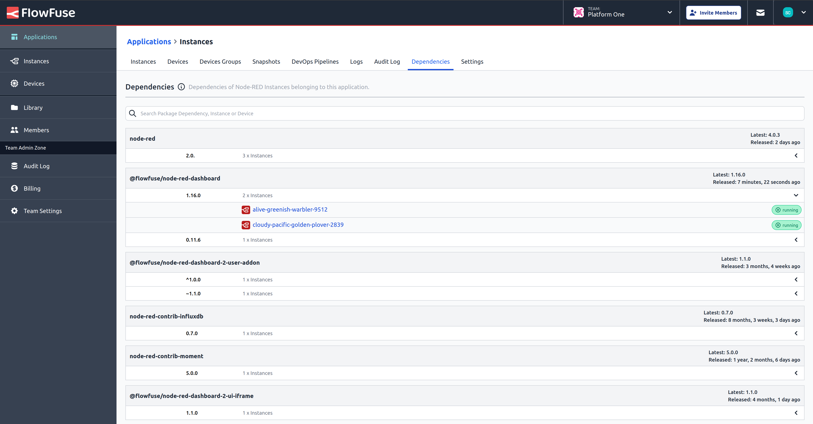

# Bill of Materials

Our platform now includes an Application Bill of Materials (BoM), providing a comprehensive overview of all instance dependencies associated with each application. This feature empowers you to monitor, manage, and analyze the full range of components your applications rely on, ensuring better visibility and control over dependencies.

The Bill of Materials is located within the Dependencies tab of each application, making it easy to access and review at any time. 

Additionally, the integrated search function allows users to efficiently search through devices and instances assigned to the current application. 
You can search by instance/device name, package name, specific dependency, or even dependency version, ensuring you can quickly find the information you need to manage your application’s dependencies with precision and ease.

## Prerequisites
### FlowFuse Cloud
- A Instance Stack with a launcher version of 2.9.0 or greater.
- Enterprise Team Type.

### Self-Hosted

This feature is available only on self-hosted Enterprise licensed versions of FlowFuse.
