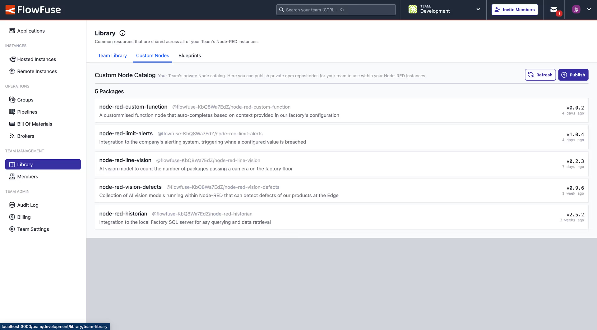

# Custom Node Packages

FlowFuse has access to the wide range of Node-RED nodes listed in the public 
catalogue as found on https://flows.nodered.org. But occasionally there will 
be the need for a custom node for a situation that is specific to your Team.

If you decide to [develop](https://nodered.org/docs/creating-nodes/) your 
own node, you will need somewhere to host both the node and a Node-RED 
catalogue file. FlowFuse has 2 solutions for this.

## FlowFuse Hosted Nodes

If you want to create a Node-RED node for private use by Instances in your 
FlowFuse Team then you can publish them to the FlowFuse Custom Node Registry 
(available to Teams and Enterprise level teams on FlowFuse Cloud).

### Publishing Nodes

After developing your node you can publish it to your Teams Custom Nodes 
registry with the following steps

#### Authenticating

Before publishing to the registry you need to authenticate. This step should 
only need to be done once.

The credentials can be found by navigating to the "Custom Nodes" tab under 
the Team Library and clicking on the "Publish" button.

{data-zoomable}
_Publish Custom Package_

```
npm login --registry=https://registry.flowfuse.dev
```

#### Packaging

There are steps required to ensure your node is correctly packaged for the 
FlowFuse Custom Nodes registry

1. Make sure the package name contains the correct scope prefix e.g. 
`@flowfuse-[team id]/node-name`. The correct prefix will be shown on the in 
the FlowFuse application
2. Add a `publishConfig` section with a `registry` entry


e.g. for a Team with ID `6Rag1kQj4k`
```json
{
    "name": "@flowfuse-6Rag1kQj4k/bar",
    "version": "0.0.1",
    "description": "...",
    "publishConfig": {
        "registry": "https://registry.flowfuse.dev"
    },
    ...
}
```

#### Publishing

In the same directory as the `package.json` file run the following command

```
npm publish
```

Once published you should see the Node listed in the "Custom Nodes" section 
of the Team Library.

{data-zoomable}
_Custom Node List_

### Installing Nodes

Any packages uploaded to the Team Library will be published to your Instances 
under a custom catalogue with the name "FlowFuse Team [team name] Catalogue"

{data-zoomable}
_Custom Catalogue_


## 3rd Party NPM Registries or Private npmjs.org packages

The following features are available to Team and Enterprise users of FlowFuse
Cloud.

### NPM Registries

If you have already published packages to an existing NPM Registry then you 
can enable access to this by adding the required values to a `.npmrc" file
in the Instance Settings.

This can include authentication tokens to access private packages.

{data-zoomable}
_.npmrc file_

### Node-RED Catalogues

In order to be able to install packages in the Node-RED editor they need to 
in a Node-RED Catalogue file that is loaded from a HTTPS URL. You can 
supply a list of Catalogue URLS in the Instance Settings.

{data-zoomable}
_Node Catalogues_